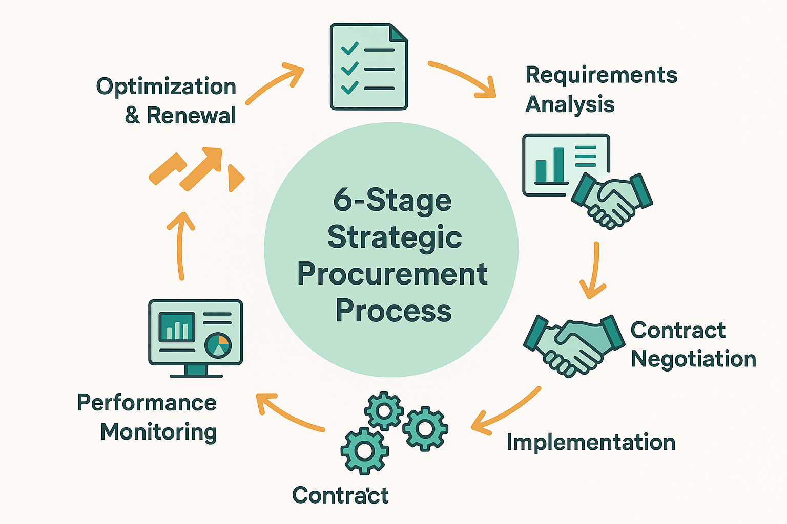

# Vendor and Tool Cost Management



*Figure 4: Vendor Management Lifecycle - 6-stage strategic procurement process with requirements analysis, vendor evaluation, contract negotiation, implementation, performance monitoring, and optimization & renewal.*

## Introduction

Vendor and tool cost management represents a critical component of AI evaluation cost optimization, often accounting for 30-40% of total evaluation program expenses. As the AI evaluation ecosystem rapidly evolves with new platforms, services, and technologies, organizations must develop sophisticated approaches to vendor selection, contract negotiation, and ongoing cost optimization. This section provides comprehensive frameworks for managing external evaluation investments while maximizing value and maintaining strategic flexibility.

The complexity of vendor and tool management in AI evaluation extends beyond traditional procurement to encompass rapidly evolving technology landscapes, complex integration requirements, performance-based pricing models, and strategic partnership considerations. Organizations that master vendor cost management achieve 15-25% better value from external investments and maintain 40-60% more flexibility in technology choices compared to those using ad-hoc procurement approaches.

Modern vendor management frameworks must balance cost optimization with innovation access, risk mitigation with strategic partnerships, and standardization benefits with flexibility requirements. The most successful organizations implement dynamic vendor management systems that adapt to changing technology landscapes while maintaining cost discipline and strategic alignment.

## Understanding the AI Evaluation Vendor Landscape

### Vendor Category Analysis

**Platform Providers**
AI evaluation platform providers offer comprehensive solutions that integrate multiple evaluation capabilities into unified systems. These vendors typically provide subscription-based pricing models with tiered feature access, usage-based components, and enterprise customization options.

Platform providers often represent the largest single vendor expense but can deliver significant value through integration benefits, reduced complexity, and comprehensive support. Organizations must carefully evaluate platform capabilities against current and future requirements while considering lock-in risks and migration costs.

The platform vendor landscape includes established enterprise software companies expanding into AI evaluation, specialized AI evaluation startups, and cloud platform providers offering evaluation services as part of broader AI ecosystems.

**Specialized Service Providers**
Specialized service providers focus on specific aspects of AI evaluation such as human annotation, domain expertise, quality assurance, or technical implementation. These vendors often provide more flexible pricing models and specialized capabilities but require more complex integration and management.

Service providers can offer significant value for specific evaluation requirements but may create vendor proliferation challenges and integration complexity. Organizations should develop frameworks for evaluating when specialized services provide better value than platform-based solutions.

**Infrastructure and Compute Providers**
Infrastructure providers supply the computational resources, storage, and networking capabilities required for AI evaluation systems. These vendors typically offer usage-based pricing with complex optimization opportunities through reserved capacity, spot pricing, and geographic distribution.

Infrastructure costs can exhibit high variability based on evaluation workloads and optimization strategies. Organizations must develop sophisticated cost modeling and optimization approaches to manage these expenses effectively.

**Data and Content Providers**
Data and content providers supply evaluation datasets, benchmarks, reference materials, and domain-specific content required for comprehensive evaluation. These vendors often use licensing models with usage restrictions and quality guarantees.

Data costs can represent significant ongoing expenses, particularly for organizations requiring large-scale or specialized evaluation datasets. Organizations should develop strategies for data acquisition, sharing, and lifecycle management to optimize these investments.

### Cost Structure Analysis

**Subscription vs. Usage-Based Pricing**
The choice between subscription and usage-based pricing models significantly impacts cost predictability and optimization opportunities. Subscription models provide cost predictability but may result in underutilization during low-demand periods. Usage-based models offer flexibility but can create budget uncertainty and optimization complexity.

Organizations should analyze their evaluation patterns, growth projections, and risk tolerance to determine optimal pricing model preferences. Hybrid models that combine base subscriptions with usage overages often provide the best balance of predictability and flexibility.

**Tiered Pricing Structures**
Most AI evaluation vendors offer tiered pricing structures with different feature sets, capacity limits, and support levels. Understanding these tiers and their value propositions is critical for optimizing vendor investments and avoiding over-purchasing.

Organizations should regularly review their tier selections based on actual usage patterns and evolving requirements. Tier optimization can often achieve 10-20% cost reductions without functionality loss.

## Strategic Vendor Selection Framework

### Multi-Criteria Evaluation Process

**Total Cost of Ownership (TCO) Analysis**
Comprehensive TCO analysis goes beyond initial pricing to include implementation costs, integration expenses, training requirements, ongoing support, and potential switching costs. This analysis provides a more accurate basis for vendor comparison and selection.

```python
import pandas as pd
import numpy as np
from datetime import datetime, timedelta
from typing import Dict, List, Optional, Tuple
import json

class VendorTCOAnalyzer:
    """
    Comprehensive Total Cost of Ownership analyzer for AI evaluation vendors.
    Provides multi-dimensional cost analysis and vendor comparison capabilities.
    """
    
    def __init__(self):
        self.vendors = {}
        self.cost_categories = [
            'initial_licensing',
            'implementation_services',
            'integration_costs',
            'training_costs',
            'ongoing_licensing',
            'support_costs',
            'infrastructure_costs',
            'maintenance_costs',
            'switching_costs'
        ]
        self.analysis_period_years = 3
        
    def add_vendor(self, vendor_id: str, vendor_data: Dict):
        """
        Add vendor information for TCO analysis.
        
        Args:
            vendor_id: Unique identifier for the vendor
            vendor_data: Comprehensive vendor cost and capability data
        """
        self.vendors[vendor_id] = vendor_data
        
    def calculate_vendor_tco(self, vendor_id: str, usage_projections: Dict) -> Dict:
        """
        Calculate Total Cost of Ownership for a specific vendor.
        
        Args:
            vendor_id: Vendor identifier
            usage_projections: Projected usage patterns over analysis period
            
        Returns:
            Comprehensive TCO analysis
        """
        if vendor_id not in self.vendors:
            return {'error': f'Vendor {vendor_id} not found'}
            
        vendor = self.vendors[vendor_id]
        tco_analysis = {
            'vendor_id': vendor_id,
            'analysis_period_years': self.analysis_period_years,
            'cost_breakdown': {},
            'total_tco': 0,
            'annual_costs': []
        }
        
        # Calculate costs by category
        for category in self.cost_categories:
            category_cost = self._calculate_category_cost(
                vendor, category, usage_projections
            )
            tco_analysis['cost_breakdown'][category] = category_cost
            tco_analysis['total_tco'] += category_cost
        
        # Calculate annual cost distribution
        for year in range(self.analysis_period_years):
            annual_cost = self._calculate_annual_cost(vendor, year, usage_projections)
            tco_analysis['annual_costs'].append({
                'year': year + 1,
                'cost': annual_cost,
                'cumulative_cost': sum(tco_analysis['annual_costs'][i]['cost'] 
                                     for i in range(year)) + annual_cost
            })
        
        # Calculate cost per unit metrics
        total_usage = sum(usage_projections.get('annual_usage', [0] * self.analysis_period_years))
        tco_analysis['cost_per_unit'] = (
            tco_analysis['total_tco'] / total_usage if total_usage > 0 else 0
        )
        
        return tco_analysis
        
    def _calculate_category_cost(self, vendor: Dict, category: str, 
                               usage_projections: Dict) -> float:
        """Calculate cost for a specific category."""
        cost_data = vendor.get('costs', {}).get(category, {})
        
        if category == 'initial_licensing':
            return cost_data.get('base_cost', 0) + (
                cost_data.get('per_user_cost', 0) * 
                usage_projections.get('initial_users', 0)
            )
        elif category == 'ongoing_licensing':
            annual_cost = cost_data.get('annual_base', 0) + (
                cost_data.get('per_user_annual', 0) * 
                usage_projections.get('average_users', 0)
            )
            return annual_cost * self.analysis_period_years
        elif category == 'infrastructure_costs':
            annual_infra_cost = (
                cost_data.get('compute_cost_per_hour', 0) * 
                usage_projections.get('annual_compute_hours', 0)
            )
            return annual_infra_cost * self.analysis_period_years
        else:
            # One-time costs
            return cost_data.get('total_cost', 0)
    
    def _calculate_annual_cost(self, vendor: Dict, year: int, 
                             usage_projections: Dict) -> float:
        """Calculate cost for a specific year."""
        annual_cost = 0
        
        # First year includes one-time costs
        if year == 0:
            one_time_categories = [
                'initial_licensing', 'implementation_services', 
                'integration_costs', 'training_costs'
            ]
            for category in one_time_categories:
                annual_cost += self._calculate_category_cost(
                    vendor, category, usage_projections
                ) / self.analysis_period_years if category == 'initial_licensing' else self._calculate_category_cost(
                    vendor, category, usage_projections
                )
        
        # Ongoing annual costs
        ongoing_categories = ['ongoing_licensing', 'support_costs', 'infrastructure_costs', 'maintenance_costs']
        for category in ongoing_categories:
            annual_cost += self._calculate_category_cost(
                vendor, category, usage_projections
            ) / self.analysis_period_years
        
        return annual_cost
        
    def compare_vendors(self, vendor_ids: List[str], usage_projections: Dict) -> Dict:
        """
        Compare multiple vendors across TCO and other criteria.
        
        Args:
            vendor_ids: List of vendor identifiers to compare
            usage_projections: Usage projections for comparison
            
        Returns:
            Comprehensive vendor comparison
        """
        comparison = {
            'vendors': {},
            'summary': {},
            'recommendations': []
        }
        
        # Calculate TCO for each vendor
        for vendor_id in vendor_ids:
            tco_analysis = self.calculate_vendor_tco(vendor_id, usage_projections)
            comparison['vendors'][vendor_id] = tco_analysis
        
        # Generate summary comparison
        if comparison['vendors']:
            tco_values = [v['total_tco'] for v in comparison['vendors'].values()]
            comparison['summary'] = {
                'lowest_tco': min(tco_values),
                'highest_tco': max(tco_values),
                'average_tco': np.mean(tco_values),
                'tco_range': max(tco_values) - min(tco_values),
                'cost_leader': min(comparison['vendors'].items(), 
                                 key=lambda x: x[1]['total_tco'])[0]
            }
        
        # Generate recommendations
        comparison['recommendations'] = self._generate_vendor_recommendations(comparison)
        
        return comparison
        
    def _generate_vendor_recommendations(self, comparison: Dict) -> List[Dict]:
        """Generate vendor selection recommendations."""
        recommendations = []
        
        if not comparison['vendors']:
            return recommendations
        
        # Cost-based recommendations
        cost_leader = comparison['summary']['cost_leader']
        recommendations.append({
            'type': 'cost_optimization',
            'title': f'{cost_leader} offers lowest TCO',
            'description': f'Total cost advantage of ${comparison["summary"]["tco_range"]:,.2f} over highest-cost option',
            'priority': 'high' if comparison['summary']['tco_range'] > 100000 else 'medium'
        })
        
        # Value-based recommendations
        for vendor_id, vendor_data in comparison['vendors'].items():
            cost_per_unit = vendor_data['cost_per_unit']
            if cost_per_unit > 0:
                recommendations.append({
                    'type': 'value_analysis',
                    'title': f'{vendor_id} cost efficiency',
                    'description': f'Cost per unit: ${cost_per_unit:.2f}',
                    'priority': 'medium'
                })
        
        return recommendations
        
    def analyze_pricing_models(self, vendor_id: str, usage_scenarios: List[Dict]) -> Dict:
        """
        Analyze different pricing models for a vendor across usage scenarios.
        
        Args:
            vendor_id: Vendor identifier
            usage_scenarios: Different usage scenarios to analyze
            
        Returns:
            Pricing model analysis
        """
        if vendor_id not in self.vendors:
            return {'error': f'Vendor {vendor_id} not found'}
        
        vendor = self.vendors[vendor_id]
        pricing_models = vendor.get('pricing_models', {})
        
        analysis = {
            'vendor_id': vendor_id,
            'scenarios': {},
            'optimal_model_by_scenario': {}
        }
        
        for scenario in usage_scenarios:
            scenario_name = scenario['name']
            scenario_analysis = {}
            
            for model_name, model_config in pricing_models.items():
                model_cost = self._calculate_pricing_model_cost(
                    model_config, scenario
                )
                scenario_analysis[model_name] = model_cost
            
            analysis['scenarios'][scenario_name] = scenario_analysis
            
            # Find optimal model for this scenario
            if scenario_analysis:
                optimal_model = min(scenario_analysis.items(), key=lambda x: x[1])
                analysis['optimal_model_by_scenario'][scenario_name] = {
                    'model': optimal_model[0],
                    'cost': optimal_model[1]
                }
        
        return analysis
        
    def _calculate_pricing_model_cost(self, model_config: Dict, scenario: Dict) -> float:
        """Calculate cost for a specific pricing model and usage scenario."""
        model_type = model_config.get('type', 'subscription')
        
        if model_type == 'subscription':
            base_cost = model_config.get('monthly_base', 0) * 12
            user_cost = (model_config.get('per_user_monthly', 0) * 
                        scenario.get('users', 0) * 12)
            return base_cost + user_cost
            
        elif model_type == 'usage_based':
            unit_cost = model_config.get('cost_per_unit', 0)
            usage_volume = scenario.get('annual_usage', 0)
            return unit_cost * usage_volume
            
        elif model_type == 'hybrid':
            base_cost = model_config.get('monthly_base', 0) * 12
            overage_cost = max(0, scenario.get('annual_usage', 0) - 
                             model_config.get('included_usage', 0)) * model_config.get('overage_rate', 0)
            return base_cost + overage_cost
            
        else:
            return 0

# Example vendor analysis implementation
def demonstrate_vendor_tco_analysis():
    """Demonstrate vendor TCO analysis capabilities."""
    
    analyzer = VendorTCOAnalyzer()
    
    # Define vendor data
    vendors = {
        'platform_a': {
            'name': 'AI Evaluation Platform A',
            'costs': {
                'initial_licensing': {'base_cost': 50000, 'per_user_cost': 500},
                'implementation_services': {'total_cost': 75000},
                'integration_costs': {'total_cost': 25000},
                'training_costs': {'total_cost': 15000},
                'ongoing_licensing': {'annual_base': 100000, 'per_user_annual': 2000},
                'support_costs': {'total_cost': 30000},
                'infrastructure_costs': {'compute_cost_per_hour': 5.0},
                'maintenance_costs': {'total_cost': 20000},
                'switching_costs': {'total_cost': 40000}
            },
            'pricing_models': {
                'subscription': {'type': 'subscription', 'monthly_base': 10000, 'per_user_monthly': 200},
                'usage_based': {'type': 'usage_based', 'cost_per_unit': 2.5},
                'hybrid': {'type': 'hybrid', 'monthly_base': 5000, 'included_usage': 2000, 'overage_rate': 3.0}
            }
        },
        'platform_b': {
            'name': 'AI Evaluation Platform B',
            'costs': {
                'initial_licensing': {'base_cost': 30000, 'per_user_cost': 300},
                'implementation_services': {'total_cost': 50000},
                'integration_costs': {'total_cost': 35000},
                'training_costs': {'total_cost': 20000},
                'ongoing_licensing': {'annual_base': 80000, 'per_user_annual': 1500},
                'support_costs': {'total_cost': 25000},
                'infrastructure_costs': {'compute_cost_per_hour': 4.0},
                'maintenance_costs': {'total_cost': 15000},
                'switching_costs': {'total_cost': 30000}
            },
            'pricing_models': {
                'subscription': {'type': 'subscription', 'monthly_base': 8000, 'per_user_monthly': 150},
                'usage_based': {'type': 'usage_based', 'cost_per_unit': 2.0},
                'hybrid': {'type': 'hybrid', 'monthly_base': 4000, 'included_usage': 1500, 'overage_rate': 2.5}
            }
        }
    }
    
    # Add vendors to analyzer
    for vendor_id, vendor_data in vendors.items():
        analyzer.add_vendor(vendor_id, vendor_data)
    
    # Define usage projections
    usage_projections = {
        'initial_users': 25,
        'average_users': 30,
        'annual_usage': [5000, 6000, 7000],
        'annual_compute_hours': 2000
    }
    
    # Compare vendors
    comparison = analyzer.compare_vendors(['platform_a', 'platform_b'], usage_projections)
    
    # Analyze pricing models
    usage_scenarios = [
        {'name': 'low_usage', 'users': 10, 'annual_usage': 2000},
        {'name': 'medium_usage', 'users': 25, 'annual_usage': 5000},
        {'name': 'high_usage', 'users': 50, 'annual_usage': 10000}
    ]
    
    pricing_analysis_a = analyzer.analyze_pricing_models('platform_a', usage_scenarios)
    pricing_analysis_b = analyzer.analyze_pricing_models('platform_b', usage_scenarios)
    
    return analyzer, comparison, pricing_analysis_a, pricing_analysis_b

if __name__ == "__main__":
    analyzer, comparison, pricing_a, pricing_b = demonstrate_vendor_tco_analysis()
    print(f"Vendor TCO analysis completed. Cost leader: {comparison['summary']['cost_leader']}")
```

**Capability Assessment Framework**
Beyond cost considerations, vendor selection requires comprehensive capability assessment that evaluates functional fit, technical compatibility, scalability potential, and strategic alignment. This assessment should use structured evaluation criteria with weighted scoring to enable objective comparison.

Capability assessment should include proof-of-concept evaluations, reference customer interviews, and technical deep-dives to validate vendor claims and assess real-world performance. Organizations should also evaluate vendor roadmaps and strategic direction to ensure long-term alignment.

**Risk Assessment and Mitigation**
Vendor selection involves multiple risk dimensions including financial stability, technology risks, integration challenges, and strategic dependencies. Organizations should develop comprehensive risk assessment frameworks that identify, quantify, and mitigate these risks.

Risk mitigation strategies include diversification across multiple vendors, contractual protections, escrow arrangements, and exit planning. The goal is to balance risk mitigation with cost efficiency and operational simplicity.

## Contract Negotiation and Optimization

### Negotiation Strategy Development

**Value-Based Negotiation Approaches**
Value-based negotiation focuses on creating mutual value rather than simply reducing costs. This approach often achieves better long-term outcomes by aligning vendor incentives with customer success and creating win-win scenarios.

Effective value-based negotiation requires understanding vendor business models, profit drivers, and strategic objectives. Organizations can often achieve better terms by offering longer commitments, reference opportunities, or strategic partnerships that provide value to vendors beyond immediate revenue.

**Multi-Year Contract Optimization**
Multi-year contracts can provide significant cost advantages through volume discounts, price protection, and reduced vendor sales costs. However, these contracts also create flexibility risks and require careful structuring to maintain optimization opportunities.

Contract optimization should include escalation caps, usage flexibility, technology refresh provisions, and performance guarantees that protect against changing requirements and vendor performance issues.

### Contract Terms and Conditions

**Performance-Based Pricing Models**
Performance-based pricing aligns vendor compensation with delivered value, creating incentives for continuous improvement and customer success. These models can include service level agreements, outcome-based pricing, and shared savings arrangements.

Performance-based contracts require clear metrics, measurement frameworks, and dispute resolution procedures. Organizations should balance performance incentives with cost predictability and operational simplicity.

**Flexibility and Exit Provisions**
Contract flexibility provisions enable organizations to adapt to changing requirements without penalty while maintaining cost efficiency. Key flexibility provisions include usage scaling, feature modifications, and technology updates.

Exit provisions should include data portability, transition assistance, and reasonable termination terms that enable vendor changes without excessive switching costs or business disruption.

## Ongoing Vendor Management and Optimization

### Vendor Performance Monitoring

**Comprehensive Scorecard Systems**
Vendor scorecards provide systematic performance monitoring across multiple dimensions including cost efficiency, service quality, innovation contribution, and strategic alignment. These scorecards enable data-driven vendor management and continuous improvement.

```python
class VendorPerformanceManager:
    """
    Comprehensive vendor performance management system.
    Tracks performance across multiple dimensions and provides optimization insights.
    """
    
    def __init__(self):
        self.vendors = {}
        self.performance_history = {}
        self.scorecards = {}
        self.benchmarks = {}
        
    def register_vendor(self, vendor_id: str, vendor_info: Dict):
        """Register a vendor in the performance management system."""
        self.vendors[vendor_id] = vendor_info
        self.performance_history[vendor_id] = []
        
    def record_performance(self, vendor_id: str, performance_data: Dict):
        """Record performance data for a vendor."""
        if vendor_id not in self.vendors:
            return False
            
        performance_record = {
            'timestamp': datetime.now(),
            'data': performance_data.copy()
        }
        
        self.performance_history[vendor_id].append(performance_record)
        return True
        
    def calculate_vendor_scorecard(self, vendor_id: str, scoring_criteria: Dict) -> Dict:
        """
        Calculate comprehensive vendor scorecard.
        
        Args:
            vendor_id: Vendor identifier
            scoring_criteria: Scoring criteria and weights
            
        Returns:
            Vendor scorecard with scores and analysis
        """
        if vendor_id not in self.vendors or not self.performance_history[vendor_id]:
            return {'error': 'Insufficient data for scorecard calculation'}
        
        # Get recent performance data
        recent_data = self.performance_history[vendor_id][-6:]  # Last 6 measurements
        
        scorecard = {
            'vendor_id': vendor_id,
            'evaluation_period': f'{len(recent_data)} measurements',
            'category_scores': {},
            'overall_score': 0,
            'performance_trends': {},
            'recommendations': []
        }
        
        total_weight = 0
        weighted_score = 0
        
        for category, criteria in scoring_criteria.items():
            category_score = self._calculate_category_score(recent_data, criteria)
            weight = criteria.get('weight', 1.0)
            
            scorecard['category_scores'][category] = {
                'score': category_score,
                'weight': weight,
                'weighted_contribution': category_score * weight
            }
            
            weighted_score += category_score * weight
            total_weight += weight
        
        scorecard['overall_score'] = weighted_score / total_weight if total_weight > 0 else 0
        
        # Calculate performance trends
        scorecard['performance_trends'] = self._calculate_performance_trends(
            vendor_id, scoring_criteria
        )
        
        # Generate recommendations
        scorecard['recommendations'] = self._generate_performance_recommendations(scorecard)
        
        self.scorecards[vendor_id] = scorecard
        return scorecard
        
    def _calculate_category_score(self, performance_data: List[Dict], criteria: Dict) -> float:
        """Calculate score for a specific category."""
        metrics = criteria.get('metrics', {})
        category_scores = []
        
        for metric, config in metrics.items():
            metric_values = []
            
            for record in performance_data:
                if metric in record['data']:
                    metric_values.append(record['data'][metric])
            
            if metric_values:
                avg_value = np.mean(metric_values)
                target_value = config.get('target', 1.0)
                scoring_type = config.get('type', 'higher_better')
                
                if scoring_type == 'higher_better':
                    score = min(avg_value / target_value, 1.0) * 100
                elif scoring_type == 'lower_better':
                    score = min(target_value / avg_value, 1.0) * 100 if avg_value > 0 else 0
                else:  # target_based
                    score = max(0, 100 - abs(avg_value - target_value) / target_value * 100)
                
                category_scores.append(score)
        
        return np.mean(category_scores) if category_scores else 0
        
    def _calculate_performance_trends(self, vendor_id: str, scoring_criteria: Dict) -> Dict:
        """Calculate performance trends for a vendor."""
        trends = {}
        
        if len(self.performance_history[vendor_id]) < 3:
            return trends
        
        recent_records = self.performance_history[vendor_id][-6:]
        
        for category, criteria in scoring_criteria.items():
            for metric in criteria.get('metrics', {}):
                values = []
                timestamps = []
                
                for record in recent_records:
                    if metric in record['data']:
                        values.append(record['data'][metric])
                        timestamps.append(record['timestamp'])
                
                if len(values) >= 3:
                    # Simple trend calculation
                    x = np.arange(len(values))
                    slope, _ = np.polyfit(x, values, 1)
                    
                    trends[f"{category}_{metric}"] = {
                        'trend_slope': slope,
                        'trend_direction': 'improving' if slope > 0 else 'declining',
                        'current_value': values[-1],
                        'change_rate': slope / values[0] if values[0] != 0 else 0
                    }
        
        return trends
        
    def _generate_performance_recommendations(self, scorecard: Dict) -> List[Dict]:
        """Generate performance improvement recommendations."""
        recommendations = []
        
        # Overall performance recommendations
        overall_score = scorecard['overall_score']
        if overall_score < 70:
            recommendations.append({
                'type': 'performance_improvement',
                'priority': 'high',
                'title': 'Address Overall Performance Issues',
                'description': f'Overall score ({overall_score:.1f}) below acceptable threshold',
                'action': 'Schedule vendor performance review meeting'
            })
        
        # Category-specific recommendations
        for category, score_data in scorecard['category_scores'].items():
            if score_data['score'] < 60:
                recommendations.append({
                    'type': 'category_improvement',
                    'priority': 'medium',
                    'title': f'Improve {category} Performance',
                    'description': f'{category} score ({score_data["score"]:.1f}) needs attention',
                    'action': f'Develop {category} improvement plan with vendor'
                })
        
        # Trend-based recommendations
        for trend_key, trend_data in scorecard['performance_trends'].items():
            if trend_data['trend_direction'] == 'declining' and abs(trend_data['change_rate']) > 0.1:
                recommendations.append({
                    'type': 'trend_concern',
                    'priority': 'medium',
                    'title': f'Address Declining {trend_key}',
                    'description': f'{trend_key} showing declining trend ({trend_data["change_rate"]:.1%})',
                    'action': f'Investigate root causes of {trend_key} decline'
                })
        
        return recommendations
        
    def compare_vendor_performance(self, vendor_ids: List[str]) -> Dict:
        """Compare performance across multiple vendors."""
        comparison = {
            'vendors': {},
            'rankings': {},
            'best_practices': []
        }
        
        # Get scorecards for all vendors
        for vendor_id in vendor_ids:
            if vendor_id in self.scorecards:
                comparison['vendors'][vendor_id] = self.scorecards[vendor_id]
        
        if not comparison['vendors']:
            return {'error': 'No vendor scorecards available for comparison'}
        
        # Calculate rankings
        overall_scores = {
            vendor_id: scorecard['overall_score']
            for vendor_id, scorecard in comparison['vendors'].items()
        }
        
        sorted_vendors = sorted(overall_scores.items(), key=lambda x: x[1], reverse=True)
        
        for rank, (vendor_id, score) in enumerate(sorted_vendors, 1):
            comparison['rankings'][vendor_id] = {
                'rank': rank,
                'score': score,
                'performance_tier': self._get_performance_tier(score)
            }
        
        # Identify best practices
        comparison['best_practices'] = self._identify_best_practices(comparison['vendors'])
        
        return comparison
        
    def _get_performance_tier(self, score: float) -> str:
        """Determine performance tier based on score."""
        if score >= 90:
            return 'excellent'
        elif score >= 80:
            return 'good'
        elif score >= 70:
            return 'acceptable'
        else:
            return 'needs_improvement'
            
    def _identify_best_practices(self, vendor_scorecards: Dict) -> List[Dict]:
        """Identify best practices from top-performing vendors."""
        best_practices = []
        
        # Find top performers in each category
        categories = set()
        for scorecard in vendor_scorecards.values():
            categories.update(scorecard['category_scores'].keys())
        
        for category in categories:
            category_scores = {
                vendor_id: scorecard['category_scores'].get(category, {}).get('score', 0)
                for vendor_id, scorecard in vendor_scorecards.items()
            }
            
            if category_scores:
                top_performer = max(category_scores.items(), key=lambda x: x[1])
                if top_performer[1] >= 85:  # High performance threshold
                    best_practices.append({
                        'category': category,
                        'top_performer': top_performer[0],
                        'score': top_performer[1],
                        'practice': f'Leverage {top_performer[0]} approach for {category}'
                    })
        
        return best_practices

# Example vendor performance management
def demonstrate_vendor_performance_management():
    """Demonstrate vendor performance management capabilities."""
    
    manager = VendorPerformanceManager()
    
    # Register vendors
    vendors = {
        'vendor_a': {'name': 'AI Platform A', 'type': 'platform'},
        'vendor_b': {'name': 'Evaluation Service B', 'type': 'service'},
        'vendor_c': {'name': 'Infrastructure Provider C', 'type': 'infrastructure'}
    }
    
    for vendor_id, vendor_info in vendors.items():
        manager.register_vendor(vendor_id, vendor_info)
    
    # Simulate performance data over time
    for month in range(6):
        for vendor_id in vendors.keys():
            performance_data = {
                'cost_efficiency': np.random.normal(0.8, 0.1),
                'service_quality': np.random.normal(0.85, 0.08),
                'response_time': np.random.normal(2.0, 0.5),
                'uptime': np.random.normal(0.99, 0.01),
                'customer_satisfaction': np.random.normal(0.82, 0.1),
                'innovation_score': np.random.normal(0.75, 0.15)
            }
            
            # Add vendor-specific variations
            if vendor_id == 'vendor_a':
                performance_data['cost_efficiency'] += 0.1
            elif vendor_id == 'vendor_b':
                performance_data['service_quality'] += 0.05
            
            manager.record_performance(vendor_id, performance_data)
    
    # Define scoring criteria
    scoring_criteria = {
        'cost_performance': {
            'weight': 0.3,
            'metrics': {
                'cost_efficiency': {'target': 0.85, 'type': 'higher_better'}
            }
        },
        'service_quality': {
            'weight': 0.4,
            'metrics': {
                'service_quality': {'target': 0.9, 'type': 'higher_better'},
                'uptime': {'target': 0.99, 'type': 'higher_better'}
            }
        },
        'customer_experience': {
            'weight': 0.2,
            'metrics': {
                'response_time': {'target': 2.0, 'type': 'lower_better'},
                'customer_satisfaction': {'target': 0.85, 'type': 'higher_better'}
            }
        },
        'innovation': {
            'weight': 0.1,
            'metrics': {
                'innovation_score': {'target': 0.8, 'type': 'higher_better'}
            }
        }
    }
    
    # Calculate scorecards
    scorecards = {}
    for vendor_id in vendors.keys():
        scorecard = manager.calculate_vendor_scorecard(vendor_id, scoring_criteria)
        scorecards[vendor_id] = scorecard
    
    # Compare vendor performance
    comparison = manager.compare_vendor_performance(list(vendors.keys()))
    
    return manager, scorecards, comparison

if __name__ == "__main__":
    perf_manager, scorecards, comparison = demonstrate_vendor_performance_management()
    print(f"Vendor performance analysis completed for {len(scorecards)} vendors.")
```

**Regular Performance Reviews**
Regular performance reviews provide structured opportunities for vendor feedback, issue resolution, and relationship optimization. These reviews should include quantitative performance assessment, qualitative feedback, and forward-looking planning.

Performance reviews should be collaborative processes that identify mutual improvement opportunities and strengthen vendor relationships. The goal is continuous improvement rather than punitive assessment.

### Cost Optimization Strategies

**Usage Optimization and Right-Sizing**
Continuous monitoring of vendor usage patterns enables optimization opportunities through right-sizing, usage pattern adjustments, and feature optimization. Organizations should implement automated monitoring and alerting systems that identify optimization opportunities.

Usage optimization requires understanding vendor pricing models, usage patterns, and alternative configuration options. Regular optimization reviews can often achieve 10-15% cost reductions without functionality loss.

**Vendor Consolidation Opportunities**
Vendor consolidation can reduce complexity, improve negotiating leverage, and achieve volume discounts. However, consolidation also creates concentration risks and may limit best-of-breed technology access.

Organizations should regularly assess consolidation opportunities based on vendor performance, strategic alignment, and risk considerations. The goal is to balance simplicity benefits with capability optimization and risk management.

## Technology Lifecycle Management

### Vendor Technology Roadmap Alignment

**Strategic Technology Planning**
Vendor technology roadmaps should align with organizational strategic objectives and technology evolution plans. This requires regular roadmap reviews, technology trend analysis, and strategic planning coordination.

Organizations should maintain technology roadmaps that incorporate vendor capabilities, internal development plans, and industry trends. This enables proactive vendor management and strategic technology decisions.

**Innovation Partnership Development**
Strategic vendor partnerships can provide early access to new technologies, influence product development, and create competitive advantages. These partnerships require careful selection and management to maximize value while managing risks.

Innovation partnerships should include clear value propositions, success metrics, and governance structures that ensure mutual benefit and strategic alignment.

### Migration and Transition Planning

**Vendor Transition Strategies**
Vendor transitions require comprehensive planning to minimize business disruption while achieving optimization objectives. Transition planning should include risk assessment, timeline development, resource allocation, and success criteria definition.

Effective transition strategies balance speed with risk management, ensuring that business continuity is maintained while achieving optimization benefits. Organizations should develop standardized transition frameworks that can be adapted to specific vendor changes.

**Technology Migration Frameworks**
Technology migration frameworks provide structured approaches for moving between vendor platforms while maintaining data integrity, functionality, and performance. These frameworks should include data migration, integration updates, training, and validation procedures.

Migration frameworks should be tested and validated before implementation to ensure successful transitions and minimize business impact.

## Conclusion

Vendor and tool cost management represents a critical capability for optimizing AI evaluation investments while maintaining strategic flexibility and operational excellence. Organizations that master vendor management achieve superior cost efficiency, better technology access, and stronger strategic partnerships that support long-term competitive advantage.

The key to success lies in implementing comprehensive vendor management frameworks that balance cost optimization with value creation, risk management with innovation access, and standardization with flexibility. Organizations should develop vendor management capabilities that scale with their evaluation programs and adapt to evolving technology landscapes.

Effective vendor management enables organizations to maximize the value of external investments while maintaining strategic control and operational efficiency. This creates a virtuous cycle where better vendor management leads to better technology access and cost efficiency, which supports continued evaluation capability development and competitive positioning.

The next section will explore scaling strategies for cost-effective evaluation that build upon these vendor management foundations to enable sustainable growth while maintaining economic efficiency.

