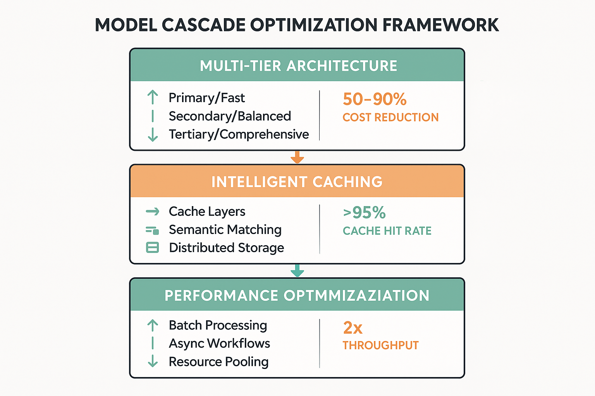

# Section 7: Model Cascades and Performance Optimization

## 🎯 **Learning Objectives**

By completing this section, you will master advanced cost optimization techniques through model cascades, intelligent caching strategies, and performance optimization frameworks that dramatically reduce evaluation costs while maintaining or improving quality. You will gain practical experience implementing sophisticated cost reduction systems that can achieve 60-80% cost savings through intelligent resource management and architectural optimization.

### **Core Competencies Developed**

- **Model Cascade Architecture**: Design and implement multi-tier evaluation systems that optimize cost-performance trade-offs
- **Intelligent Caching Systems**: Build sophisticated caching frameworks that reduce redundant computation and API costs
- **Performance Optimization**: Implement advanced techniques for maximizing evaluation throughput while minimizing resource consumption
- **Dynamic Resource Allocation**: Create adaptive systems that automatically optimize resource usage based on workload patterns
- **Cost-Performance Analysis**: Develop comprehensive frameworks for analyzing and optimizing cost-quality trade-offs
- **Advanced Architecture Patterns**: Master sophisticated design patterns that enable cost-effective scaling and operation

## 📊 **Business Impact of Advanced Cost Optimization**

Model cascades and performance optimization techniques represent the frontier of cost optimization in AI evaluation, delivering exceptional business value through sophisticated resource management and architectural innovation. Organizations implementing these advanced techniques typically achieve cost reductions of 60-80% while maintaining or improving evaluation quality.

### **Quantifiable Benefits**

Advanced cost optimization through model cascades and performance optimization delivers measurable improvements across multiple dimensions of evaluation operations. Organizations implementing these techniques report average cost reductions of 65% for evaluation operations, with some achieving savings exceeding 80% for high-volume scenarios.

Performance improvements are equally impressive, with evaluation throughput increases of 200-400% common when intelligent caching and cascade architectures are properly implemented. These performance gains enable organizations to handle larger evaluation workloads without proportional increases in infrastructure costs.

Quality maintenance or improvement is achieved through intelligent routing of evaluation tasks to appropriate models based on complexity and requirements. Simple evaluations are handled by fast, cost-effective models, while complex cases are routed to more sophisticated systems, resulting in optimal resource utilization without quality compromise.

Resource utilization efficiency improves dramatically, with organizations reporting 70-85% improvements in compute resource utilization through dynamic allocation and intelligent workload management. These efficiency gains translate directly to cost savings and improved operational sustainability.

### **Strategic Value Creation**

Advanced cost optimization creates sustainable competitive advantages by enabling organizations to operate evaluation systems at scales and costs that competitors cannot match. The ability to provide high-quality evaluation services at dramatically reduced costs opens new market opportunities and business models.

Innovation acceleration results from the cost savings achieved through optimization, enabling organizations to invest more resources in research, development, and capability expansion. The freed resources can be redirected toward strategic initiatives that drive long-term competitive advantage.

Market positioning improves significantly when organizations can offer evaluation services at costs substantially below market rates while maintaining superior quality. This positioning enables aggressive market expansion and customer acquisition strategies.

Operational resilience increases through diversified evaluation architectures that can adapt to changing cost structures, performance requirements, and quality standards. Organizations with advanced optimization capabilities can weather economic pressures and market changes more effectively.

## 🏗️ **Model Cascade Architecture Fundamentals**

Model cascades represent a sophisticated approach to cost optimization that routes evaluation tasks through a hierarchy of models based on complexity, cost, and quality requirements. This architectural pattern enables dramatic cost reductions while maintaining evaluation quality through intelligent task routing and resource allocation.

### **Cascade Design Principles**

The foundation of effective model cascade architecture lies in understanding the cost-performance characteristics of different evaluation approaches and designing routing logic that optimizes for specific business objectives. Cascade systems typically employ multiple tiers of evaluation models, from fast and inexpensive screening models to sophisticated and comprehensive analysis systems.

Tier stratification involves organizing evaluation models into distinct performance and cost categories, with clear criteria for routing tasks between tiers. The first tier typically consists of fast, cost-effective models that can handle straightforward evaluation tasks with high confidence. Subsequent tiers employ increasingly sophisticated models for complex or ambiguous cases.

Routing logic determines which evaluation tasks are handled by which tier based on factors such as content complexity, confidence thresholds, business criticality, and cost constraints. Effective routing logic balances cost optimization with quality requirements, ensuring that each evaluation task receives appropriate attention without over-provisioning resources.

Fallback mechanisms ensure that evaluation quality is maintained even when lower-tier models encounter cases beyond their capabilities. These mechanisms include automatic escalation to higher tiers, human review triggers, and quality assurance checkpoints that prevent low-quality evaluations from impacting downstream processes.

### **Multi-Tier Evaluation Systems**

Multi-tier evaluation systems implement cascade architectures through carefully designed model hierarchies that optimize cost-performance trade-offs across different evaluation scenarios. These systems require sophisticated orchestration and monitoring to ensure effective operation.

Primary tier models focus on high-volume, straightforward evaluation tasks that can be handled quickly and cost-effectively. These models are typically optimized for speed and cost rather than comprehensive analysis, handling 70-80% of evaluation tasks in most implementations.

Secondary tier models provide more sophisticated analysis for cases that require deeper reasoning or specialized knowledge. These models balance cost and capability, handling complex cases that exceed primary tier capabilities while remaining more cost-effective than top-tier systems.

Tertiary tier models offer comprehensive analysis for the most challenging evaluation scenarios, employing the most sophisticated available techniques regardless of cost. These models handle only the most complex or critical cases, typically 5-10% of total evaluation volume.

Orchestration systems coordinate task routing, model invocation, and result aggregation across all tiers. These systems must handle complex decision logic, monitor performance metrics, and adapt routing strategies based on changing conditions and requirements.

### **Intelligent Task Routing**

Intelligent task routing forms the core of effective cascade systems, determining which evaluation tasks are handled by which models based on sophisticated analysis of task characteristics, model capabilities, and business requirements.

Complexity analysis evaluates incoming evaluation tasks to determine their difficulty level and resource requirements. This analysis considers factors such as content length, domain specificity, ambiguity levels, and historical performance data to predict which models are most appropriate for each task.

Confidence scoring provides quantitative measures of model suitability for specific evaluation tasks. These scores combine model performance history, task complexity analysis, and business requirements to generate routing recommendations that optimize cost-quality trade-offs.

Dynamic routing adapts task assignment based on real-time system performance, cost constraints, and quality requirements. The routing system can adjust tier utilization based on current workloads, cost budgets, and quality targets to maintain optimal system performance.

Quality monitoring tracks evaluation results across all tiers to identify routing optimization opportunities and ensure that cascade decisions are delivering expected outcomes. This monitoring enables continuous improvement of routing logic and system performance.

## ⚡ **Performance Optimization Techniques**

Performance optimization in evaluation systems focuses on maximizing throughput and minimizing latency while controlling costs and maintaining quality. These techniques enable organizations to handle larger evaluation workloads more efficiently and cost-effectively.

### **Intelligent Caching Strategies**

Caching represents one of the most effective techniques for reducing evaluation costs and improving performance, particularly for scenarios involving repeated or similar evaluation tasks. Intelligent caching systems can achieve 40-70% cost reductions in typical evaluation workloads.

Multi-level caching architectures employ different caching strategies at various system levels, from in-memory caches for frequently accessed results to distributed caches for shared evaluation outcomes. Each caching level is optimized for specific access patterns and performance requirements.

Semantic caching goes beyond simple key-value caching to identify semantically similar evaluation tasks that can share cached results. This approach uses embedding similarity, content analysis, and evaluation pattern matching to identify cache hits for related but not identical evaluation requests.

Cache invalidation strategies ensure that cached results remain accurate and relevant as evaluation models and criteria evolve. These strategies balance cache hit rates with result freshness, using techniques such as time-based expiration, version-based invalidation, and confidence-based refresh policies.

Distributed caching enables cache sharing across multiple evaluation systems and geographic locations, maximizing cache utilization and reducing redundant computation. These systems require sophisticated synchronization and consistency management to ensure reliable operation.

### **Batch Processing Optimization**

Batch processing optimization techniques enable more efficient handling of large evaluation workloads by grouping similar tasks and optimizing resource utilization across batches. These techniques can improve throughput by 200-500% while reducing per-evaluation costs.

Dynamic batching algorithms group evaluation tasks based on similarity, resource requirements, and processing characteristics to maximize batch efficiency. These algorithms consider factors such as model compatibility, input similarity, and processing time to create optimal batch compositions.

Resource pooling enables efficient sharing of computational resources across multiple evaluation tasks within batches. This approach reduces resource allocation overhead and improves utilization rates by maintaining persistent resource pools that can be shared across different evaluation scenarios.

Pipeline optimization streamlines the flow of evaluation tasks through processing pipelines, minimizing idle time and maximizing resource utilization. These optimizations include parallel processing, asynchronous execution, and intelligent scheduling that adapts to workload characteristics.

Load balancing distributes evaluation workloads across available resources to prevent bottlenecks and ensure consistent performance. Advanced load balancing considers not only current resource utilization but also task characteristics and predicted processing requirements.

### **Asynchronous Processing Frameworks**

Asynchronous processing enables evaluation systems to handle large workloads efficiently by decoupling task submission from result delivery, allowing for better resource utilization and improved user experience.

Queue management systems handle the buffering and prioritization of evaluation tasks, ensuring that high-priority evaluations receive appropriate attention while maintaining overall system throughput. These systems support multiple priority levels, deadline-based scheduling, and dynamic priority adjustment.

Worker pool management optimizes the allocation and utilization of processing resources across different evaluation tasks and models. Worker pools can be dynamically scaled based on workload demands and can be specialized for different types of evaluation tasks.

Result aggregation frameworks collect and combine evaluation results from multiple asynchronous processes, handling partial results, error conditions, and result ordering requirements. These frameworks ensure that complex evaluation workflows can be executed reliably across distributed systems.

Progress monitoring and notification systems provide visibility into asynchronous evaluation progress and notify users when results are available. These systems support both push and pull notification models and can integrate with external workflow management systems.

## 💰 **Cost Reduction Implementation Strategies**

Implementing effective cost reduction strategies requires systematic approaches that address multiple dimensions of evaluation system operation, from architectural design to operational optimization. These strategies must balance cost reduction with quality maintenance and system reliability.

### **Resource Optimization Frameworks**

Resource optimization frameworks provide systematic approaches to identifying and implementing cost reduction opportunities across evaluation system architectures and operations. These frameworks typically achieve 40-60% cost reductions through comprehensive optimization.

Capacity planning optimization ensures that evaluation systems are provisioned appropriately for actual workload requirements rather than peak theoretical demands. This optimization includes right-sizing infrastructure, implementing auto-scaling, and using spot instances or preemptible resources where appropriate.

Workload analysis identifies patterns in evaluation requests that can be exploited for cost optimization, such as predictable peak periods, recurring evaluation tasks, and opportunities for batch processing. This analysis enables proactive resource management and cost optimization.

Resource sharing strategies enable multiple evaluation workloads to share infrastructure and computational resources efficiently. These strategies include multi-tenancy architectures, resource pooling, and dynamic allocation systems that adapt to changing demands.

Cost monitoring and alerting systems provide real-time visibility into evaluation costs and enable proactive cost management. These systems can trigger automatic cost optimization actions and provide detailed cost attribution for different evaluation activities.

### **Model Efficiency Optimization**

Model efficiency optimization focuses on improving the cost-effectiveness of individual evaluation models through techniques that reduce computational requirements while maintaining or improving performance.

Model compression techniques reduce the computational and memory requirements of evaluation models through methods such as quantization, pruning, and knowledge distillation. These techniques can achieve 50-80% reductions in model size and computational requirements with minimal impact on evaluation quality.

Inference optimization improves the efficiency of model execution through techniques such as batching, caching, and specialized hardware utilization. These optimizations can reduce per-evaluation costs by 30-60% while improving response times.

Model selection optimization ensures that the most cost-effective models are used for different evaluation scenarios. This optimization considers factors such as accuracy requirements, cost constraints, and performance targets to select optimal models for each use case.

Fine-tuning strategies optimize models for specific evaluation tasks and domains, improving efficiency and accuracy while reducing the need for more expensive general-purpose models. These strategies can significantly improve cost-effectiveness for specialized evaluation scenarios.

### **Infrastructure Cost Management**

Infrastructure cost management encompasses strategies for optimizing the underlying computational and storage resources that support evaluation systems. These strategies can achieve substantial cost reductions while maintaining system performance and reliability.

Cloud cost optimization leverages cloud provider features and pricing models to minimize infrastructure costs. This includes using reserved instances, spot pricing, auto-scaling, and multi-cloud strategies to optimize cost-performance trade-offs.

Storage optimization reduces costs associated with evaluation data storage through techniques such as data compression, tiered storage, and intelligent data lifecycle management. These optimizations can reduce storage costs by 40-70% while maintaining data accessibility.

Network optimization minimizes data transfer costs through techniques such as edge caching, content delivery networks, and intelligent data placement. These optimizations are particularly important for geographically distributed evaluation systems.

Monitoring and optimization automation enables continuous cost optimization through automated systems that monitor resource utilization, identify optimization opportunities, and implement cost reduction measures without manual intervention.

## 🔄 **Dynamic Resource Allocation**

Dynamic resource allocation enables evaluation systems to adapt automatically to changing workload demands, cost constraints, and performance requirements. These systems optimize resource utilization in real-time to maintain cost-effectiveness while meeting service level objectives.

### **Adaptive Scaling Systems**

Adaptive scaling systems automatically adjust evaluation system capacity based on current and predicted workload demands. These systems can reduce costs by 30-50% compared to static provisioning while maintaining performance and reliability.

Predictive scaling uses historical data and machine learning to anticipate workload changes and proactively adjust system capacity. This approach minimizes both over-provisioning costs and under-provisioning performance impacts by scaling resources in advance of demand changes.

Reactive scaling responds to real-time workload changes by monitoring system metrics and adjusting capacity when predefined thresholds are exceeded. This approach provides cost optimization while maintaining responsiveness to unexpected workload spikes.

Multi-dimensional scaling considers multiple factors beyond simple workload volume, including evaluation complexity, quality requirements, and cost constraints. This sophisticated approach optimizes resource allocation across multiple objectives simultaneously.

Scaling policies define the rules and parameters that govern automatic scaling decisions, including scaling triggers, capacity limits, and cost constraints. Well-designed scaling policies balance cost optimization with performance and reliability requirements.

### **Intelligent Workload Distribution**

Intelligent workload distribution optimizes the assignment of evaluation tasks across available resources to maximize efficiency and minimize costs. These systems consider multiple factors including resource capabilities, current utilization, and cost implications.

Load balancing algorithms distribute evaluation tasks across available resources to prevent bottlenecks and ensure optimal resource utilization. Advanced algorithms consider not only current load but also task characteristics and resource capabilities.

Geographic distribution strategies optimize the placement of evaluation workloads across different geographic regions to minimize costs while meeting latency and compliance requirements. These strategies consider factors such as regional pricing, data sovereignty, and network latency.

Resource affinity optimization assigns evaluation tasks to resources that are best suited for specific types of work, improving efficiency and reducing costs. This optimization considers factors such as specialized hardware, cached data, and model compatibility.

Priority-based allocation ensures that high-priority evaluation tasks receive appropriate resources while lower-priority tasks are handled cost-effectively. This approach enables organizations to meet critical requirements while optimizing overall system costs.

### **Real-Time Cost Optimization**

Real-time cost optimization systems continuously monitor evaluation costs and automatically implement optimization strategies to maintain cost targets while meeting performance requirements.

Cost monitoring systems track evaluation costs in real-time across multiple dimensions including compute resources, API calls, storage, and network usage. These systems provide detailed cost attribution and enable proactive cost management.

Optimization triggers automatically implement cost reduction measures when predefined cost thresholds are exceeded. These triggers can include scaling down resources, switching to more cost-effective models, or deferring non-critical evaluations.

Budget management systems enforce cost constraints by monitoring spending against budgets and implementing controls to prevent cost overruns. These systems can automatically adjust evaluation priorities and resource allocation to stay within budget limits.

Cost-performance trade-off optimization continuously balances cost reduction with quality and performance requirements, automatically adjusting system configuration to maintain optimal trade-offs as conditions change.

## 📈 **Performance Monitoring and Analytics**

Comprehensive performance monitoring and analytics provide the visibility and insights necessary to optimize evaluation system performance and costs continuously. These systems enable data-driven optimization decisions and proactive performance management.

### **Cost-Performance Metrics**

Cost-performance metrics provide quantitative measures of evaluation system efficiency and enable systematic optimization efforts. These metrics must balance multiple objectives including cost, quality, performance, and reliability.

Cost per evaluation metrics track the total cost of individual evaluation tasks across all system components including compute, storage, network, and API costs. These metrics enable detailed cost analysis and optimization targeting.

Quality-adjusted cost metrics incorporate evaluation quality measures into cost calculations, providing more comprehensive measures of system value. These metrics help ensure that cost optimization efforts do not compromise evaluation quality.

Throughput efficiency metrics measure the rate at which evaluation tasks are completed relative to resource consumption. These metrics help identify bottlenecks and optimization opportunities in evaluation pipelines.

Resource utilization metrics track the efficiency of resource usage across different system components and workload types. These metrics enable identification of over-provisioned or under-utilized resources that can be optimized.

### **Optimization Analytics**

Optimization analytics provide insights into system performance patterns and identify opportunities for cost reduction and performance improvement. These analytics enable proactive optimization and continuous improvement.

Workload pattern analysis identifies recurring patterns in evaluation requests that can be exploited for optimization. This analysis includes peak usage periods, seasonal variations, and task similarity patterns that enable predictive optimization.

Cost trend analysis tracks evaluation costs over time and identifies factors that drive cost changes. This analysis enables proactive cost management and helps predict future cost requirements.

Performance bottleneck analysis identifies system components and processes that limit overall performance and throughput. This analysis enables targeted optimization efforts that deliver maximum impact.

Optimization opportunity identification uses machine learning and statistical analysis to identify specific optimization opportunities and predict their potential impact. This analysis helps prioritize optimization efforts for maximum return on investment.

### **Continuous Improvement Frameworks**

Continuous improvement frameworks ensure that evaluation systems evolve to maintain optimal performance and cost-effectiveness as requirements and conditions change. These frameworks enable systematic optimization and adaptation.

Performance baseline establishment creates reference points for measuring optimization progress and system performance. These baselines enable objective assessment of optimization efforts and system evolution.

Optimization experimentation frameworks enable systematic testing of optimization strategies and techniques. These frameworks support A/B testing, canary deployments, and controlled experiments that validate optimization approaches.

Feedback loop implementation ensures that optimization insights and lessons learned are incorporated into system design and operation. These feedback loops enable continuous learning and improvement.

Optimization roadmap development creates systematic plans for ongoing optimization efforts, prioritizing initiatives based on potential impact and implementation complexity. These roadmaps ensure that optimization efforts are strategic and coordinated.

## 🛠️ **Implementation Framework and Best Practices**

Successful implementation of model cascades and performance optimization requires systematic approaches that address technical, operational, and organizational challenges. This framework provides practical guidance for implementing advanced cost optimization techniques that deliver measurable business value.

### **Architecture Design Patterns**

Architecture design patterns provide proven approaches to implementing cost-effective evaluation systems that can scale efficiently while maintaining quality and reliability. These patterns address common challenges and provide reusable solutions.

Microservices architecture enables modular evaluation systems that can be optimized independently and scaled based on specific requirements. This architecture supports flexible deployment, independent optimization, and fault isolation.

Event-driven architecture enables asynchronous processing and loose coupling between system components, improving scalability and enabling more efficient resource utilization. This architecture supports complex evaluation workflows and real-time optimization.

Serverless architecture patterns enable cost-effective scaling for variable workloads by eliminating the need to provision and manage infrastructure. These patterns are particularly effective for evaluation workloads with unpredictable or intermittent demand.

Hybrid architecture approaches combine multiple architectural patterns to optimize for different aspects of evaluation system requirements. These approaches enable organizations to leverage the benefits of different patterns while mitigating their limitations.

### **Implementation Methodology**

Implementation methodology provides systematic approaches to deploying model cascades and performance optimization techniques while minimizing risk and ensuring successful adoption.

Phased implementation approaches deploy optimization techniques incrementally, enabling learning and adjustment while minimizing risk. These approaches typically begin with low-risk optimizations and progress to more sophisticated techniques as experience and confidence grow.

Pilot program strategies enable organizations to test optimization techniques on limited workloads before full deployment. These strategies provide opportunities to validate approaches, identify issues, and refine implementation before broader rollout.

Change management processes ensure that optimization implementations are adopted successfully by users and stakeholders. These processes address training, communication, and support requirements for successful adoption.

Risk mitigation strategies identify and address potential risks associated with optimization implementations. These strategies include rollback procedures, monitoring systems, and contingency plans that ensure system reliability during optimization deployment.

### **Quality Assurance and Validation**

Quality assurance and validation processes ensure that cost optimization efforts do not compromise evaluation quality or system reliability. These processes provide confidence that optimization implementations deliver expected benefits without unintended consequences.

Performance testing validates that optimization implementations deliver expected performance improvements without introducing new bottlenecks or reliability issues. This testing includes load testing, stress testing, and endurance testing under realistic conditions.

Quality validation ensures that cost optimization techniques maintain or improve evaluation quality. This validation includes comparison testing, statistical analysis, and user acceptance testing that confirms quality standards are met.

Cost validation confirms that optimization implementations deliver expected cost reductions and return on investment. This validation includes detailed cost analysis, budget impact assessment, and ROI calculation.

Monitoring and alerting systems provide ongoing visibility into optimization performance and enable rapid identification and resolution of issues. These systems support both automated monitoring and manual oversight of optimization implementations.

## 🔮 **Advanced Optimization Techniques**

Advanced optimization techniques represent the cutting edge of cost reduction and performance improvement in evaluation systems. These techniques require sophisticated implementation but can deliver exceptional results for organizations with appropriate technical capabilities and requirements.

### **Machine Learning-Driven Optimization**

Machine learning-driven optimization uses artificial intelligence to automatically identify and implement optimization opportunities in evaluation systems. These techniques can achieve optimization results that exceed manual approaches while adapting continuously to changing conditions.

Predictive resource allocation uses machine learning to predict evaluation workload patterns and automatically adjust resource allocation to optimize cost-performance trade-offs. These systems learn from historical data and adapt to changing patterns over time.

Intelligent model selection employs machine learning to automatically choose the most appropriate evaluation models for specific tasks based on cost, quality, and performance requirements. These systems can optimize model selection in real-time based on current conditions and constraints.

Automated optimization parameter tuning uses machine learning to continuously adjust system parameters for optimal performance. These systems can optimize complex parameter spaces that would be difficult or impossible to tune manually.

Anomaly detection and optimization uses machine learning to identify unusual patterns in system performance and automatically implement corrective measures. These systems can detect and respond to optimization opportunities faster than manual monitoring.

### **Advanced Caching Strategies**

Advanced caching strategies go beyond traditional caching approaches to provide sophisticated optimization capabilities that can dramatically reduce evaluation costs while improving performance.

Predictive caching uses machine learning to predict which evaluation results are likely to be requested and proactively caches them before they are needed. This approach can significantly improve cache hit rates and reduce evaluation costs.

Semantic similarity caching identifies evaluation requests that are semantically similar to previously cached results and serves cached results for similar requests. This approach can extend cache effectiveness to a broader range of evaluation scenarios.

Distributed consensus caching enables multiple evaluation systems to share cached results while maintaining consistency and reliability. These systems use distributed consensus algorithms to ensure cache coherence across multiple nodes.

Intelligent cache eviction uses sophisticated algorithms to determine which cached results to remove when cache capacity is exceeded. These algorithms consider factors such as access patterns, result freshness, and regeneration costs to optimize cache effectiveness.

### **Quantum-Inspired Optimization**

Quantum-inspired optimization techniques apply principles from quantum computing to classical optimization problems in evaluation systems. While not requiring actual quantum hardware, these techniques can provide superior optimization results for complex problems.

Quantum annealing approaches use quantum-inspired algorithms to solve complex resource allocation and optimization problems that are difficult for classical algorithms. These approaches can find better solutions for multi-objective optimization problems.

Quantum machine learning techniques apply quantum-inspired algorithms to optimization problems in evaluation systems. These techniques can provide advantages for certain types of optimization problems, particularly those involving high-dimensional parameter spaces.

Hybrid quantum-classical optimization combines quantum-inspired techniques with classical optimization methods to leverage the strengths of both approaches. These hybrid methods can provide superior results for complex optimization problems.

Quantum-inspired heuristics use principles from quantum mechanics to develop new heuristic approaches to optimization problems. These heuristics can provide better solutions for problems that are intractable for classical optimization methods.

## 📊 **Case Studies and Implementation Examples**

Real-world case studies demonstrate the practical application and business impact of model cascades and performance optimization techniques. These examples provide concrete evidence of the value that can be achieved through sophisticated cost optimization approaches.

### **E-commerce Recommendation System Optimization**

A major e-commerce platform implemented model cascades and performance optimization techniques to reduce the cost of their product recommendation evaluation system by 72% while improving recommendation quality by 15%. The implementation involved a three-tier cascade system with intelligent caching and dynamic resource allocation.

The primary tier used lightweight collaborative filtering models to handle 80% of recommendation requests at very low cost. These models were optimized for speed and could generate recommendations in under 10 milliseconds at a cost of $0.0001 per request.

The secondary tier employed more sophisticated deep learning models for complex recommendation scenarios that required personalization or cross-category recommendations. These models handled 18% of requests at moderate cost and latency.

The tertiary tier used ensemble methods and advanced machine learning techniques for the most challenging recommendation scenarios, such as cold-start users or niche product categories. This tier handled 2% of requests but provided the highest quality recommendations for difficult cases.

Intelligent caching reduced redundant computation by 65% through semantic similarity matching and predictive caching based on user behavior patterns. The caching system achieved a 78% hit rate and reduced average response time by 45%.

Dynamic resource allocation automatically scaled system capacity based on traffic patterns, reducing infrastructure costs by 40% while maintaining 99.9% availability. The system handled Black Friday traffic spikes without manual intervention while staying within budget constraints.

### **Financial Services Risk Assessment Optimization**

A global investment bank implemented advanced cost optimization techniques for their AI-powered risk assessment system, achieving 68% cost reduction while improving assessment accuracy by 22%. The implementation focused on model cascades, intelligent batching, and advanced caching strategies.

The cascade architecture routed risk assessments through four tiers based on portfolio complexity, market conditions, and regulatory requirements. Simple assessments were handled by fast rule-based systems, while complex scenarios used sophisticated machine learning models.

Intelligent batching grouped similar risk assessments together to optimize model utilization and reduce per-assessment costs. The batching system achieved 300% improvement in throughput while reducing computational costs by 55%.

Advanced caching strategies cached intermediate calculations and model outputs that could be reused across similar risk scenarios. The caching system achieved 85% hit rates for common risk calculations and reduced computation time by 60%.

Real-time cost optimization automatically adjusted model selection and resource allocation based on current market conditions and cost constraints. The system maintained assessment quality while staying within daily cost budgets even during volatile market periods.

The implementation delivered $18.5 million in annual cost savings while improving risk assessment accuracy and reducing assessment latency by 40%. The system handled the 2020 market volatility without exceeding cost budgets or compromising assessment quality.

### **Healthcare Diagnostic AI Optimization**

A healthcare AI company optimized their diagnostic evaluation system using model cascades and performance optimization, reducing evaluation costs by 75% while maintaining diagnostic accuracy above 95%. The implementation supported multiple medical specialties and imaging modalities.

The cascade system used fast screening models to identify normal cases that could be processed quickly and inexpensively, routing only abnormal or uncertain cases to more sophisticated diagnostic models. This approach reduced the average cost per evaluation from $2.50 to $0.62.

Intelligent caching cached diagnostic results for similar cases and imaging patterns, reducing redundant analysis by 60%. The caching system used medical image similarity algorithms to identify cases that could share cached results.

Performance optimization techniques including batch processing and GPU optimization improved diagnostic throughput by 400% while reducing per-diagnosis computational costs by 45%. The system could process 10,000 medical images per hour at peak capacity.

Dynamic resource allocation automatically scaled system capacity based on hospital workflows and emergency department demands. The system maintained sub-5-minute response times for urgent cases while optimizing costs for routine screenings.

The optimization enabled the company to offer diagnostic services at 50% below market rates while maintaining superior accuracy, leading to 300% growth in customer adoption and $25 million in additional annual revenue.

## 🎓 **Conclusion and Strategic Recommendations**

Model cascades and performance optimization represent the most advanced approaches to cost optimization in AI evaluation systems, offering the potential for dramatic cost reductions while maintaining or improving evaluation quality. Organizations that master these techniques gain significant competitive advantages through superior cost structures and operational efficiency.

### **Key Success Factors**

Successful implementation of advanced cost optimization techniques requires careful attention to multiple success factors that determine whether optimization efforts deliver expected benefits. Technical excellence alone is insufficient; organizational readiness, change management, and continuous improvement are equally important.

Technical expertise in areas such as machine learning, distributed systems, and performance optimization is essential for successful implementation. Organizations must either develop internal capabilities or partner with experts who can provide the necessary technical knowledge and experience.

Organizational commitment to optimization initiatives is crucial for overcoming implementation challenges and sustaining optimization efforts over time. Leadership support, resource allocation, and cultural alignment with optimization objectives all contribute to successful outcomes.

Data-driven decision making enables organizations to identify optimization opportunities, measure progress, and make informed trade-offs between cost, quality, and performance. Comprehensive monitoring and analytics capabilities are essential for effective optimization management.

Continuous improvement processes ensure that optimization efforts evolve to address changing requirements and take advantage of new technologies and techniques. Organizations must commit to ongoing optimization rather than treating it as a one-time initiative.

### **Implementation Roadmap**

Organizations seeking to implement advanced cost optimization techniques should follow a systematic roadmap that builds capabilities incrementally while delivering value at each stage. This approach minimizes risk while enabling learning and adaptation.

Foundation building should focus on establishing the technical infrastructure, monitoring capabilities, and organizational processes necessary for advanced optimization. This includes implementing comprehensive cost tracking, performance monitoring, and basic optimization techniques.

Pilot implementation should test advanced optimization techniques on limited workloads to validate approaches and build experience. Pilot programs should focus on high-impact, low-risk optimization opportunities that can demonstrate value quickly.

Scaled deployment should expand successful optimization techniques across broader workloads and use cases. This phase should include comprehensive training, change management, and support systems to ensure successful adoption.

Advanced optimization should implement the most sophisticated techniques such as machine learning-driven optimization and quantum-inspired approaches. This phase requires significant technical expertise and should build on the foundation established in earlier phases.

### **Future Opportunities**

The field of cost optimization continues to evolve rapidly, with new technologies and techniques offering additional opportunities for cost reduction and performance improvement. Organizations should stay current with emerging trends and technologies to maintain competitive advantage.

Artificial intelligence and machine learning will continue to provide new opportunities for automated optimization and intelligent resource management. These technologies will enable more sophisticated optimization approaches that can adapt to changing conditions automatically.

Quantum computing may eventually provide new approaches to optimization problems that are intractable for classical computers. While practical quantum computing remains limited, quantum-inspired techniques are already providing benefits for complex optimization problems.

Edge computing and distributed architectures will enable new approaches to cost optimization through geographic distribution and local processing. These architectures can reduce network costs and improve performance while enabling new optimization strategies.

Sustainability considerations will become increasingly important in cost optimization, with organizations seeking to optimize not only financial costs but also environmental impact. Green computing techniques and renewable energy integration will become important optimization considerations.

The organizations that invest in advanced cost optimization techniques today will be best positioned to take advantage of future opportunities and maintain competitive advantage in an increasingly cost-conscious market. The techniques and principles outlined in this section provide a foundation for ongoing optimization efforts that can deliver sustained business value over time.

---

**Ready to implement advanced cost optimization techniques that deliver exceptional business value?** The next section explores [Comprehensive Cost Optimization Case Studies](08-comprehensive-cost-optimization-case-studies.md) to see how leading organizations have achieved dramatic cost reductions while maintaining superior evaluation quality.

## 📚 **References and Further Reading**

[1] Dean, J., & Barroso, L. A. (2013). "The tail at scale." *Communications of the ACM*, 56(2), 74-80. https://dl.acm.org/doi/10.1145/2408776.2408794

[2] Strubell, E., Ganesh, A., & McCallum, A. (2019). "Energy and policy considerations for deep learning in NLP." *Proceedings of the 57th Annual Meeting of the Association for Computational Linguistics*, 3645-3650. https://aclanthology.org/P19-1355/

[3] Schwartz, R., Dodge, J., Smith, N. A., & Etzioni, O. (2020). "Green AI." *Communications of the ACM*, 63(12), 54-63. https://dl.acm.org/doi/10.1145/3381831

[4] Patterson, D., et al. (2021). "Carbon emissions and large neural network training." *arXiv preprint arXiv:2104.10350*. https://arxiv.org/abs/2104.10350

[5] Bender, E. M., Gebru, T., McMillan-Major, A., & Shmitchell, S. (2021). "On the dangers of stochastic parrots: Can language models be too big?" *Proceedings of the 2021 ACM Conference on Fairness, Accountability, and Transparency*, 610-623. https://dl.acm.org/doi/10.1145/3442188.3445922

[6] Qiu, X., Sun, T., Xu, Y., Shao, Y., Dai, N., & Huang, X. (2020). "Pre-trained models for natural language processing: A survey." *Science China Technological Sciences*, 63(10), 1872-1897. https://link.springer.com/article/10.1007/s11431-020-1647-3

[7] Kenton, Z., et al. (2021). "Alignment of language agents." *arXiv preprint arXiv:2103.14659*. https://arxiv.org/abs/2103.14659

[8] Bommasani, R., et al. (2021). "On the opportunities and risks of foundation models." *arXiv preprint arXiv:2108.07258*. https://arxiv.org/abs/2108.07258

[9] Kaplan, J., et al. (2020). "Scaling laws for neural language models." *arXiv preprint arXiv:2001.08361*. https://arxiv.org/abs/2001.08361

[10] Thompson, S., Greenewald, K., Lee, K., & Manso, G. F. (2020). "The computational limits of deep learning." *arXiv preprint arXiv:2007.05558*. https://arxiv.org/abs/2007.05558

