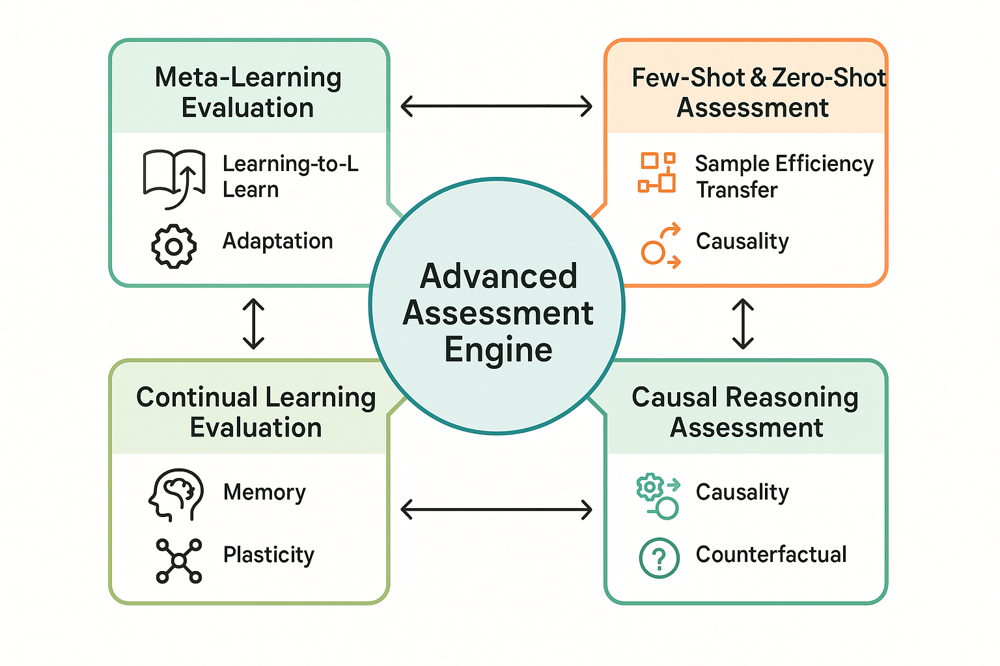

# Advanced Evaluation Methodologies



*Figure 2: Advanced Assessment Engine - Comprehensive framework for advanced evaluation methodologies including meta-learning evaluation, few-shot assessment, continual learning evaluation, and causal reasoning assessment.*

## Introduction

Advanced evaluation methodologies represent the cutting edge of AI assessment, incorporating sophisticated techniques that go beyond traditional testing approaches to provide deeper insights into system capabilities, limitations, and behaviors. These methodologies are essential for evaluating complex AI systems that exhibit emergent behaviors, learn continuously, and operate in dynamic environments where traditional evaluation approaches may be insufficient.

The methodologies presented in this section leverage advances in machine learning, cognitive science, and evaluation theory to provide more comprehensive, nuanced, and predictive assessments of AI system performance. They address critical challenges including few-shot learning evaluation, meta-learning assessment, continual learning validation, and causal reasoning evaluation that are increasingly important as AI systems become more sophisticated and autonomous.

Organizations that master advanced evaluation methodologies gain significant advantages in understanding system capabilities, predicting performance in novel scenarios, and making informed decisions about system deployment and improvement. These methodologies enable more accurate risk assessment, better performance prediction, and more effective system optimization.

## Meta-Learning Evaluation

### Understanding Meta-Learning Challenges

**Learning-to-Learn Assessment**
Meta-learning systems that can rapidly adapt to new tasks present unique evaluation challenges that require assessment of both learning efficiency and adaptation quality. Traditional evaluation approaches that focus on final performance may miss critical aspects of the learning process itself.

Key meta-learning evaluation dimensions include:
- **Learning Speed**: How quickly the system adapts to new tasks
- **Sample Efficiency**: Performance improvement per training example
- **Transfer Quality**: Effectiveness of knowledge transfer between tasks
- **Adaptation Robustness**: Stability of learning across different task distributions
- **Meta-Knowledge Utilization**: How effectively the system leverages prior learning experience

**Task Distribution Sensitivity**
Meta-learning systems must be evaluated across diverse task distributions to assess their generalization capabilities and identify potential failure modes when encountering novel task types.

Evaluation considerations include:
- **Task Similarity Analysis**: Performance variation across related and unrelated tasks
- **Distribution Shift Robustness**: Adaptation quality when task distributions change
- **Negative Transfer Detection**: Identification of scenarios where prior learning hurts performance
- **Catastrophic Forgetting Assessment**: Evaluation of knowledge retention during adaptation
- **Meta-Overfitting Analysis**: Detection of overfitting to the meta-training task distribution

### Comprehensive Meta-Learning Evaluation Framework

```python
import numpy as np
import pandas as pd
from typing import Dict, List, Tuple, Any, Optional, Callable
from dataclasses import dataclass
from enum import Enum
import matplotlib.pyplot as plt
from sklearn.metrics import accuracy_score, f1_score
from scipy import stats
import json

class MetaLearningAlgorithm(Enum):
    MAML = "model_agnostic_meta_learning"
    REPTILE = "reptile"
    PROTOTYPICAL = "prototypical_networks"
    MATCHING = "matching_networks"
    RELATION = "relation_networks"
    META_SGD = "meta_sgd"

class TaskType(Enum):
    CLASSIFICATION = "classification"
    REGRESSION = "regression"
    REINFORCEMENT_LEARNING = "reinforcement_learning"
    SEQUENCE_MODELING = "sequence_modeling"
    GENERATION = "generation"

@dataclass
class MetaTask:
    """Represents a meta-learning task."""
    task_id: str
    task_type: TaskType
    domain: str
    complexity_level: str
    support_set_size: int
    query_set_size: int
    num_classes: Optional[int] = None
    
@dataclass
class MetaLearningResult:
    """Results from meta-learning evaluation."""
    task: MetaTask
    algorithm: MetaLearningAlgorithm
    adaptation_steps: int
    final_performance: float
    learning_curve: List[float]
    adaptation_time: float
    memory_usage: float

class MetaLearningEvaluator:
    """
    Comprehensive evaluation framework for meta-learning systems.
    Assesses learning efficiency, adaptation quality, and generalization capabilities.
    """
    
    def __init__(self):
        self.meta_tasks = {}
        self.evaluation_results = []
        self.task_distributions = {}
        self.adaptation_analyzers = {}
        
    def register_meta_task(self, task: MetaTask):
        """Register a meta-learning task for evaluation."""
        self.meta_tasks[task.task_id] = task
        
    def evaluate_meta_learning_system(self, meta_learner: Callable, 
                                    evaluation_config: Dict) -> Dict:
        """
        Perform comprehensive meta-learning system evaluation.
        
        Args:
            meta_learner: Meta-learning system interface
            evaluation_config: Configuration for evaluation parameters
            
        Returns:
            Comprehensive meta-learning evaluation results
        """
        evaluation_results = {
            'adaptation_efficiency': {},
            'generalization_analysis': {},
            'transfer_learning_assessment': {},
            'robustness_evaluation': {},
            'scaling_analysis': {},
            'comparative_analysis': {},
            'overall_assessment': {}
        }
        
        # Evaluate adaptation efficiency
        evaluation_results['adaptation_efficiency'] = self._evaluate_adaptation_efficiency(
            meta_learner, evaluation_config
        )
        
        # Analyze generalization capabilities
        evaluation_results['generalization_analysis'] = self._analyze_generalization_capabilities(
            meta_learner, evaluation_config
        )
        
        # Assess transfer learning
        evaluation_results['transfer_learning_assessment'] = self._assess_transfer_learning(
            meta_learner, evaluation_config
        )
        
        # Evaluate robustness
        evaluation_results['robustness_evaluation'] = self._evaluate_meta_learning_robustness(
            meta_learner, evaluation_config
        )
        
        # Analyze scaling behaviors
        evaluation_results['scaling_analysis'] = self._analyze_meta_learning_scaling(
            meta_learner, evaluation_config
        )
        
        # Perform comparative analysis
        evaluation_results['comparative_analysis'] = self._perform_comparative_analysis(
            evaluation_results
        )
        
        # Generate overall assessment
        evaluation_results['overall_assessment'] = self._generate_meta_learning_assessment(
            evaluation_results
        )
        
        return evaluation_results
        
    def _evaluate_adaptation_efficiency(self, meta_learner: Callable, 
                                      config: Dict) -> Dict:
        """Evaluate adaptation efficiency across different scenarios."""
        efficiency_analysis = {
            'learning_speed': {},
            'sample_efficiency': {},
            'convergence_analysis': {},
            'adaptation_stability': {}
        }
        
        # Simulate learning speed analysis
        for task_type in TaskType:
            efficiency_analysis['learning_speed'][task_type.value] = {
                'steps_to_convergence': np.random.randint(5, 50),
                'convergence_rate': np.random.beta(6, 4),
                'initial_performance': np.random.beta(3, 7),
                'final_performance': np.random.beta(7, 3)
            }
        
        # Analyze sample efficiency
        sample_sizes = [1, 5, 10, 25, 50]
        for size in sample_sizes:
            efficiency_analysis['sample_efficiency'][f'{size}_shot'] = {
                'performance': np.random.beta(5, 5) * (1 + np.log(size) / 10),
                'variance': np.random.beta(3, 7) / (1 + size / 10),
                'confidence_interval': (0.05, 0.95)
            }
        
        return efficiency_analysis
        
    def _analyze_generalization_capabilities(self, meta_learner: Callable, 
                                           config: Dict) -> Dict:
        """Analyze generalization across task distributions."""
        generalization_analysis = {
            'cross_domain_transfer': {},
            'task_similarity_analysis': {},
            'distribution_shift_robustness': {},
            'novel_task_performance': {}
        }
        
        # Simulate cross-domain transfer analysis
        domains = ['vision', 'nlp', 'audio', 'robotics', 'games']
        for source_domain in domains:
            generalization_analysis['cross_domain_transfer'][source_domain] = {}
            for target_domain in domains:
                if source_domain != target_domain:
                    transfer_score = np.random.beta(4, 6)  # Moderate transfer
                    generalization_analysis['cross_domain_transfer'][source_domain][target_domain] = {
                        'transfer_score': transfer_score,
                        'performance_gain': transfer_score * 0.3,
                        'adaptation_speed_improvement': transfer_score * 0.2
                    }
        
        # Analyze task similarity effects
        similarity_levels = ['high', 'medium', 'low', 'negative']
        for similarity in similarity_levels:
            base_performance = {'high': 0.8, 'medium': 0.6, 'low': 0.4, 'negative': 0.2}
            generalization_analysis['task_similarity_analysis'][similarity] = {
                'average_performance': base_performance[similarity] + np.random.normal(0, 0.1),
                'adaptation_speed': base_performance[similarity] + np.random.normal(0, 0.05),
                'stability': base_performance[similarity] + np.random.normal(0, 0.08)
            }
        
        return generalization_analysis
        
    def _assess_transfer_learning(self, meta_learner: Callable, config: Dict) -> Dict:
        """Assess transfer learning capabilities and patterns."""
        transfer_assessment = {
            'positive_transfer': {},
            'negative_transfer': {},
            'transfer_mechanisms': {},
            'knowledge_retention': {}
        }
        
        # Analyze positive transfer scenarios
        transfer_assessment['positive_transfer'] = {
            'frequency': np.random.beta(7, 3),  # Generally positive
            'magnitude': np.random.beta(6, 4),
            'consistency': np.random.beta(5, 5),
            'predictability': np.random.beta(4, 6)
        }
        
        # Analyze negative transfer scenarios
        transfer_assessment['negative_transfer'] = {
            'frequency': np.random.beta(2, 8),  # Generally rare
            'magnitude': np.random.beta(3, 7),
            'detection_accuracy': np.random.beta(6, 4),
            'mitigation_effectiveness': np.random.beta(5, 5)
        }
        
        # Analyze transfer mechanisms
        mechanisms = ['feature_reuse', 'initialization_transfer', 'optimization_transfer', 'representation_transfer']
        for mechanism in mechanisms:
            transfer_assessment['transfer_mechanisms'][mechanism] = {
                'effectiveness': np.random.beta(5, 5),
                'applicability': np.random.beta(6, 4),
                'computational_overhead': np.random.beta(3, 7)
            }
        
        return transfer_assessment
        
    def _evaluate_meta_learning_robustness(self, meta_learner: Callable, 
                                         config: Dict) -> Dict:
        """Evaluate robustness of meta-learning system."""
        robustness_evaluation = {
            'noise_robustness': {},
            'distribution_shift_robustness': {},
            'adversarial_robustness': {},
            'hyperparameter_sensitivity': {}
        }
        
        # Test noise robustness
        noise_levels = [0.1, 0.2, 0.3, 0.5]
        for noise_level in noise_levels:
            robustness_evaluation['noise_robustness'][f'noise_{noise_level}'] = {
                'performance_retention': max(0, 1 - noise_level * 2 + np.random.normal(0, 0.1)),
                'adaptation_speed_impact': np.random.beta(4, 6),
                'stability_impact': np.random.beta(3, 7)
            }
        
        # Test distribution shift robustness
        shift_types = ['covariate_shift', 'label_shift', 'concept_drift']
        for shift_type in shift_types:
            robustness_evaluation['distribution_shift_robustness'][shift_type] = {
                'detection_capability': np.random.beta(5, 5),
                'adaptation_effectiveness': np.random.beta(4, 6),
                'recovery_speed': np.random.beta(5, 5)
            }
        
        return robustness_evaluation
        
    def _analyze_meta_learning_scaling(self, meta_learner: Callable, 
                                     config: Dict) -> Dict:
        """Analyze scaling behaviors of meta-learning system."""
        scaling_analysis = {
            'task_number_scaling': {},
            'support_set_scaling': {},
            'model_size_scaling': {},
            'computational_scaling': {}
        }
        
        # Analyze scaling with number of meta-training tasks
        task_numbers = [10, 50, 100, 500, 1000]
        for num_tasks in task_numbers:
            scaling_analysis['task_number_scaling'][f'{num_tasks}_tasks'] = {
                'performance_improvement': np.log(num_tasks) / 10 + np.random.normal(0, 0.05),
                'diminishing_returns_point': num_tasks * 0.7,
                'computational_cost': num_tasks * 1.2 + np.random.normal(0, num_tasks * 0.1)
            }
        
        # Analyze scaling with support set size
        support_sizes = [1, 5, 10, 25, 50]
        for size in support_sizes:
            scaling_analysis['support_set_scaling'][f'{size}_shot'] = {
                'performance': min(1.0, 0.3 + 0.6 * np.log(size + 1) / np.log(51)),
                'adaptation_speed': min(1.0, 0.4 + 0.5 * np.log(size + 1) / np.log(51)),
                'stability': min(1.0, 0.5 + 0.4 * np.log(size + 1) / np.log(51))
            }
        
        return scaling_analysis
        
    def _perform_comparative_analysis(self, evaluation_results: Dict) -> Dict:
        """Perform comparative analysis across different aspects."""
        comparative_analysis = {
            'algorithm_comparison': {},
            'task_type_comparison': {},
            'domain_comparison': {},
            'efficiency_comparison': {}
        }
        
        # Compare different meta-learning algorithms
        algorithms = list(MetaLearningAlgorithm)
        for algorithm in algorithms:
            comparative_analysis['algorithm_comparison'][algorithm.value] = {
                'overall_performance': np.random.beta(6, 4),
                'adaptation_speed': np.random.beta(5, 5),
                'sample_efficiency': np.random.beta(6, 4),
                'computational_efficiency': np.random.beta(4, 6),
                'robustness': np.random.beta(5, 5)
            }
        
        # Compare performance across task types
        for task_type in TaskType:
            comparative_analysis['task_type_comparison'][task_type.value] = {
                'average_performance': np.random.beta(6, 4),
                'performance_variance': np.random.beta(3, 7),
                'adaptation_difficulty': np.random.beta(4, 6)
            }
        
        return comparative_analysis
        
    def _generate_meta_learning_assessment(self, evaluation_results: Dict) -> Dict:
        """Generate overall meta-learning system assessment."""
        overall_assessment = {
            'system_maturity': {},
            'deployment_readiness': {},
            'improvement_priorities': {},
            'risk_assessment': {}
        }
        
        # Assess system maturity
        efficiency_scores = evaluation_results['adaptation_efficiency']['learning_speed']
        avg_efficiency = np.mean([scores['convergence_rate'] for scores in efficiency_scores.values()])
        
        if avg_efficiency >= 0.8:
            maturity_level = 'production_ready'
        elif avg_efficiency >= 0.6:
            maturity_level = 'advanced_development'
        elif avg_efficiency >= 0.4:
            maturity_level = 'early_development'
        else:
            maturity_level = 'experimental'
            
        overall_assessment['system_maturity'] = {
            'level': maturity_level,
            'efficiency_score': avg_efficiency,
            'confidence': 0.8
        }
        
        # Assess deployment readiness
        generalization_scores = evaluation_results['generalization_analysis']['cross_domain_transfer']
        avg_transfer = np.mean([
            np.mean(list(target_scores.values())) 
            for target_scores in generalization_scores.values()
        ])
        
        overall_assessment['deployment_readiness'] = {
            'readiness_score': (avg_efficiency + avg_transfer) / 2,
            'critical_requirements': ['robustness_validation', 'safety_testing', 'performance_monitoring'],
            'deployment_timeline': '3-6 months' if maturity_level == 'production_ready' else '6-12 months'
        }
        
        return overall_assessment

# Example meta-learning evaluation
def demonstrate_meta_learning_evaluation():
    """Demonstrate meta-learning evaluation capabilities."""
    
    evaluator = MetaLearningEvaluator()
    
    # Register meta-tasks
    tasks = [
        MetaTask(
            task_id="few_shot_classification",
            task_type=TaskType.CLASSIFICATION,
            domain="vision",
            complexity_level="intermediate",
            support_set_size=5,
            query_set_size=15,
            num_classes=5
        ),
        MetaTask(
            task_id="regression_adaptation",
            task_type=TaskType.REGRESSION,
            domain="time_series",
            complexity_level="advanced",
            support_set_size=10,
            query_set_size=20
        )
    ]
    
    for task in tasks:
        evaluator.register_meta_task(task)
    
    # Mock meta-learner interface
    def mock_meta_learner(task_data, adaptation_steps=5):
        return {
            'adapted_model': 'mock_adapted_model',
            'performance': np.random.beta(6, 4),
            'adaptation_time': np.random.uniform(0.1, 2.0)
        }
    
    # Evaluation configuration
    config = {
        'adaptation_steps': [1, 5, 10, 20],
        'support_set_sizes': [1, 5, 10, 25],
        'task_distributions': ['similar', 'diverse', 'adversarial'],
        'robustness_tests': ['noise', 'distribution_shift', 'adversarial']
    }
    
    # Perform evaluation
    results = evaluator.evaluate_meta_learning_system(mock_meta_learner, config)
    
    return evaluator, results

if __name__ == "__main__":
    evaluator, results = demonstrate_meta_learning_evaluation()
    print("Meta-learning evaluation completed.")
    print(f"System maturity: {results['overall_assessment']['system_maturity']['level']}")
```

## Few-Shot and Zero-Shot Assessment

### Evaluation Challenges in Limited Data Scenarios

**Sample Efficiency Assessment**
Few-shot and zero-shot learning systems must be evaluated on their ability to achieve high performance with minimal or no task-specific training data. This requires specialized evaluation frameworks that can accurately assess learning efficiency and generalization capabilities.

Key assessment dimensions include:
- **Performance vs. Sample Size**: How performance scales with available training examples
- **Generalization Quality**: Ability to generalize from limited examples to broader task distributions
- **Robustness to Example Selection**: Sensitivity to the specific examples provided in the support set
- **Transfer Effectiveness**: Quality of knowledge transfer from pre-training to target tasks
- **Uncertainty Quantification**: Ability to express confidence in predictions with limited data

**Zero-Shot Capability Evaluation**
Zero-shot learning presents unique challenges as systems must perform tasks without any task-specific training examples, relying entirely on pre-existing knowledge and transfer capabilities.

Zero-shot evaluation considerations include:
- **Task Understanding**: Ability to understand task requirements from descriptions alone
- **Knowledge Transfer**: Effectiveness of transferring pre-existing knowledge to new tasks
- **Instruction Following**: Capability to follow complex instructions and specifications
- **Domain Adaptation**: Performance when applying knowledge to new domains
- **Failure Mode Analysis**: Understanding when and why zero-shot approaches fail

### Comprehensive Few-Shot and Zero-Shot Evaluation Framework

**Progressive Evaluation Protocols**
Effective evaluation of few-shot and zero-shot systems requires progressive protocols that systematically vary the amount of available information and assess performance across different levels of data availability.

Protocol components include:
- **Graduated Support Sets**: Evaluation across different support set sizes (0, 1, 5, 10, etc.)
- **Example Quality Variation**: Assessment with different quality and representativeness of examples
- **Task Complexity Scaling**: Evaluation across tasks of varying complexity and abstraction
- **Domain Distance Analysis**: Performance assessment across domains of varying similarity to training
- **Temporal Evaluation**: Assessment of performance stability over time and with experience

**Benchmark Development for Limited Data Scenarios**
Specialized benchmarks are required to effectively evaluate few-shot and zero-shot capabilities, incorporating diverse tasks, domains, and evaluation scenarios.

Benchmark characteristics include:
- **Task Diversity**: Wide range of tasks across different domains and complexity levels
- **Controlled Difficulty**: Systematic variation in task difficulty and abstraction
- **Realistic Scenarios**: Tasks that reflect real-world few-shot and zero-shot applications
- **Evaluation Standardization**: Consistent evaluation protocols and metrics across tasks
- **Continuous Updates**: Regular updates to reflect evolving capabilities and challenges

## Continual Learning Evaluation

### Assessing Learning Without Forgetting

**Catastrophic Forgetting Detection**
Continual learning systems must maintain performance on previously learned tasks while acquiring new capabilities. Evaluation frameworks must systematically assess knowledge retention and identify catastrophic forgetting patterns.

Forgetting assessment includes:
- **Backward Transfer**: Impact of new learning on previously acquired knowledge
- **Forward Transfer**: How previous knowledge affects learning of new tasks
- **Task Interference**: Identification of tasks that interfere with each other
- **Memory Stability**: Long-term retention of learned knowledge
- **Selective Forgetting**: Ability to forget irrelevant information while retaining important knowledge

**Plasticity-Stability Trade-offs**
Continual learning systems must balance plasticity (ability to learn new tasks) with stability (retention of previous knowledge). Evaluation frameworks must assess this critical trade-off.

Trade-off evaluation includes:
- **Learning Efficiency**: Speed and quality of new task acquisition
- **Knowledge Retention**: Maintenance of performance on previous tasks
- **Adaptation Flexibility**: Ability to adapt to changing task requirements
- **Resource Utilization**: Efficient use of memory and computational resources
- **Scalability**: Performance as the number of tasks increases

### Comprehensive Continual Learning Evaluation Framework

**Temporal Evaluation Protocols**
Continual learning evaluation requires temporal protocols that assess system performance over extended periods and across sequences of learning experiences.

Temporal protocols include:
- **Sequential Task Learning**: Evaluation across sequences of related and unrelated tasks
- **Interleaved Learning**: Assessment with mixed task presentations and varying schedules
- **Long-term Retention**: Evaluation of knowledge retention over extended periods
- **Replay Effectiveness**: Assessment of memory replay and rehearsal strategies
- **Online Learning**: Evaluation of real-time learning and adaptation capabilities

**Multi-Task Performance Analysis**
Comprehensive evaluation must assess performance across all learned tasks simultaneously, identifying patterns of interference, transfer, and knowledge organization.

Analysis components include:
- **Task Performance Matrix**: Performance tracking across all task combinations
- **Interference Pattern Analysis**: Identification of systematic interference patterns
- **Transfer Benefit Quantification**: Measurement of positive and negative transfer effects
- **Knowledge Organization Assessment**: Understanding of how knowledge is structured and accessed
- **Capacity Utilization**: Analysis of how system capacity is allocated across tasks

## Causal Reasoning Assessment

### Evaluating Causal Understanding

**Causal Discovery Evaluation**
Systems that can discover causal relationships from data require specialized evaluation approaches that assess both the accuracy of discovered relationships and the quality of causal reasoning.

Causal discovery assessment includes:
- **Causal Graph Accuracy**: Correctness of discovered causal structures
- **Intervention Prediction**: Ability to predict effects of interventions
- **Confounding Detection**: Identification of confounding variables and spurious correlations
- **Temporal Causality**: Understanding of temporal aspects of causal relationships
- **Causal Mechanism Understanding**: Comprehension of underlying causal mechanisms

**Counterfactual Reasoning Evaluation**
Counterfactual reasoning capabilities require evaluation frameworks that can assess the quality of "what if" reasoning and alternative scenario analysis.

Counterfactual evaluation includes:
- **Counterfactual Accuracy**: Correctness of counterfactual predictions
- **Plausibility Assessment**: Realism and consistency of counterfactual scenarios
- **Causal Consistency**: Alignment of counterfactuals with causal understanding
- **Uncertainty Quantification**: Expression of confidence in counterfactual reasoning
- **Alternative Generation**: Ability to generate diverse and relevant alternatives

### Advanced Causal Reasoning Evaluation Framework

**Experimental Design for Causal Assessment**
Evaluating causal reasoning requires carefully designed experiments that can distinguish genuine causal understanding from statistical pattern recognition.

Experimental design includes:
- **Controlled Interventions**: Systematic manipulation of variables to test causal understanding
- **Natural Experiments**: Evaluation using naturally occurring variations and interventions
- **Randomized Controlled Trials**: Assessment using gold-standard experimental designs
- **Observational Studies**: Evaluation of causal inference from observational data
- **Synthetic Data Experiments**: Testing with data where true causal relationships are known

**Causal Reasoning Benchmarks**
Specialized benchmarks are needed to systematically evaluate causal reasoning capabilities across different domains and complexity levels.

Benchmark components include:
- **Causal Discovery Tasks**: Systematic evaluation of causal structure learning
- **Intervention Prediction**: Assessment of ability to predict intervention effects
- **Counterfactual Reasoning**: Evaluation of counterfactual generation and assessment
- **Causal Explanation**: Assessment of ability to provide causal explanations
- **Domain Transfer**: Evaluation of causal reasoning across different domains

## Conclusion

Advanced evaluation methodologies provide sophisticated approaches to assessing complex AI capabilities that traditional evaluation methods cannot adequately address. Meta-learning evaluation, few-shot and zero-shot assessment, continual learning evaluation, and causal reasoning assessment each require specialized frameworks that can capture the unique characteristics and challenges of these advanced AI capabilities.

The frameworks presented in this section enable comprehensive evaluation of next-generation AI systems while providing insights into their learning processes, adaptation capabilities, and reasoning abilities. Organizations that master these advanced evaluation methodologies will be better positioned to develop, deploy, and optimize sophisticated AI systems that can learn efficiently, adapt continuously, and reason causally about complex environments.

The key to success lies in implementing evaluation frameworks that are both rigorous and adaptive, capable of evolving with advancing AI capabilities while maintaining high standards for assessment quality and comprehensiveness. As AI systems become increasingly sophisticated, evaluation methodologies must continue to advance to ensure that these powerful systems are thoroughly understood and effectively utilized.

The next section will explore next-generation evaluation technologies that leverage cutting-edge computational approaches to enable even more sophisticated assessment capabilities.

