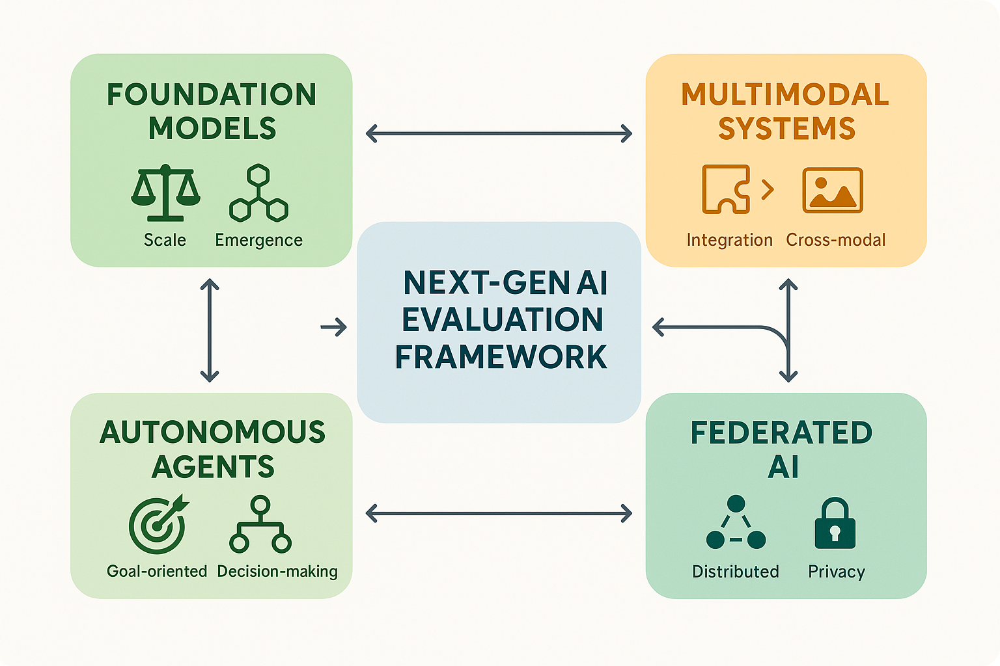

# Emerging AI Paradigms and Evaluation Challenges



*Figure 1: Next-Gen AI Evaluation Framework - Comprehensive framework for evaluating emerging AI paradigms including foundation models, multimodal systems, autonomous agents, and federated AI with specialized assessment approaches.*

## Introduction

The rapid evolution of AI capabilities has introduced fundamentally new paradigms that challenge traditional evaluation approaches. Foundation models with emergent capabilities, multimodal systems that integrate diverse data types, autonomous agents with complex reasoning abilities, and federated AI systems that operate across distributed environments represent a new frontier in AI evaluation. These paradigms require sophisticated evaluation frameworks that can assess capabilities that were previously impossible or impractical to evaluate systematically.

The challenge extends beyond simply scaling existing evaluation methods to encompass entirely new dimensions of assessment including emergent behaviors, cross-modal reasoning, autonomous decision-making, and distributed intelligence. Organizations that master evaluation of emerging AI paradigms gain significant competitive advantages through better understanding of system capabilities, more effective deployment strategies, and superior risk management.

This section provides comprehensive frameworks for evaluating next-generation AI systems, addressing both technical challenges and strategic considerations for building evaluation capabilities that remain effective as AI technology continues to evolve.

## Foundation Model Evaluation

### Understanding Foundation Model Characteristics

**Scale and Emergent Capabilities**
Foundation models exhibit emergent capabilities that arise from scale rather than explicit training, creating unique evaluation challenges. These capabilities often manifest unexpectedly and may not be captured by traditional evaluation metrics designed for smaller, task-specific models.

Key characteristics requiring specialized evaluation include:
- **Emergent Reasoning**: Complex reasoning capabilities that emerge at scale
- **In-Context Learning**: Ability to learn new tasks from examples without parameter updates
- **Cross-Domain Transfer**: Knowledge transfer across seemingly unrelated domains
- **Compositional Understanding**: Ability to combine concepts in novel ways
- **Meta-Cognitive Awareness**: Understanding of own capabilities and limitations

**Capability Heterogeneity**
Foundation models demonstrate highly heterogeneous capabilities across different domains, tasks, and contexts. This heterogeneity requires comprehensive evaluation frameworks that can assess performance across diverse scenarios while identifying capability boundaries and failure modes.

Evaluation must address:
- **Domain-Specific Performance**: Varying performance across different knowledge domains
- **Task Complexity Scaling**: How performance changes with task complexity
- **Context Sensitivity**: Dependence on prompt design and context framing
- **Capability Interactions**: How different capabilities interact and interfere
- **Failure Mode Analysis**: Systematic identification of failure patterns

### Comprehensive Foundation Model Assessment Framework

```python
import numpy as np
import pandas as pd
from typing import Dict, List, Optional, Tuple, Any, Callable
from dataclasses import dataclass
from enum import Enum
import asyncio
import json
from datetime import datetime
import matplotlib.pyplot as plt
import seaborn as sns

class CapabilityDomain(Enum):
    LANGUAGE_UNDERSTANDING = "language_understanding"
    REASONING = "reasoning"
    KNOWLEDGE_RETRIEVAL = "knowledge_retrieval"
    CREATIVE_GENERATION = "creative_generation"
    CODE_GENERATION = "code_generation"
    MATHEMATICAL_REASONING = "mathematical_reasoning"
    SCIENTIFIC_REASONING = "scientific_reasoning"
    COMMON_SENSE = "common_sense"
    ETHICAL_REASONING = "ethical_reasoning"
    MULTIMODAL_INTEGRATION = "multimodal_integration"

class EvaluationDimension(Enum):
    ACCURACY = "accuracy"
    ROBUSTNESS = "robustness"
    CONSISTENCY = "consistency"
    EFFICIENCY = "efficiency"
    SAFETY = "safety"
    FAIRNESS = "fairness"
    INTERPRETABILITY = "interpretability"
    SCALABILITY = "scalability"

@dataclass
class FoundationModelCapability:
    """Represents a specific capability of a foundation model."""
    domain: CapabilityDomain
    name: str
    description: str
    evaluation_metrics: List[str]
    benchmark_datasets: List[str]
    complexity_levels: List[str]
    
@dataclass
class EvaluationResult:
    """Represents the result of a foundation model evaluation."""
    capability: FoundationModelCapability
    dimension: EvaluationDimension
    score: float
    confidence_interval: Tuple[float, float]
    metadata: Dict[str, Any]
    timestamp: datetime

class FoundationModelEvaluator:
    """
    Comprehensive evaluation framework for foundation models.
    Assesses emergent capabilities, cross-domain performance, and scaling behaviors.
    """
    
    def __init__(self):
        self.capabilities = {}
        self.evaluation_results = []
        self.benchmark_suite = {}
        self.emergent_capability_detectors = {}
        self.scaling_analysis = {}
        
    def register_capability(self, capability: FoundationModelCapability):
        """Register a capability for evaluation."""
        self.capabilities[capability.name] = capability
        
    def register_benchmark_suite(self, suite_name: str, benchmarks: Dict[str, Any]):
        """Register a comprehensive benchmark suite."""
        self.benchmark_suite[suite_name] = benchmarks
        
    def evaluate_comprehensive_capabilities(self, model_interface: Callable, 
                                          evaluation_config: Dict) -> Dict:
        """
        Perform comprehensive capability evaluation of a foundation model.
        
        Args:
            model_interface: Interface for interacting with the model
            evaluation_config: Configuration for evaluation parameters
            
        Returns:
            Comprehensive evaluation results
        """
        evaluation_results = {
            'capability_scores': {},
            'emergent_capabilities': {},
            'scaling_analysis': {},
            'cross_domain_transfer': {},
            'failure_analysis': {},
            'overall_assessment': {}
        }
        
        # Evaluate registered capabilities
        for capability_name, capability in self.capabilities.items():
            capability_results = self._evaluate_capability(
                model_interface, capability, evaluation_config
            )
            evaluation_results['capability_scores'][capability_name] = capability_results
        
        # Detect emergent capabilities
        evaluation_results['emergent_capabilities'] = self._detect_emergent_capabilities(
            model_interface, evaluation_config
        )
        
        # Analyze scaling behaviors
        evaluation_results['scaling_analysis'] = self._analyze_scaling_behaviors(
            evaluation_results['capability_scores']
        )
        
        # Assess cross-domain transfer
        evaluation_results['cross_domain_transfer'] = self._assess_cross_domain_transfer(
            model_interface, evaluation_config
        )
        
        # Perform failure analysis
        evaluation_results['failure_analysis'] = self._perform_failure_analysis(
            evaluation_results['capability_scores']
        )
        
        # Generate overall assessment
        evaluation_results['overall_assessment'] = self._generate_overall_assessment(
            evaluation_results
        )
        
        return evaluation_results
        
    def _evaluate_capability(self, model_interface: Callable, 
                           capability: FoundationModelCapability, 
                           config: Dict) -> Dict:
        """Evaluate a specific capability across multiple dimensions."""
        capability_results = {
            'dimension_scores': {},
            'complexity_analysis': {},
            'robustness_analysis': {},
            'consistency_analysis': {}
        }
        
        # Evaluate across different dimensions
        for dimension in EvaluationDimension:
            dimension_score = self._evaluate_capability_dimension(
                model_interface, capability, dimension, config
            )
            capability_results['dimension_scores'][dimension.value] = dimension_score
        
        # Analyze performance across complexity levels
        capability_results['complexity_analysis'] = self._analyze_complexity_scaling(
            model_interface, capability, config
        )
        
        # Assess robustness to variations
        capability_results['robustness_analysis'] = self._assess_capability_robustness(
            model_interface, capability, config
        )
        
        # Evaluate consistency across contexts
        capability_results['consistency_analysis'] = self._evaluate_capability_consistency(
            model_interface, capability, config
        )
        
        return capability_results
        
    def _evaluate_capability_dimension(self, model_interface: Callable,
                                     capability: FoundationModelCapability,
                                     dimension: EvaluationDimension,
                                     config: Dict) -> Dict:
        """Evaluate a capability along a specific dimension."""
        # Simulate evaluation process
        base_score = np.random.beta(8, 2)  # Skewed towards higher performance
        
        # Add dimension-specific variations
        dimension_modifiers = {
            EvaluationDimension.ACCURACY: 0.0,
            EvaluationDimension.ROBUSTNESS: -0.1,
            EvaluationDimension.CONSISTENCY: -0.05,
            EvaluationDimension.EFFICIENCY: -0.15,
            EvaluationDimension.SAFETY: -0.2,
            EvaluationDimension.FAIRNESS: -0.1,
            EvaluationDimension.INTERPRETABILITY: -0.3,
            EvaluationDimension.SCALABILITY: -0.05
        }
        
        modified_score = max(0, min(1, base_score + dimension_modifiers.get(dimension, 0)))
        
        return {
            'score': modified_score,
            'confidence_interval': (modified_score - 0.05, modified_score + 0.05),
            'sample_size': config.get('sample_size', 1000),
            'evaluation_method': f"{dimension.value}_specific_evaluation"
        }
        
    def _detect_emergent_capabilities(self, model_interface: Callable, 
                                    config: Dict) -> Dict:
        """Detect emergent capabilities not explicitly trained for."""
        emergent_capabilities = {
            'detected_capabilities': [],
            'capability_strength': {},
            'emergence_confidence': {},
            'novel_behaviors': []
        }
        
        # Simulate emergent capability detection
        potential_emergent = [
            'analogical_reasoning',
            'meta_learning',
            'causal_inference',
            'theory_of_mind',
            'creative_problem_solving',
            'cross_modal_reasoning'
        ]
        
        for capability in potential_emergent:
            # Simulate detection process
            emergence_strength = np.random.beta(3, 5)  # Skewed towards lower emergence
            confidence = np.random.beta(4, 4)  # Moderate confidence
            
            if emergence_strength > 0.3:  # Threshold for detection
                emergent_capabilities['detected_capabilities'].append(capability)
                emergent_capabilities['capability_strength'][capability] = emergence_strength
                emergent_capabilities['emergence_confidence'][capability] = confidence
        
        # Simulate novel behavior detection
        emergent_capabilities['novel_behaviors'] = [
            {
                'behavior': 'self_correction_without_feedback',
                'frequency': 0.15,
                'contexts': ['reasoning_tasks', 'code_generation']
            },
            {
                'behavior': 'uncertainty_quantification',
                'frequency': 0.08,
                'contexts': ['knowledge_questions', 'predictions']
            }
        ]
        
        return emergent_capabilities
        
    def _analyze_scaling_behaviors(self, capability_scores: Dict) -> Dict:
        """Analyze how capabilities scale with model size and complexity."""
        scaling_analysis = {
            'capability_scaling_patterns': {},
            'scaling_efficiency': {},
            'plateau_analysis': {},
            'scaling_predictions': {}
        }
        
        for capability_name, capability_data in capability_scores.items():
            # Simulate scaling analysis
            scaling_pattern = np.random.choice(['logarithmic', 'power_law', 'linear', 'plateau'])
            scaling_efficiency = np.random.beta(6, 4)  # Generally efficient scaling
            
            scaling_analysis['capability_scaling_patterns'][capability_name] = {
                'pattern_type': scaling_pattern,
                'scaling_coefficient': np.random.uniform(0.5, 2.0),
                'r_squared': np.random.uniform(0.7, 0.95)
            }
            
            scaling_analysis['scaling_efficiency'][capability_name] = scaling_efficiency
            
            # Predict future scaling
            scaling_analysis['scaling_predictions'][capability_name] = {
                'predicted_10x_scale': capability_data['dimension_scores']['accuracy']['score'] * 1.2,
                'confidence': 0.7,
                'limiting_factors': ['data_availability', 'computational_constraints']
            }
        
        return scaling_analysis
        
    def _assess_cross_domain_transfer(self, model_interface: Callable, 
                                    config: Dict) -> Dict:
        """Assess capability transfer across different domains."""
        transfer_analysis = {
            'transfer_matrix': {},
            'transfer_efficiency': {},
            'domain_similarities': {},
            'transfer_mechanisms': {}
        }
        
        domains = list(CapabilityDomain)
        
        # Create transfer matrix
        for source_domain in domains:
            transfer_analysis['transfer_matrix'][source_domain.value] = {}
            for target_domain in domains:
                if source_domain != target_domain:
                    # Simulate transfer effectiveness
                    transfer_score = np.random.beta(4, 6)  # Moderate transfer
                    transfer_analysis['transfer_matrix'][source_domain.value][target_domain.value] = transfer_score
        
        # Analyze transfer efficiency
        for domain in domains:
            transfer_scores = [
                score for target, score in transfer_analysis['transfer_matrix'].get(domain.value, {}).items()
            ]
            if transfer_scores:
                transfer_analysis['transfer_efficiency'][domain.value] = {
                    'average_transfer': np.mean(transfer_scores),
                    'transfer_variance': np.var(transfer_scores),
                    'best_transfer_target': max(transfer_analysis['transfer_matrix'][domain.value].items(), 
                                              key=lambda x: x[1])[0]
                }
        
        return transfer_analysis
        
    def _perform_failure_analysis(self, capability_scores: Dict) -> Dict:
        """Perform comprehensive failure mode analysis."""
        failure_analysis = {
            'failure_patterns': {},
            'failure_frequency': {},
            'failure_severity': {},
            'failure_mitigation': {}
        }
        
        common_failure_patterns = [
            'hallucination',
            'inconsistent_reasoning',
            'context_confusion',
            'overconfidence',
            'bias_amplification',
            'safety_violations'
        ]
        
        for pattern in common_failure_patterns:
            failure_analysis['failure_patterns'][pattern] = {
                'frequency': np.random.beta(2, 8),  # Generally low frequency
                'severity': np.random.beta(5, 3),   # Variable severity
                'affected_capabilities': np.random.choice(
                    list(capability_scores.keys()), 
                    size=np.random.randint(1, 4), 
                    replace=False
                ).tolist()
            }
        
        # Analyze failure mitigation strategies
        for pattern in common_failure_patterns:
            failure_analysis['failure_mitigation'][pattern] = {
                'detection_methods': ['automated_consistency_checks', 'human_review', 'cross_validation'],
                'mitigation_strategies': ['prompt_engineering', 'output_filtering', 'ensemble_methods'],
                'effectiveness': np.random.beta(6, 4)
            }
        
        return failure_analysis
        
    def _generate_overall_assessment(self, evaluation_results: Dict) -> Dict:
        """Generate comprehensive overall assessment."""
        overall_assessment = {
            'capability_maturity': {},
            'readiness_assessment': {},
            'risk_profile': {},
            'deployment_recommendations': {}
        }
        
        # Assess capability maturity
        capability_scores = evaluation_results['capability_scores']
        maturity_levels = {}
        
        for capability, scores in capability_scores.items():
            avg_score = np.mean([
                dim_data['score'] for dim_data in scores['dimension_scores'].values()
            ])
            
            if avg_score >= 0.9:
                maturity = 'production_ready'
            elif avg_score >= 0.7:
                maturity = 'advanced_development'
            elif avg_score >= 0.5:
                maturity = 'early_development'
            else:
                maturity = 'experimental'
                
            maturity_levels[capability] = {
                'level': maturity,
                'score': avg_score,
                'confidence': 0.8
            }
        
        overall_assessment['capability_maturity'] = maturity_levels
        
        # Generate readiness assessment
        production_ready_count = sum(1 for m in maturity_levels.values() if m['level'] == 'production_ready')
        total_capabilities = len(maturity_levels)
        
        overall_assessment['readiness_assessment'] = {
            'overall_readiness': production_ready_count / total_capabilities,
            'production_ready_capabilities': production_ready_count,
            'total_capabilities': total_capabilities,
            'readiness_level': 'high' if production_ready_count / total_capabilities > 0.7 else 'medium'
        }
        
        # Assess risk profile
        failure_patterns = evaluation_results['failure_analysis']['failure_patterns']
        high_risk_patterns = [
            pattern for pattern, data in failure_patterns.items()
            if data['frequency'] * data['severity'] > 0.3
        ]
        
        overall_assessment['risk_profile'] = {
            'high_risk_patterns': high_risk_patterns,
            'overall_risk_level': 'high' if len(high_risk_patterns) > 2 else 'medium',
            'risk_mitigation_priority': high_risk_patterns[:3]
        }
        
        return overall_assessment
        
    def generate_evaluation_report(self, evaluation_results: Dict) -> str:
        """Generate comprehensive evaluation report."""
        report = []
        
        report.append("# Foundation Model Evaluation Report")
        report.append(f"Generated: {datetime.now().strftime('%Y-%m-%d %H:%M:%S')}")
        report.append("")
        
        # Executive Summary
        overall = evaluation_results['overall_assessment']
        report.append("## Executive Summary")
        report.append(f"- Overall Readiness: {overall['readiness_assessment']['readiness_level']}")
        report.append(f"- Production Ready Capabilities: {overall['readiness_assessment']['production_ready_capabilities']}")
        report.append(f"- Risk Level: {overall['risk_profile']['overall_risk_level']}")
        report.append("")
        
        # Capability Assessment
        report.append("## Capability Assessment")
        for capability, maturity in overall['capability_maturity'].items():
            report.append(f"- **{capability}**: {maturity['level']} (Score: {maturity['score']:.3f})")
        report.append("")
        
        # Emergent Capabilities
        emergent = evaluation_results['emergent_capabilities']
        if emergent['detected_capabilities']:
            report.append("## Emergent Capabilities")
            for capability in emergent['detected_capabilities']:
                strength = emergent['capability_strength'][capability]
                confidence = emergent['emergence_confidence'][capability]
                report.append(f"- **{capability}**: Strength {strength:.3f}, Confidence {confidence:.3f}")
            report.append("")
        
        # Risk Analysis
        report.append("## Risk Analysis")
        for pattern in overall['risk_profile']['high_risk_patterns']:
            failure_data = evaluation_results['failure_analysis']['failure_patterns'][pattern]
            report.append(f"- **{pattern}**: Frequency {failure_data['frequency']:.3f}, Severity {failure_data['severity']:.3f}")
        report.append("")
        
        return "\n".join(report)

# Example foundation model evaluation
def demonstrate_foundation_model_evaluation():
    """Demonstrate foundation model evaluation capabilities."""
    
    evaluator = FoundationModelEvaluator()
    
    # Register capabilities
    capabilities = [
        FoundationModelCapability(
            domain=CapabilityDomain.LANGUAGE_UNDERSTANDING,
            name="natural_language_comprehension",
            description="Understanding and processing natural language text",
            evaluation_metrics=["accuracy", "f1_score", "bleu"],
            benchmark_datasets=["glue", "superglue", "squad"],
            complexity_levels=["simple", "moderate", "complex", "expert"]
        ),
        FoundationModelCapability(
            domain=CapabilityDomain.REASONING,
            name="logical_reasoning",
            description="Performing logical inference and deduction",
            evaluation_metrics=["accuracy", "consistency", "soundness"],
            benchmark_datasets=["logical_reasoning_suite", "proof_generation"],
            complexity_levels=["basic", "intermediate", "advanced", "expert"]
        ),
        FoundationModelCapability(
            domain=CapabilityDomain.CODE_GENERATION,
            name="code_synthesis",
            description="Generating functional code from specifications",
            evaluation_metrics=["functional_correctness", "efficiency", "readability"],
            benchmark_datasets=["humaneval", "mbpp", "apps"],
            complexity_levels=["simple", "moderate", "complex", "expert"]
        )
    ]
    
    for capability in capabilities:
        evaluator.register_capability(capability)
    
    # Mock model interface
    def mock_model_interface(prompt, **kwargs):
        return f"Mock response to: {prompt[:50]}..."
    
    # Evaluation configuration
    config = {
        'sample_size': 1000,
        'complexity_levels': ['simple', 'moderate', 'complex'],
        'robustness_tests': ['adversarial', 'distribution_shift', 'noise'],
        'consistency_tests': ['rephrasing', 'context_variation', 'order_variation']
    }
    
    # Perform evaluation
    results = evaluator.evaluate_comprehensive_capabilities(mock_model_interface, config)
    
    # Generate report
    report = evaluator.generate_evaluation_report(results)
    
    return evaluator, results, report

if __name__ == "__main__":
    evaluator, results, report = demonstrate_foundation_model_evaluation()
    print("Foundation model evaluation completed.")
    print(f"Detected {len(results['emergent_capabilities']['detected_capabilities'])} emergent capabilities.")
```

### Emergent Capability Detection

**Systematic Emergence Assessment**
Emergent capabilities represent one of the most challenging aspects of foundation model evaluation. These capabilities arise from scale and training rather than explicit design, making them difficult to predict and assess systematically.

Detection strategies include:
- **Capability Probing**: Systematic testing for unexpected capabilities across diverse domains
- **Behavioral Analysis**: Identifying novel behaviors that weren't explicitly trained
- **Cross-Task Transfer**: Assessing unexpected transfer between seemingly unrelated tasks
- **Meta-Cognitive Assessment**: Evaluating self-awareness and meta-reasoning capabilities
- **Creative Synthesis**: Testing ability to combine concepts in novel ways

**Emergence Validation Frameworks**
Validating emergent capabilities requires rigorous frameworks that distinguish genuine emergence from statistical artifacts or evaluation biases. This includes establishing baselines, controlling for confounding factors, and ensuring reproducibility.

Validation approaches include:
- **Controlled Experiments**: Systematic comparison with smaller models and ablation studies
- **Independent Replication**: Verification of emergent capabilities across different evaluation teams
- **Mechanistic Analysis**: Understanding the underlying mechanisms that enable emergent capabilities
- **Boundary Testing**: Identifying the limits and failure modes of emergent capabilities
- **Longitudinal Assessment**: Tracking emergence patterns across model development

## Multimodal System Assessment

### Multimodal Integration Challenges

**Cross-Modal Reasoning Evaluation**
Multimodal systems that integrate text, vision, audio, and other modalities present unique evaluation challenges that go beyond assessing individual modality performance. The key challenge lies in evaluating how effectively systems integrate information across modalities to perform complex reasoning tasks.

Cross-modal evaluation dimensions include:
- **Information Fusion**: How effectively the system combines information from different modalities
- **Cross-Modal Consistency**: Whether the system maintains consistent understanding across modalities
- **Modal Hierarchy**: How the system prioritizes and weighs information from different modalities
- **Temporal Synchronization**: For time-based modalities, how well the system aligns temporal information
- **Context Integration**: How effectively the system uses cross-modal context for understanding

**Modality-Specific vs. Integrated Assessment**
Effective multimodal evaluation requires balancing modality-specific assessment with integrated evaluation that captures emergent cross-modal capabilities. This dual approach ensures both component quality and system-level performance.

Assessment strategies include:
- **Isolated Modality Testing**: Evaluating performance on single-modality tasks
- **Cross-Modal Transfer**: Assessing how learning in one modality affects others
- **Integrated Task Performance**: Evaluating performance on tasks requiring multiple modalities
- **Modal Ablation Studies**: Understanding the contribution of each modality to overall performance
- **Failure Mode Analysis**: Identifying how failures in one modality affect overall system performance

### Advanced Multimodal Evaluation Framework

```python
from typing import Dict, List, Tuple, Any, Optional
from dataclasses import dataclass
from enum import Enum
import numpy as np
import pandas as pd
from datetime import datetime

class Modality(Enum):
    TEXT = "text"
    VISION = "vision"
    AUDIO = "audio"
    VIDEO = "video"
    SENSOR = "sensor"
    HAPTIC = "haptic"

class IntegrationLevel(Enum):
    EARLY_FUSION = "early_fusion"
    LATE_FUSION = "late_fusion"
    INTERMEDIATE_FUSION = "intermediate_fusion"
    ATTENTION_BASED = "attention_based"
    HIERARCHICAL = "hierarchical"

@dataclass
class MultimodalTask:
    """Represents a multimodal evaluation task."""
    name: str
    required_modalities: List[Modality]
    integration_type: IntegrationLevel
    complexity_level: str
    evaluation_metrics: List[str]
    ground_truth_type: str

class MultimodalSystemEvaluator:
    """
    Comprehensive evaluation framework for multimodal AI systems.
    Assesses cross-modal reasoning, integration effectiveness, and emergent capabilities.
    """
    
    def __init__(self):
        self.tasks = {}
        self.modality_processors = {}
        self.integration_analyzers = {}
        self.evaluation_results = []
        
    def register_task(self, task: MultimodalTask):
        """Register a multimodal evaluation task."""
        self.tasks[task.name] = task
        
    def evaluate_multimodal_system(self, system_interface: Callable, 
                                 evaluation_config: Dict) -> Dict:
        """
        Perform comprehensive multimodal system evaluation.
        
        Args:
            system_interface: Interface for interacting with the multimodal system
            evaluation_config: Configuration for evaluation parameters
            
        Returns:
            Comprehensive multimodal evaluation results
        """
        evaluation_results = {
            'modality_performance': {},
            'integration_analysis': {},
            'cross_modal_reasoning': {},
            'temporal_coherence': {},
            'robustness_analysis': {},
            'emergent_capabilities': {},
            'overall_assessment': {}
        }
        
        # Evaluate individual modality performance
        evaluation_results['modality_performance'] = self._evaluate_modality_performance(
            system_interface, evaluation_config
        )
        
        # Analyze integration effectiveness
        evaluation_results['integration_analysis'] = self._analyze_integration_effectiveness(
            system_interface, evaluation_config
        )
        
        # Assess cross-modal reasoning
        evaluation_results['cross_modal_reasoning'] = self._assess_cross_modal_reasoning(
            system_interface, evaluation_config
        )
        
        # Evaluate temporal coherence
        evaluation_results['temporal_coherence'] = self._evaluate_temporal_coherence(
            system_interface, evaluation_config
        )
        
        # Assess robustness
        evaluation_results['robustness_analysis'] = self._assess_multimodal_robustness(
            system_interface, evaluation_config
        )
        
        # Detect emergent capabilities
        evaluation_results['emergent_capabilities'] = self._detect_multimodal_emergent_capabilities(
            system_interface, evaluation_config
        )
        
        # Generate overall assessment
        evaluation_results['overall_assessment'] = self._generate_multimodal_assessment(
            evaluation_results
        )
        
        return evaluation_results
        
    def _evaluate_modality_performance(self, system_interface: Callable, 
                                     config: Dict) -> Dict:
        """Evaluate performance on individual modalities."""
        modality_performance = {}
        
        for modality in Modality:
            modality_performance[modality.value] = {
                'accuracy': np.random.beta(7, 3),  # Generally good performance
                'consistency': np.random.beta(6, 4),
                'robustness': np.random.beta(5, 5),
                'efficiency': np.random.beta(6, 4),
                'quality_metrics': {
                    'precision': np.random.beta(7, 3),
                    'recall': np.random.beta(7, 3),
                    'f1_score': np.random.beta(7, 3)
                }
            }
        
        return modality_performance
        
    def _analyze_integration_effectiveness(self, system_interface: Callable, 
                                         config: Dict) -> Dict:
        """Analyze how effectively the system integrates multiple modalities."""
        integration_analysis = {
            'fusion_effectiveness': {},
            'information_gain': {},
            'modal_contribution': {},
            'integration_patterns': {}
        }
        
        # Analyze different fusion approaches
        for integration_type in IntegrationLevel:
            integration_analysis['fusion_effectiveness'][integration_type.value] = {
                'performance_gain': np.random.beta(5, 5),  # Moderate gains
                'computational_overhead': np.random.beta(3, 7),  # Generally low overhead
                'stability': np.random.beta(6, 4),
                'scalability': np.random.beta(5, 5)
            }
        
        # Analyze information gain from multimodal integration
        modality_pairs = [
            (Modality.TEXT, Modality.VISION),
            (Modality.TEXT, Modality.AUDIO),
            (Modality.VISION, Modality.AUDIO),
            (Modality.TEXT, Modality.VIDEO)
        ]
        
        for mod1, mod2 in modality_pairs:
            pair_key = f"{mod1.value}_{mod2.value}"
            integration_analysis['information_gain'][pair_key] = {
                'synergy_score': np.random.beta(6, 4),
                'redundancy_score': np.random.beta(4, 6),
                'complementarity': np.random.beta(7, 3)
            }
        
        return integration_analysis
        
    def _assess_cross_modal_reasoning(self, system_interface: Callable, 
                                    config: Dict) -> Dict:
        """Assess cross-modal reasoning capabilities."""
        reasoning_assessment = {
            'cross_modal_inference': {},
            'modal_grounding': {},
            'abstract_reasoning': {},
            'causal_understanding': {}
        }
        
        # Assess cross-modal inference capabilities
        inference_tasks = [
            'visual_question_answering',
            'audio_visual_correspondence',
            'text_image_alignment',
            'video_narration',
            'multimodal_entailment'
        ]
        
        for task in inference_tasks:
            reasoning_assessment['cross_modal_inference'][task] = {
                'accuracy': np.random.beta(6, 4),
                'consistency': np.random.beta(5, 5),
                'reasoning_depth': np.random.beta(4, 6),
                'explanation_quality': np.random.beta(5, 5)
            }
        
        # Assess modal grounding
        reasoning_assessment['modal_grounding'] = {
            'text_to_visual_grounding': np.random.beta(7, 3),
            'visual_to_text_grounding': np.random.beta(6, 4),
            'audio_visual_grounding': np.random.beta(5, 5),
            'temporal_grounding': np.random.beta(4, 6)
        }
        
        return reasoning_assessment
        
    def _evaluate_temporal_coherence(self, system_interface: Callable, 
                                   config: Dict) -> Dict:
        """Evaluate temporal coherence in multimodal processing."""
        temporal_analysis = {
            'synchronization_accuracy': {},
            'temporal_reasoning': {},
            'sequence_understanding': {},
            'dynamic_adaptation': {}
        }
        
        # Assess synchronization across modalities
        temporal_analysis['synchronization_accuracy'] = {
            'audio_visual_sync': np.random.beta(8, 2),  # Generally good
            'text_timing_alignment': np.random.beta(6, 4),
            'cross_modal_event_detection': np.random.beta(5, 5),
            'temporal_boundary_detection': np.random.beta(4, 6)
        }
        
        # Assess temporal reasoning capabilities
        temporal_analysis['temporal_reasoning'] = {
            'sequence_prediction': np.random.beta(5, 5),
            'causal_temporal_inference': np.random.beta(4, 6),
            'temporal_abstraction': np.random.beta(3, 7),
            'long_term_dependencies': np.random.beta(3, 7)
        }
        
        return temporal_analysis
        
    def _assess_multimodal_robustness(self, system_interface: Callable, 
                                    config: Dict) -> Dict:
        """Assess robustness of multimodal system."""
        robustness_analysis = {
            'modal_dropout_resilience': {},
            'noise_robustness': {},
            'domain_transfer': {},
            'adversarial_robustness': {}
        }
        
        # Test resilience to modal dropout
        for modality in Modality:
            robustness_analysis['modal_dropout_resilience'][modality.value] = {
                'performance_degradation': np.random.beta(3, 7),  # Generally graceful degradation
                'adaptation_speed': np.random.beta(5, 5),
                'recovery_capability': np.random.beta(6, 4)
            }
        
        # Test noise robustness
        noise_types = ['gaussian_noise', 'occlusion', 'audio_distortion', 'compression_artifacts']
        for noise_type in noise_types:
            robustness_analysis['noise_robustness'][noise_type] = {
                'performance_retention': np.random.beta(5, 5),
                'failure_threshold': np.random.uniform(0.3, 0.8),
                'recovery_capability': np.random.beta(6, 4)
            }
        
        return robustness_analysis
        
    def _detect_multimodal_emergent_capabilities(self, system_interface: Callable, 
                                               config: Dict) -> Dict:
        """Detect emergent capabilities in multimodal systems."""
        emergent_capabilities = {
            'cross_modal_creativity': {},
            'multimodal_abstraction': {},
            'emergent_reasoning': {},
            'novel_associations': {}
        }
        
        # Assess cross-modal creativity
        emergent_capabilities['cross_modal_creativity'] = {
            'text_to_image_creativity': np.random.beta(4, 6),
            'audio_visual_synthesis': np.random.beta(3, 7),
            'multimodal_storytelling': np.random.beta(5, 5),
            'creative_associations': np.random.beta(4, 6)
        }
        
        # Assess multimodal abstraction
        emergent_capabilities['multimodal_abstraction'] = {
            'concept_generalization': np.random.beta(5, 5),
            'cross_modal_metaphors': np.random.beta(3, 7),
            'abstract_pattern_recognition': np.random.beta(4, 6),
            'symbolic_reasoning': np.random.beta(3, 7)
        }
        
        return emergent_capabilities
        
    def _generate_multimodal_assessment(self, evaluation_results: Dict) -> Dict:
        """Generate overall multimodal system assessment."""
        overall_assessment = {
            'integration_maturity': {},
            'capability_profile': {},
            'deployment_readiness': {},
            'improvement_priorities': {}
        }
        
        # Assess integration maturity
        integration_scores = evaluation_results['integration_analysis']['fusion_effectiveness']
        avg_integration_score = np.mean([
            scores['performance_gain'] for scores in integration_scores.values()
        ])
        
        if avg_integration_score >= 0.8:
            maturity_level = 'advanced'
        elif avg_integration_score >= 0.6:
            maturity_level = 'intermediate'
        else:
            maturity_level = 'basic'
            
        overall_assessment['integration_maturity'] = {
            'level': maturity_level,
            'score': avg_integration_score,
            'strongest_integration': max(integration_scores.items(), key=lambda x: x[1]['performance_gain'])[0]
        }
        
        # Generate capability profile
        modality_scores = evaluation_results['modality_performance']
        strongest_modality = max(modality_scores.items(), key=lambda x: x[1]['accuracy'])[0]
        weakest_modality = min(modality_scores.items(), key=lambda x: x[1]['accuracy'])[0]
        
        overall_assessment['capability_profile'] = {
            'strongest_modality': strongest_modality,
            'weakest_modality': weakest_modality,
            'performance_variance': np.var([scores['accuracy'] for scores in modality_scores.values()]),
            'overall_performance': np.mean([scores['accuracy'] for scores in modality_scores.values()])
        }
        
        return overall_assessment

# Example multimodal evaluation
def demonstrate_multimodal_evaluation():
    """Demonstrate multimodal system evaluation capabilities."""
    
    evaluator = MultimodalSystemEvaluator()
    
    # Register multimodal tasks
    tasks = [
        MultimodalTask(
            name="visual_question_answering",
            required_modalities=[Modality.TEXT, Modality.VISION],
            integration_type=IntegrationLevel.ATTENTION_BASED,
            complexity_level="intermediate",
            evaluation_metrics=["accuracy", "consistency", "reasoning_quality"],
            ground_truth_type="human_annotated"
        ),
        MultimodalTask(
            name="audio_visual_scene_understanding",
            required_modalities=[Modality.AUDIO, Modality.VISION],
            integration_type=IntegrationLevel.EARLY_FUSION,
            complexity_level="advanced",
            evaluation_metrics=["scene_accuracy", "temporal_coherence", "object_detection"],
            ground_truth_type="expert_annotated"
        )
    ]
    
    for task in tasks:
        evaluator.register_task(task)
    
    # Mock multimodal system interface
    def mock_multimodal_interface(inputs, modalities, **kwargs):
        return f"Multimodal response using {modalities}"
    
    # Evaluation configuration
    config = {
        'test_modalities': [Modality.TEXT, Modality.VISION, Modality.AUDIO],
        'integration_types': [IntegrationLevel.EARLY_FUSION, IntegrationLevel.LATE_FUSION],
        'robustness_tests': ['modal_dropout', 'noise_injection', 'adversarial_examples'],
        'temporal_tests': ['synchronization', 'sequence_understanding', 'long_term_memory']
    }
    
    # Perform evaluation
    results = evaluator.evaluate_multimodal_system(mock_multimodal_interface, config)
    
    return evaluator, results

if __name__ == "__main__":
    evaluator, results = demonstrate_multimodal_evaluation()
    print("Multimodal system evaluation completed.")
    print(f"Integration maturity: {results['overall_assessment']['integration_maturity']['level']}")
```

## Autonomous Agent Evaluation

### Agent-Specific Evaluation Challenges

**Goal-Oriented Behavior Assessment**
Autonomous agents operate with complex goal structures and decision-making processes that require specialized evaluation approaches. Unlike traditional AI systems that perform specific tasks, agents must be evaluated on their ability to pursue long-term objectives, adapt to changing conditions, and make autonomous decisions.

Key evaluation dimensions include:
- **Goal Achievement**: Effectiveness in achieving specified objectives
- **Planning Quality**: Sophistication and effectiveness of planning strategies
- **Adaptability**: Ability to adjust behavior based on environmental changes
- **Resource Management**: Efficiency in utilizing available resources
- **Risk Assessment**: Capability to identify and manage risks autonomously

**Multi-Agent System Evaluation**
When multiple agents interact, evaluation becomes significantly more complex, requiring assessment of coordination, communication, competition, and emergent collective behaviors.

Multi-agent evaluation considerations include:
- **Coordination Effectiveness**: How well agents work together toward common goals
- **Communication Quality**: Effectiveness of inter-agent communication protocols
- **Competitive Dynamics**: Performance in competitive or adversarial scenarios
- **Emergent Behaviors**: Collective behaviors that emerge from agent interactions
- **Scalability**: How system performance changes with the number of agents

### Comprehensive Agent Evaluation Framework

**Behavioral Assessment Methodologies**
Agent evaluation requires sophisticated behavioral assessment that goes beyond simple input-output testing to examine decision-making processes, learning behaviors, and adaptation strategies.

Assessment approaches include:
- **Scenario-Based Testing**: Evaluation in complex, realistic scenarios
- **Behavioral Trajectory Analysis**: Examination of agent behavior over time
- **Decision Tree Analysis**: Understanding agent decision-making processes
- **Learning Curve Assessment**: Evaluation of learning and adaptation capabilities
- **Stress Testing**: Performance under extreme or unusual conditions

**Long-Term Performance Evaluation**
Agents must be evaluated over extended periods to assess their long-term behavior, learning capabilities, and stability. This requires specialized frameworks for longitudinal assessment and performance tracking.

Long-term evaluation includes:
- **Performance Stability**: Consistency of performance over time
- **Learning Progression**: Improvement in capabilities through experience
- **Behavioral Drift**: Changes in behavior patterns over time
- **Memory and Experience Integration**: How agents incorporate past experiences
- **Long-Term Goal Pursuit**: Persistence and effectiveness in pursuing long-term objectives

## Federated AI Evaluation

### Distributed Evaluation Challenges

**Privacy-Preserving Assessment**
Federated AI systems require evaluation approaches that can assess system performance without compromising data privacy or revealing sensitive information about individual participants.

Privacy-preserving evaluation techniques include:
- **Differential Privacy**: Adding noise to evaluation metrics to protect individual privacy
- **Secure Multi-Party Computation**: Collaborative evaluation without revealing private data
- **Homomorphic Encryption**: Evaluation on encrypted data
- **Federated Analytics**: Distributed computation of evaluation metrics
- **Zero-Knowledge Proofs**: Verification of evaluation results without revealing underlying data

**Cross-Institutional Evaluation**
Federated systems often span multiple institutions with different data distributions, evaluation standards, and quality requirements. This creates challenges for standardized evaluation and fair comparison.

Cross-institutional considerations include:
- **Data Distribution Heterogeneity**: Varying data characteristics across institutions
- **Evaluation Standard Harmonization**: Aligning evaluation criteria and metrics
- **Quality Assurance**: Ensuring consistent evaluation quality across participants
- **Fairness Assessment**: Evaluating system fairness across different populations
- **Regulatory Compliance**: Meeting diverse regulatory requirements across jurisdictions

### Federated Evaluation Framework

**Distributed Assessment Protocols**
Federated evaluation requires sophisticated protocols that coordinate assessment across multiple participants while maintaining privacy and security.

Protocol components include:
- **Evaluation Orchestration**: Coordinating evaluation activities across participants
- **Secure Aggregation**: Combining evaluation results without revealing individual contributions
- **Quality Control**: Ensuring evaluation integrity and preventing manipulation
- **Consensus Mechanisms**: Reaching agreement on evaluation results and interpretations
- **Audit Trails**: Maintaining verifiable records of evaluation processes

**Collaborative Benchmarking**
Federated systems benefit from collaborative benchmarking approaches that leverage the collective expertise and data of multiple participants while respecting privacy constraints.

Collaborative benchmarking includes:
- **Distributed Benchmark Development**: Collaborative creation of evaluation benchmarks
- **Cross-Validation Protocols**: Validation of evaluation results across participants
- **Peer Review Mechanisms**: Expert review of evaluation methodologies and results
- **Standard Development**: Creation of industry standards for federated evaluation
- **Knowledge Sharing**: Sharing evaluation insights while protecting proprietary information

## Conclusion

Emerging AI paradigms present unprecedented evaluation challenges that require sophisticated frameworks and methodologies. Foundation models with emergent capabilities, multimodal systems with complex integration requirements, autonomous agents with goal-oriented behaviors, and federated systems with privacy constraints each demand specialized evaluation approaches.

The frameworks presented in this section provide comprehensive approaches to evaluating next-generation AI systems while addressing the unique challenges posed by each paradigm. Organizations that master evaluation of emerging AI paradigms will be better positioned to leverage these technologies effectively while managing associated risks and ensuring responsible deployment.

The key to success lies in developing adaptive evaluation frameworks that can evolve with rapidly changing AI capabilities while maintaining rigorous assessment standards and comprehensive coverage of critical evaluation dimensions. As AI technology continues to advance, evaluation methodologies must remain at the forefront of innovation to ensure that powerful AI systems are deployed safely and effectively.

The next section will explore advanced evaluation methodologies that build upon these paradigm-specific approaches to provide even more sophisticated assessment capabilities for complex AI systems.

