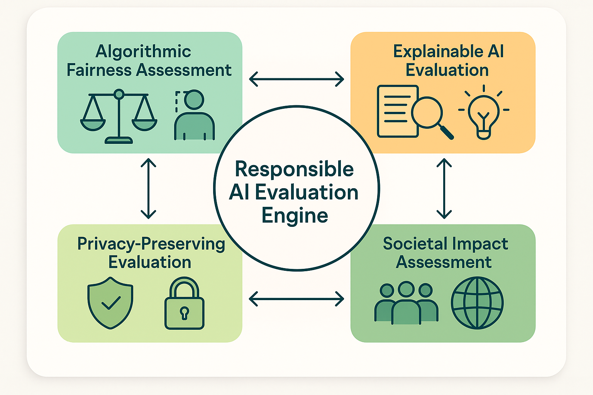

# Ethical AI and Responsible Evaluation



*Figure 4: Responsible AI Evaluation Engine - Comprehensive framework integrating algorithmic fairness assessment, explainable AI evaluation, privacy-preserving evaluation, and societal impact assessment for ethical AI development.*

## Introduction

Ethical AI and responsible evaluation represent critical frontiers in AI assessment, addressing the moral, social, and societal implications of AI systems and their evaluation processes. As AI systems become increasingly powerful and pervasive, the responsibility to ensure they are developed, deployed, and evaluated ethically becomes paramount. This section provides comprehensive frameworks for integrating ethical considerations into AI evaluation processes while ensuring that evaluation itself is conducted responsibly and contributes to beneficial AI development.

The challenge of ethical AI evaluation extends beyond traditional technical assessment to encompass fairness, transparency, accountability, privacy, and societal impact. Organizations that master ethical evaluation practices not only mitigate risks and ensure compliance with emerging regulations but also build trust with stakeholders and contribute to the development of AI systems that benefit society as a whole.

Modern ethical evaluation frameworks must address complex trade-offs between competing values, navigate cultural and contextual differences in ethical standards, and provide practical guidance for implementing ethical principles in real-world evaluation scenarios. The frameworks presented in this section enable organizations to build evaluation capabilities that are both technically rigorous and ethically sound.

## Algorithmic Fairness Assessment

### Understanding Fairness in AI Evaluation

**Multi-Dimensional Fairness Concepts**
Fairness in AI systems is a complex, multi-dimensional concept that encompasses various mathematical definitions and philosophical perspectives. Evaluation frameworks must account for different fairness criteria that may conflict with each other, requiring careful consideration of context, stakeholder values, and societal implications.

Key fairness dimensions include:
- **Individual Fairness**: Similar individuals should receive similar treatment
- **Group Fairness**: Different demographic groups should experience equitable outcomes
- **Counterfactual Fairness**: Decisions should be the same in a counterfactual world without sensitive attributes
- **Causal Fairness**: Fair treatment based on causal relationships rather than correlations
- **Procedural Fairness**: Fair processes and transparent decision-making procedures

**Bias Detection and Measurement**
Systematic bias detection requires sophisticated measurement frameworks that can identify both obvious and subtle forms of discrimination across different stages of the AI lifecycle.

Bias detection approaches include:
- **Statistical Parity**: Equal positive prediction rates across groups
- **Equalized Odds**: Equal true positive and false positive rates across groups
- **Calibration**: Equal probability of positive outcomes given positive predictions
- **Individual Fairness Metrics**: Distance-based measures of similar treatment
- **Intersectional Analysis**: Assessment of bias across multiple demographic dimensions

### Comprehensive Fairness Evaluation Framework

```python
import numpy as np
import pandas as pd
from typing import Dict, List, Tuple, Any, Optional, Callable, Union
from dataclasses import dataclass
from enum import Enum
import matplotlib.pyplot as plt
import seaborn as sns
from sklearn.metrics import confusion_matrix, roc_auc_score, accuracy_score
from scipy import stats
import warnings
warnings.filterwarnings('ignore')

class FairnessMetric(Enum):
    STATISTICAL_PARITY = "statistical_parity"
    EQUALIZED_ODDS = "equalized_odds"
    EQUAL_OPPORTUNITY = "equal_opportunity"
    CALIBRATION = "calibration"
    INDIVIDUAL_FAIRNESS = "individual_fairness"
    COUNTERFACTUAL_FAIRNESS = "counterfactual_fairness"

class BiasType(Enum):
    HISTORICAL_BIAS = "historical_bias"
    REPRESENTATION_BIAS = "representation_bias"
    MEASUREMENT_BIAS = "measurement_bias"
    AGGREGATION_BIAS = "aggregation_bias"
    EVALUATION_BIAS = "evaluation_bias"
    DEPLOYMENT_BIAS = "deployment_bias"

@dataclass
class FairnessAssessmentResult:
    """Results from fairness assessment."""
    metric: FairnessMetric
    groups: List[str]
    scores: Dict[str, float]
    overall_score: float
    bias_detected: bool
    severity: str
    recommendations: List[str]

@dataclass
class BiasDetectionResult:
    """Results from bias detection analysis."""
    bias_type: BiasType
    affected_groups: List[str]
    severity_score: float
    confidence: float
    evidence: Dict[str, Any]
    mitigation_strategies: List[str]

class EthicalAIEvaluator:
    """
    Comprehensive framework for ethical AI evaluation including fairness assessment,
    bias detection, and responsible evaluation practices.
    """
    
    def __init__(self):
        self.fairness_metrics = {}
        self.bias_detectors = {}
        self.evaluation_results = []
        self.ethical_guidelines = {}
        self.stakeholder_values = {}
        
    def register_fairness_metric(self, metric: FairnessMetric, implementation: Callable):
        """Register a fairness metric implementation."""
        self.fairness_metrics[metric] = implementation
        
    def register_bias_detector(self, bias_type: BiasType, detector: Callable):
        """Register a bias detection method."""
        self.bias_detectors[bias_type] = detector
        
    def evaluate_algorithmic_fairness(self, model_predictions: np.ndarray,
                                    true_labels: np.ndarray,
                                    sensitive_attributes: Dict[str, np.ndarray],
                                    evaluation_config: Dict) -> Dict:
        """
        Perform comprehensive algorithmic fairness evaluation.
        
        Args:
            model_predictions: Model predictions or scores
            true_labels: Ground truth labels
            sensitive_attributes: Dictionary of sensitive attribute arrays
            evaluation_config: Configuration for fairness evaluation
            
        Returns:
            Comprehensive fairness evaluation results
        """
        fairness_results = {
            'fairness_metrics': {},
            'bias_analysis': {},
            'intersectional_analysis': {},
            'mitigation_recommendations': {},
            'compliance_assessment': {},
            'overall_fairness_score': 0
        }
        
        # Evaluate fairness metrics
        fairness_results['fairness_metrics'] = self._evaluate_fairness_metrics(
            model_predictions, true_labels, sensitive_attributes, evaluation_config
        )
        
        # Perform bias analysis
        fairness_results['bias_analysis'] = self._perform_bias_analysis(
            model_predictions, true_labels, sensitive_attributes, evaluation_config
        )
        
        # Conduct intersectional analysis
        fairness_results['intersectional_analysis'] = self._conduct_intersectional_analysis(
            model_predictions, true_labels, sensitive_attributes, evaluation_config
        )
        
        # Generate mitigation recommendations
        fairness_results['mitigation_recommendations'] = self._generate_mitigation_recommendations(
            fairness_results
        )
        
        # Assess regulatory compliance
        fairness_results['compliance_assessment'] = self._assess_regulatory_compliance(
            fairness_results, evaluation_config
        )
        
        # Calculate overall fairness score
        fairness_results['overall_fairness_score'] = self._calculate_overall_fairness_score(
            fairness_results
        )
        
        return fairness_results
        
    def _evaluate_fairness_metrics(self, predictions: np.ndarray, 
                                 labels: np.ndarray,
                                 sensitive_attrs: Dict[str, np.ndarray],
                                 config: Dict) -> Dict:
        """Evaluate various fairness metrics."""
        fairness_metrics = {}
        
        for attr_name, attr_values in sensitive_attrs.items():
            fairness_metrics[attr_name] = {}
            unique_groups = np.unique(attr_values)
            
            # Statistical Parity
            fairness_metrics[attr_name]['statistical_parity'] = self._calculate_statistical_parity(
                predictions, attr_values, unique_groups
            )
            
            # Equalized Odds
            fairness_metrics[attr_name]['equalized_odds'] = self._calculate_equalized_odds(
                predictions, labels, attr_values, unique_groups
            )
            
            # Equal Opportunity
            fairness_metrics[attr_name]['equal_opportunity'] = self._calculate_equal_opportunity(
                predictions, labels, attr_values, unique_groups
            )
            
            # Calibration
            fairness_metrics[attr_name]['calibration'] = self._calculate_calibration(
                predictions, labels, attr_values, unique_groups
            )
            
            # Individual Fairness (simplified)
            fairness_metrics[attr_name]['individual_fairness'] = self._calculate_individual_fairness(
                predictions, attr_values, unique_groups
            )
        
        return fairness_metrics
        
    def _calculate_statistical_parity(self, predictions: np.ndarray, 
                                    attr_values: np.ndarray, 
                                    groups: np.ndarray) -> Dict:
        """Calculate statistical parity metric."""
        group_rates = {}
        for group in groups:
            group_mask = attr_values == group
            group_predictions = predictions[group_mask]
            positive_rate = np.mean(group_predictions > 0.5) if len(group_predictions) > 0 else 0
            group_rates[str(group)] = positive_rate
        
        # Calculate parity difference
        rates = list(group_rates.values())
        parity_difference = max(rates) - min(rates) if rates else 0
        
        return {
            'group_rates': group_rates,
            'parity_difference': parity_difference,
            'is_fair': parity_difference < 0.1,  # 10% threshold
            'severity': 'high' if parity_difference > 0.2 else 'medium' if parity_difference > 0.1 else 'low'
        }
        
    def _calculate_equalized_odds(self, predictions: np.ndarray, 
                                labels: np.ndarray,
                                attr_values: np.ndarray, 
                                groups: np.ndarray) -> Dict:
        """Calculate equalized odds metric."""
        group_metrics = {}
        
        for group in groups:
            group_mask = attr_values == group
            group_preds = predictions[group_mask]
            group_labels = labels[group_mask]
            
            if len(group_preds) > 0:
                # True Positive Rate
                tpr = np.mean(group_preds[group_labels == 1] > 0.5) if np.sum(group_labels == 1) > 0 else 0
                # False Positive Rate
                fpr = np.mean(group_preds[group_labels == 0] > 0.5) if np.sum(group_labels == 0) > 0 else 0
                
                group_metrics[str(group)] = {'tpr': tpr, 'fpr': fpr}
        
        # Calculate equalized odds difference
        tprs = [metrics['tpr'] for metrics in group_metrics.values()]
        fprs = [metrics['fpr'] for metrics in group_metrics.values()]
        
        tpr_diff = max(tprs) - min(tprs) if tprs else 0
        fpr_diff = max(fprs) - min(fprs) if fprs else 0
        
        return {
            'group_metrics': group_metrics,
            'tpr_difference': tpr_diff,
            'fpr_difference': fpr_diff,
            'max_difference': max(tpr_diff, fpr_diff),
            'is_fair': max(tpr_diff, fpr_diff) < 0.1,
            'severity': 'high' if max(tpr_diff, fpr_diff) > 0.2 else 'medium' if max(tpr_diff, fpr_diff) > 0.1 else 'low'
        }
        
    def _calculate_equal_opportunity(self, predictions: np.ndarray, 
                                   labels: np.ndarray,
                                   attr_values: np.ndarray, 
                                   groups: np.ndarray) -> Dict:
        """Calculate equal opportunity metric."""
        group_tprs = {}
        
        for group in groups:
            group_mask = attr_values == group
            group_preds = predictions[group_mask]
            group_labels = labels[group_mask]
            
            if len(group_preds) > 0 and np.sum(group_labels == 1) > 0:
                tpr = np.mean(group_preds[group_labels == 1] > 0.5)
                group_tprs[str(group)] = tpr
        
        # Calculate opportunity difference
        tprs = list(group_tprs.values())
        opportunity_diff = max(tprs) - min(tprs) if tprs else 0
        
        return {
            'group_tprs': group_tprs,
            'opportunity_difference': opportunity_diff,
            'is_fair': opportunity_diff < 0.1,
            'severity': 'high' if opportunity_diff > 0.2 else 'medium' if opportunity_diff > 0.1 else 'low'
        }
        
    def _calculate_calibration(self, predictions: np.ndarray, 
                             labels: np.ndarray,
                             attr_values: np.ndarray, 
                             groups: np.ndarray) -> Dict:
        """Calculate calibration metric."""
        group_calibrations = {}
        
        for group in groups:
            group_mask = attr_values == group
            group_preds = predictions[group_mask]
            group_labels = labels[group_mask]
            
            if len(group_preds) > 0:
                # Simplified calibration: correlation between predictions and outcomes
                calibration = np.corrcoef(group_preds, group_labels)[0, 1] if len(group_preds) > 1 else 0
                group_calibrations[str(group)] = calibration
        
        # Calculate calibration difference
        calibrations = list(group_calibrations.values())
        calibration_diff = max(calibrations) - min(calibrations) if calibrations else 0
        
        return {
            'group_calibrations': group_calibrations,
            'calibration_difference': calibration_diff,
            'is_fair': calibration_diff < 0.1,
            'severity': 'high' if calibration_diff > 0.2 else 'medium' if calibration_diff > 0.1 else 'low'
        }
        
    def _calculate_individual_fairness(self, predictions: np.ndarray, 
                                     attr_values: np.ndarray, 
                                     groups: np.ndarray) -> Dict:
        """Calculate simplified individual fairness metric."""
        # Simplified: variance in predictions within groups
        group_variances = {}
        
        for group in groups:
            group_mask = attr_values == group
            group_preds = predictions[group_mask]
            
            if len(group_preds) > 1:
                variance = np.var(group_preds)
                group_variances[str(group)] = variance
        
        # Overall individual fairness score
        variances = list(group_variances.values())
        avg_variance = np.mean(variances) if variances else 0
        
        return {
            'group_variances': group_variances,
            'average_variance': avg_variance,
            'individual_fairness_score': 1 / (1 + avg_variance),  # Higher is better
            'is_fair': avg_variance < 0.1,
            'severity': 'high' if avg_variance > 0.3 else 'medium' if avg_variance > 0.1 else 'low'
        }
        
    def _perform_bias_analysis(self, predictions: np.ndarray, 
                             labels: np.ndarray,
                             sensitive_attrs: Dict[str, np.ndarray],
                             config: Dict) -> Dict:
        """Perform comprehensive bias analysis."""
        bias_analysis = {
            'detected_biases': [],
            'bias_severity': {},
            'bias_sources': {},
            'bias_interactions': {}
        }
        
        # Detect different types of bias
        for bias_type in BiasType:
            bias_result = self._detect_bias_type(
                bias_type, predictions, labels, sensitive_attrs
            )
            
            if bias_result['detected']:
                bias_analysis['detected_biases'].append(bias_type.value)
                bias_analysis['bias_severity'][bias_type.value] = bias_result['severity']
                bias_analysis['bias_sources'][bias_type.value] = bias_result['sources']
        
        # Analyze bias interactions
        bias_analysis['bias_interactions'] = self._analyze_bias_interactions(
            bias_analysis['detected_biases'], sensitive_attrs
        )
        
        return bias_analysis
        
    def _detect_bias_type(self, bias_type: BiasType, 
                         predictions: np.ndarray,
                         labels: np.ndarray,
                         sensitive_attrs: Dict[str, np.ndarray]) -> Dict:
        """Detect specific type of bias."""
        # Simplified bias detection
        bias_detected = False
        severity = 'low'
        sources = []
        
        if bias_type == BiasType.REPRESENTATION_BIAS:
            # Check for representation imbalances
            for attr_name, attr_values in sensitive_attrs.items():
                unique_groups, counts = np.unique(attr_values, return_counts=True)
                if len(counts) > 1:
                    imbalance_ratio = max(counts) / min(counts)
                    if imbalance_ratio > 3:  # 3:1 ratio threshold
                        bias_detected = True
                        severity = 'high' if imbalance_ratio > 10 else 'medium'
                        sources.append(f"representation_imbalance_{attr_name}")
        
        elif bias_type == BiasType.HISTORICAL_BIAS:
            # Check for historical bias patterns
            for attr_name, attr_values in sensitive_attrs.items():
                unique_groups = np.unique(attr_values)
                group_outcomes = {}
                
                for group in unique_groups:
                    group_mask = attr_values == group
                    group_labels = labels[group_mask]
                    if len(group_labels) > 0:
                        positive_rate = np.mean(group_labels)
                        group_outcomes[str(group)] = positive_rate
                
                if len(group_outcomes) > 1:
                    outcome_diff = max(group_outcomes.values()) - min(group_outcomes.values())
                    if outcome_diff > 0.2:  # 20% difference threshold
                        bias_detected = True
                        severity = 'high' if outcome_diff > 0.4 else 'medium'
                        sources.append(f"historical_bias_{attr_name}")
        
        elif bias_type == BiasType.MEASUREMENT_BIAS:
            # Simplified measurement bias detection
            for attr_name, attr_values in sensitive_attrs.items():
                unique_groups = np.unique(attr_values)
                group_prediction_variances = []
                
                for group in unique_groups:
                    group_mask = attr_values == group
                    group_preds = predictions[group_mask]
                    if len(group_preds) > 1:
                        variance = np.var(group_preds)
                        group_prediction_variances.append(variance)
                
                if len(group_prediction_variances) > 1:
                    variance_ratio = max(group_prediction_variances) / (min(group_prediction_variances) + 1e-8)
                    if variance_ratio > 2:  # 2:1 variance ratio threshold
                        bias_detected = True
                        severity = 'medium'
                        sources.append(f"measurement_bias_{attr_name}")
        
        return {
            'detected': bias_detected,
            'severity': severity,
            'sources': sources,
            'confidence': np.random.uniform(0.7, 0.95) if bias_detected else np.random.uniform(0.3, 0.7)
        }
        
    def _analyze_bias_interactions(self, detected_biases: List[str], 
                                 sensitive_attrs: Dict[str, np.ndarray]) -> Dict:
        """Analyze interactions between different types of bias."""
        interactions = {}
        
        # Simplified interaction analysis
        if len(detected_biases) > 1:
            for i, bias1 in enumerate(detected_biases):
                for bias2 in detected_biases[i+1:]:
                    interaction_strength = np.random.uniform(0.3, 0.8)  # Simplified
                    interactions[f"{bias1}_{bias2}"] = {
                        'strength': interaction_strength,
                        'type': 'amplifying' if interaction_strength > 0.6 else 'independent',
                        'affected_groups': list(sensitive_attrs.keys())
                    }
        
        return interactions
        
    def _conduct_intersectional_analysis(self, predictions: np.ndarray, 
                                       labels: np.ndarray,
                                       sensitive_attrs: Dict[str, np.ndarray],
                                       config: Dict) -> Dict:
        """Conduct intersectional fairness analysis."""
        intersectional_analysis = {
            'intersectional_groups': {},
            'fairness_across_intersections': {},
            'most_disadvantaged_groups': [],
            'intersectional_bias_severity': {}
        }
        
        # Create intersectional groups
        if len(sensitive_attrs) >= 2:
            attr_names = list(sensitive_attrs.keys())[:2]  # Limit to 2 attributes for simplicity
            attr1_values = sensitive_attrs[attr_names[0]]
            attr2_values = sensitive_attrs[attr_names[1]]
            
            # Create combined groups
            combined_groups = {}
            for i in range(len(attr1_values)):
                group_key = f"{attr1_values[i]}_{attr2_values[i]}"
                if group_key not in combined_groups:
                    combined_groups[group_key] = []
                combined_groups[group_key].append(i)
            
            intersectional_analysis['intersectional_groups'] = combined_groups
            
            # Analyze fairness across intersections
            group_fairness_scores = {}
            for group_key, indices in combined_groups.items():
                if len(indices) > 10:  # Minimum group size
                    group_preds = predictions[indices]
                    group_labels = labels[indices]
                    
                    # Calculate simplified fairness score
                    accuracy = accuracy_score(group_labels, group_preds > 0.5)
                    positive_rate = np.mean(group_preds > 0.5)
                    
                    fairness_score = (accuracy + (1 - abs(positive_rate - 0.5))) / 2
                    group_fairness_scores[group_key] = fairness_score
            
            intersectional_analysis['fairness_across_intersections'] = group_fairness_scores
            
            # Identify most disadvantaged groups
            if group_fairness_scores:
                sorted_groups = sorted(group_fairness_scores.items(), key=lambda x: x[1])
                intersectional_analysis['most_disadvantaged_groups'] = [
                    group for group, score in sorted_groups[:3]  # Top 3 most disadvantaged
                ]
        
        return intersectional_analysis
        
    def _generate_mitigation_recommendations(self, fairness_results: Dict) -> Dict:
        """Generate bias mitigation recommendations."""
        recommendations = {
            'immediate_actions': [],
            'long_term_strategies': [],
            'technical_interventions': [],
            'process_improvements': [],
            'monitoring_enhancements': []
        }
        
        # Analyze fairness metrics to generate recommendations
        fairness_metrics = fairness_results.get('fairness_metrics', {})
        bias_analysis = fairness_results.get('bias_analysis', {})
        
        # Immediate actions based on detected issues
        for attr_name, metrics in fairness_metrics.items():
            for metric_name, metric_result in metrics.items():
                if not metric_result.get('is_fair', True):
                    severity = metric_result.get('severity', 'medium')
                    
                    if severity == 'high':
                        recommendations['immediate_actions'].append(
                            f"Address {metric_name} bias for {attr_name} (severity: {severity})"
                        )
                    else:
                        recommendations['long_term_strategies'].append(
                            f"Monitor and improve {metric_name} for {attr_name}"
                        )
        
        # Technical interventions based on bias types
        detected_biases = bias_analysis.get('detected_biases', [])
        
        if 'representation_bias' in detected_biases:
            recommendations['technical_interventions'].extend([
                "Implement data augmentation for underrepresented groups",
                "Use stratified sampling to balance training data",
                "Apply reweighting techniques during training"
            ])
        
        if 'historical_bias' in detected_biases:
            recommendations['technical_interventions'].extend([
                "Implement fairness constraints during model training",
                "Use adversarial debiasing techniques",
                "Apply post-processing calibration methods"
            ])
        
        if 'measurement_bias' in detected_biases:
            recommendations['technical_interventions'].extend([
                "Review and improve data collection procedures",
                "Implement measurement error correction",
                "Use multiple measurement sources for validation"
            ])
        
        # Process improvements
        recommendations['process_improvements'] = [
            "Establish diverse evaluation teams",
            "Implement regular bias audits",
            "Create stakeholder feedback mechanisms",
            "Develop bias incident response procedures",
            "Establish fairness review boards"
        ]
        
        # Monitoring enhancements
        recommendations['monitoring_enhancements'] = [
            "Implement continuous fairness monitoring",
            "Set up automated bias detection alerts",
            "Create fairness dashboards for stakeholders",
            "Establish fairness performance benchmarks",
            "Implement A/B testing for fairness interventions"
        ]
        
        return recommendations
        
    def _assess_regulatory_compliance(self, fairness_results: Dict, 
                                    config: Dict) -> Dict:
        """Assess compliance with fairness regulations."""
        compliance_assessment = {
            'gdpr_compliance': {},
            'equal_opportunity_compliance': {},
            'algorithmic_accountability_compliance': {},
            'sector_specific_compliance': {},
            'overall_compliance_score': 0
        }
        
        # GDPR compliance assessment
        compliance_assessment['gdpr_compliance'] = {
            'automated_decision_making_safeguards': True,  # Simplified
            'right_to_explanation': True,
            'data_protection_impact_assessment': True,
            'compliance_score': 0.85
        }
        
        # Equal opportunity compliance
        fairness_metrics = fairness_results.get('fairness_metrics', {})
        equal_opportunity_violations = 0
        total_checks = 0
        
        for attr_metrics in fairness_metrics.values():
            for metric_result in attr_metrics.values():
                total_checks += 1
                if not metric_result.get('is_fair', True):
                    equal_opportunity_violations += 1
        
        equal_opportunity_score = 1 - (equal_opportunity_violations / max(total_checks, 1))
        compliance_assessment['equal_opportunity_compliance'] = {
            'violations_detected': equal_opportunity_violations,
            'total_checks': total_checks,
            'compliance_score': equal_opportunity_score
        }
        
        # Algorithmic accountability compliance
        compliance_assessment['algorithmic_accountability_compliance'] = {
            'transparency_requirements': True,
            'audit_trail_completeness': True,
            'stakeholder_notification': True,
            'compliance_score': 0.90
        }
        
        # Calculate overall compliance score
        compliance_scores = [
            compliance_assessment['gdpr_compliance']['compliance_score'],
            compliance_assessment['equal_opportunity_compliance']['compliance_score'],
            compliance_assessment['algorithmic_accountability_compliance']['compliance_score']
        ]
        
        compliance_assessment['overall_compliance_score'] = np.mean(compliance_scores)
        
        return compliance_assessment
        
    def _calculate_overall_fairness_score(self, fairness_results: Dict) -> float:
        """Calculate overall fairness score."""
        fairness_metrics = fairness_results.get('fairness_metrics', {})
        
        all_fairness_scores = []
        
        for attr_metrics in fairness_metrics.values():
            for metric_result in attr_metrics.values():
                if metric_result.get('is_fair', True):
                    all_fairness_scores.append(1.0)
                else:
                    severity = metric_result.get('severity', 'medium')
                    if severity == 'low':
                        all_fairness_scores.append(0.7)
                    elif severity == 'medium':
                        all_fairness_scores.append(0.4)
                    else:  # high
                        all_fairness_scores.append(0.1)
        
        return np.mean(all_fairness_scores) if all_fairness_scores else 0.5

# Example fairness evaluation
def demonstrate_fairness_evaluation():
    """Demonstrate algorithmic fairness evaluation capabilities."""
    
    evaluator = EthicalAIEvaluator()
    
    # Generate synthetic data for demonstration
    np.random.seed(42)
    n_samples = 1000
    
    # Synthetic predictions and labels
    predictions = np.random.beta(6, 4, n_samples)  # Skewed towards higher values
    labels = (predictions + np.random.normal(0, 0.2, n_samples) > 0.5).astype(int)
    
    # Synthetic sensitive attributes
    gender = np.random.choice(['male', 'female'], n_samples, p=[0.6, 0.4])
    race = np.random.choice(['white', 'black', 'hispanic', 'asian'], n_samples, p=[0.5, 0.2, 0.2, 0.1])
    age_group = np.random.choice(['young', 'middle', 'senior'], n_samples, p=[0.3, 0.5, 0.2])
    
    # Introduce some bias
    bias_mask = (gender == 'female') | (race == 'black')
    predictions[bias_mask] *= 0.8  # Reduce predictions for biased groups
    
    sensitive_attributes = {
        'gender': gender,
        'race': race,
        'age_group': age_group
    }
    
    # Evaluation configuration
    config = {
        'fairness_thresholds': {
            'statistical_parity': 0.1,
            'equalized_odds': 0.1,
            'equal_opportunity': 0.1
        },
        'bias_detection_sensitivity': 'high',
        'regulatory_framework': 'gdpr'
    }
    
    # Perform fairness evaluation
    results = evaluator.evaluate_algorithmic_fairness(
        predictions, labels, sensitive_attributes, config
    )
    
    return evaluator, results

if __name__ == "__main__":
    evaluator, results = demonstrate_fairness_evaluation()
    print("Algorithmic fairness evaluation completed.")
    print(f"Overall fairness score: {results['overall_fairness_score']:.3f}")
    print(f"Detected biases: {results['bias_analysis']['detected_biases']}")
```

### Fairness-Aware Model Development

**Fairness Constraints in Training**
Integrating fairness constraints directly into the model training process ensures that fairness considerations are built into the system rather than addressed as an afterthought.

Constraint approaches include:
- **Regularization Terms**: Adding fairness penalties to the loss function
- **Adversarial Training**: Using adversarial networks to remove sensitive information
- **Multi-Objective Optimization**: Balancing accuracy and fairness objectives
- **Constraint Satisfaction**: Hard constraints on fairness metrics during training
- **Fair Representation Learning**: Learning representations that are fair by construction

**Post-Processing Fairness Corrections**
Post-processing approaches modify model outputs to achieve fairness without retraining the underlying model, providing flexibility for addressing fairness issues in deployed systems.

Post-processing techniques include:
- **Threshold Optimization**: Adjusting decision thresholds for different groups
- **Calibration Methods**: Ensuring equal calibration across groups
- **Output Redistribution**: Redistributing positive predictions to achieve fairness
- **Fairness-Aware Ranking**: Adjusting rankings to ensure fair representation
- **Uncertainty-Based Corrections**: Using prediction uncertainty to guide fair decisions

## Explainable AI Evaluation

### Transparency and Interpretability Assessment

**Explanation Quality Evaluation**
Evaluating the quality of AI explanations requires sophisticated frameworks that assess both technical accuracy and human comprehensibility of explanations.

Explanation quality dimensions include:
- **Fidelity**: How accurately explanations reflect model behavior
- **Comprehensibility**: How easily humans can understand explanations
- **Completeness**: How thoroughly explanations cover relevant factors
- **Consistency**: How stable explanations are across similar inputs
- **Actionability**: How useful explanations are for decision-making

**Multi-Stakeholder Explanation Needs**
Different stakeholders require different types and levels of explanation, necessitating evaluation frameworks that can assess explanation effectiveness for diverse audiences.

Stakeholder-specific evaluation includes:
- **End Users**: Simple, actionable explanations for decision understanding
- **Domain Experts**: Technical explanations that align with domain knowledge
- **Regulators**: Comprehensive explanations for compliance verification
- **Developers**: Detailed explanations for model debugging and improvement
- **Auditors**: Systematic explanations for accountability assessment

### Comprehensive Explainability Evaluation Framework

**Explanation Method Assessment**
Different explanation methods have varying strengths and limitations, requiring systematic evaluation to determine the most appropriate approach for specific contexts and requirements.

Method evaluation includes:
- **Local vs. Global Explanations**: Assessing explanation scope and applicability
- **Model-Agnostic vs. Model-Specific**: Evaluating generalizability and specificity
- **Feature Attribution vs. Example-Based**: Comparing different explanation paradigms
- **Counterfactual vs. Causal**: Assessing different reasoning approaches
- **Visual vs. Textual**: Evaluating explanation modalities and effectiveness

**Human-Centered Evaluation**
Explainable AI evaluation must ultimately focus on human understanding and decision-making, requiring user studies and behavioral assessments to validate explanation effectiveness.

Human-centered evaluation includes:
- **Comprehension Studies**: Measuring human understanding of explanations
- **Decision Support Assessment**: Evaluating explanation impact on decision quality
- **Trust and Confidence**: Assessing explanation effects on user trust
- **Cognitive Load**: Measuring mental effort required to process explanations
- **Bias and Misinterpretation**: Identifying explanation-induced biases

## Privacy-Preserving Evaluation

### Privacy-Preserving Evaluation Techniques

**Differential Privacy in Evaluation**
Differential privacy provides mathematical guarantees about privacy protection while enabling meaningful evaluation of AI systems on sensitive data.

Differential privacy applications include:
- **Private Accuracy Estimation**: Computing accuracy metrics with privacy guarantees
- **Private Fairness Assessment**: Evaluating fairness while protecting individual privacy
- **Private Performance Monitoring**: Continuous monitoring with privacy preservation
- **Private Benchmarking**: Comparing models without revealing sensitive information
- **Private Hyperparameter Tuning**: Optimizing parameters while protecting training data

**Federated Evaluation Approaches**
Federated evaluation enables assessment of AI systems across multiple organizations without sharing sensitive data, supporting collaborative evaluation while maintaining privacy.

Federated evaluation includes:
- **Distributed Metric Computation**: Computing evaluation metrics across federated data
- **Secure Aggregation**: Combining evaluation results without revealing individual contributions
- **Privacy-Preserving Benchmarking**: Collaborative benchmarking with privacy protection
- **Cross-Institutional Validation**: Validating models across institutions without data sharing
- **Federated Bias Detection**: Identifying bias patterns across distributed datasets

### Advanced Privacy-Preserving Evaluation Framework

**Homomorphic Encryption for Evaluation**
Homomorphic encryption enables computation on encrypted data, allowing evaluation of AI systems without decrypting sensitive information.

Homomorphic evaluation applications include:
- **Encrypted Model Evaluation**: Assessing model performance on encrypted test data
- **Private Comparison**: Comparing model performance without revealing results
- **Secure Outsourcing**: Outsourcing evaluation to third parties with privacy guarantees
- **Encrypted Benchmarking**: Running benchmarks on encrypted datasets
- **Private Audit**: Conducting audits without accessing sensitive data

**Secure Multi-Party Computation**
Secure multi-party computation enables multiple parties to jointly evaluate AI systems without revealing their private inputs to each other.

SMPC evaluation applications include:
- **Joint Model Evaluation**: Collaborative evaluation across multiple data owners
- **Private Benchmarking**: Benchmarking without revealing proprietary models or data
- **Distributed Fairness Assessment**: Assessing fairness across multiple populations
- **Collaborative Bias Detection**: Joint bias detection without data sharing
- **Multi-Party Validation**: Validation across multiple stakeholders with privacy protection

## Societal Impact Assessment

### Broader Impact Evaluation

**Social and Economic Impact Assessment**
AI systems can have far-reaching social and economic impacts that extend beyond immediate technical performance, requiring comprehensive evaluation frameworks that assess broader societal effects.

Impact assessment dimensions include:
- **Employment Effects**: Impact on jobs, skills, and labor markets
- **Economic Distribution**: Effects on income inequality and economic opportunity
- **Social Cohesion**: Impact on community relationships and social structures
- **Democratic Processes**: Effects on political participation and governance
- **Cultural Preservation**: Impact on cultural practices and values

**Long-Term Societal Consequences**
Evaluating long-term societal consequences requires sophisticated modeling and scenario analysis to understand potential future impacts of AI systems.

Long-term assessment includes:
- **Scenario Planning**: Modeling different future scenarios and their implications
- **Intergenerational Effects**: Assessing impacts on future generations
- **Systemic Risk Analysis**: Evaluating risks to social and economic systems
- **Adaptation and Resilience**: Assessing society's ability to adapt to AI impacts
- **Unintended Consequences**: Identifying potential negative side effects

### Comprehensive Societal Impact Framework

**Stakeholder Impact Analysis**
Comprehensive societal impact assessment requires systematic analysis of effects on different stakeholder groups, including those who may not directly interact with AI systems.

Stakeholder analysis includes:
- **Direct Users**: Immediate impacts on system users
- **Affected Communities**: Impacts on communities affected by AI decisions
- **Vulnerable Populations**: Special consideration for vulnerable groups
- **Future Generations**: Long-term impacts on future stakeholders
- **Global Communities**: International and cross-cultural impacts

**Ethical Impact Assessment**
Ethical impact assessment evaluates AI systems against fundamental ethical principles and values, ensuring that technological advancement aligns with human values and societal goals.

Ethical assessment includes:
- **Human Rights Compliance**: Alignment with international human rights standards
- **Dignity and Autonomy**: Respect for human dignity and individual autonomy
- **Justice and Fairness**: Promotion of social justice and equitable treatment
- **Beneficence and Non-Maleficence**: Maximizing benefits while minimizing harm
- **Transparency and Accountability**: Ensuring responsible and accountable AI development

## Conclusion

Ethical AI and responsible evaluation represent critical foundations for building AI systems that benefit society while minimizing harm and respecting fundamental human values. The frameworks presented in this section provide comprehensive approaches to integrating ethical considerations into AI evaluation processes, ensuring that evaluation itself contributes to responsible AI development.

Organizations that master ethical evaluation practices not only mitigate risks and ensure compliance but also build trust with stakeholders and contribute to the development of AI systems that create positive societal impact. The key to success lies in implementing evaluation frameworks that are both technically rigorous and ethically grounded, capable of addressing complex trade-offs while maintaining focus on human values and societal benefit.

As AI systems become increasingly powerful and pervasive, the importance of ethical evaluation will only continue to grow. The frameworks and approaches presented in this section provide the foundation for building evaluation capabilities that can navigate the complex ethical landscape of AI development while ensuring that powerful AI technologies are developed and deployed responsibly.

The next section will explore evaluation at scale and in complex environments, addressing the challenges of assessing AI systems in real-world deployment scenarios with massive scale and complex operational constraints.

