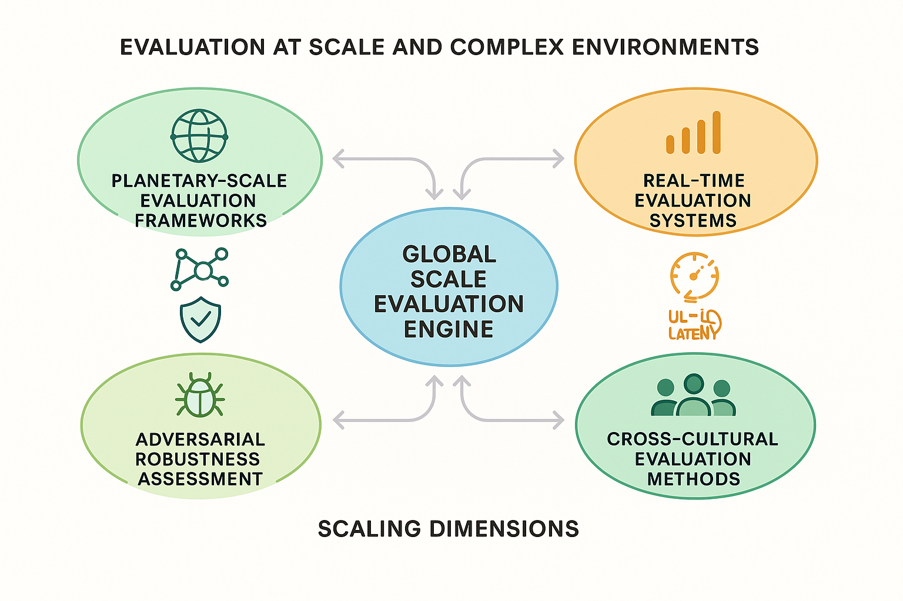

# Evaluation at Scale and in Complex Environments



*Figure 5: Global Scale Evaluation Engine - Comprehensive framework for evaluation at planetary scale with real-time systems, adversarial robustness assessment, and cross-cultural evaluation methods.*

## Introduction

Evaluation at scale and in complex environments represents one of the most challenging frontiers in AI assessment, requiring sophisticated approaches that can handle massive datasets, distributed systems, real-time constraints, and complex operational environments. As AI systems are deployed at unprecedented scales across diverse global contexts, evaluation frameworks must evolve to provide reliable assessment capabilities that maintain quality and accuracy while operating under extreme constraints.

The challenges of large-scale evaluation extend far beyond simply processing more data. They encompass distributed coordination, real-time performance requirements, resource optimization, fault tolerance, and the ability to maintain evaluation quality across diverse operational contexts. Organizations that master large-scale evaluation capabilities gain significant competitive advantages in deploying AI systems globally while maintaining confidence in their performance and reliability.

This section provides comprehensive frameworks for building evaluation systems that can operate at planetary scale, handle complex multi-modal environments, provide real-time assessment capabilities, and maintain robustness under adversarial conditions. The approaches presented enable organizations to evaluate AI systems in the most demanding real-world scenarios while ensuring accuracy, reliability, and operational efficiency.

## Planetary-Scale Evaluation Frameworks

### Distributed Evaluation Architecture

**Global Evaluation Networks**
Planetary-scale evaluation requires distributed architectures that can coordinate evaluation activities across multiple continents, time zones, and regulatory jurisdictions while maintaining consistency and reliability.

Global network characteristics include:
- **Geographic Distribution**: Evaluation nodes distributed across major global regions
- **Latency Optimization**: Minimizing evaluation latency through strategic node placement
- **Regulatory Compliance**: Ensuring compliance with local data protection and AI regulations
- **Cultural Adaptation**: Adapting evaluation criteria to local cultural contexts and values
- **Fault Tolerance**: Maintaining evaluation capabilities despite regional outages or disruptions

**Massive Parallel Processing**
Large-scale evaluation requires sophisticated parallel processing capabilities that can distribute evaluation tasks across thousands of computing nodes while maintaining coordination and result consistency.

Parallel processing approaches include:
- **Task Decomposition**: Breaking evaluation tasks into parallelizable components
- **Load Balancing**: Distributing evaluation workload across available resources
- **Result Aggregation**: Combining distributed evaluation results into coherent assessments
- **Synchronization**: Coordinating parallel evaluation processes for consistency
- **Resource Optimization**: Maximizing utilization of distributed computing resources

### Comprehensive Planetary-Scale Evaluation Framework

```python
import numpy as np
import pandas as pd
from typing import Dict, List, Tuple, Any, Optional, Callable, Union
from dataclasses import dataclass, field
from enum import Enum
import asyncio
import concurrent.futures
from datetime import datetime, timezone
import json
import hashlib
import time
from collections import defaultdict
import matplotlib.pyplot as plt

class EvaluationNode(Enum):
    NORTH_AMERICA = "north_america"
    EUROPE = "europe"
    ASIA_PACIFIC = "asia_pacific"
    SOUTH_AMERICA = "south_america"
    AFRICA = "africa"
    OCEANIA = "oceania"

class EvaluationPriority(Enum):
    CRITICAL = "critical"
    HIGH = "high"
    MEDIUM = "medium"
    LOW = "low"
    BACKGROUND = "background"

class ScalingStrategy(Enum):
    HORIZONTAL = "horizontal"
    VERTICAL = "vertical"
    HYBRID = "hybrid"
    ADAPTIVE = "adaptive"

@dataclass
class EvaluationTask:
    """Represents a distributed evaluation task."""
    task_id: str
    model_id: str
    dataset_id: str
    evaluation_type: str
    priority: EvaluationPriority
    resource_requirements: Dict[str, Any]
    geographic_constraints: List[EvaluationNode]
    deadline: datetime
    dependencies: List[str] = field(default_factory=list)
    metadata: Dict[str, Any] = field(default_factory=dict)

@dataclass
class NodeCapacity:
    """Represents evaluation node capacity and status."""
    node_id: str
    location: EvaluationNode
    cpu_cores: int
    memory_gb: int
    gpu_count: int
    storage_tb: int
    current_utilization: float
    available_capacity: float
    network_latency: Dict[str, float]
    regulatory_compliance: List[str]

@dataclass
class EvaluationResult:
    """Results from distributed evaluation."""
    task_id: str
    node_id: str
    execution_time: float
    resource_usage: Dict[str, float]
    evaluation_metrics: Dict[str, Any]
    quality_score: float
    confidence_interval: Tuple[float, float]
    metadata: Dict[str, Any]

class PlanetaryScaleEvaluator:
    """
    Comprehensive framework for planetary-scale AI evaluation with distributed
    coordination, real-time processing, and adaptive resource management.
    """
    
    def __init__(self):
        self.evaluation_nodes = {}
        self.task_queue = []
        self.active_tasks = {}
        self.completed_tasks = {}
        self.node_capacities = {}
        self.global_metrics = {}
        self.coordination_protocols = {}
        
    def register_evaluation_node(self, node_capacity: NodeCapacity):
        """Register an evaluation node in the global network."""
        self.evaluation_nodes[node_capacity.node_id] = node_capacity
        self.node_capacities[node_capacity.node_id] = node_capacity
        
    async def execute_planetary_evaluation(self, evaluation_tasks: List[EvaluationTask],
                                         scaling_config: Dict) -> Dict:
        """
        Execute evaluation tasks across the planetary-scale network.
        
        Args:
            evaluation_tasks: List of evaluation tasks to execute
            scaling_config: Configuration for scaling and resource management
            
        Returns:
            Comprehensive evaluation results from global execution
        """
        evaluation_results = {
            'task_results': {},
            'performance_metrics': {},
            'resource_utilization': {},
            'scaling_analysis': {},
            'quality_assessment': {},
            'global_coordination_metrics': {}
        }
        
        # Initialize global coordination
        await self._initialize_global_coordination(scaling_config)
        
        # Optimize task distribution
        task_distribution = await self._optimize_task_distribution(
            evaluation_tasks, scaling_config
        )
        
        # Execute distributed evaluation
        execution_results = await self._execute_distributed_evaluation(
            task_distribution, scaling_config
        )
        
        # Aggregate global results
        evaluation_results['task_results'] = execution_results
        
        # Analyze performance metrics
        evaluation_results['performance_metrics'] = await self._analyze_global_performance(
            execution_results
        )
        
        # Assess resource utilization
        evaluation_results['resource_utilization'] = await self._assess_resource_utilization(
            execution_results
        )
        
        # Evaluate scaling effectiveness
        evaluation_results['scaling_analysis'] = await self._analyze_scaling_effectiveness(
            execution_results, scaling_config
        )
        
        # Assess evaluation quality
        evaluation_results['quality_assessment'] = await self._assess_evaluation_quality(
            execution_results
        )
        
        # Analyze coordination metrics
        evaluation_results['global_coordination_metrics'] = await self._analyze_coordination_metrics(
            execution_results
        )
        
        return evaluation_results
        
    async def _initialize_global_coordination(self, config: Dict):
        """Initialize global coordination protocols."""
        # Establish inter-node communication
        for node_id, node in self.evaluation_nodes.items():
            await self._establish_node_communication(node_id, node)
        
        # Synchronize global clock
        await self._synchronize_global_clock()
        
        # Initialize distributed consensus
        await self._initialize_distributed_consensus()
        
        # Set up monitoring and alerting
        await self._setup_global_monitoring()
        
    async def _establish_node_communication(self, node_id: str, node: NodeCapacity):
        """Establish communication with evaluation node."""
        # Simulate network setup and latency measurement
        communication_metrics = {
            'connection_established': True,
            'latency_ms': np.random.uniform(10, 200),  # Simulate global latencies
            'bandwidth_mbps': np.random.uniform(100, 1000),
            'reliability_score': np.random.uniform(0.95, 0.99)
        }
        
        self.coordination_protocols[node_id] = communication_metrics
        
    async def _synchronize_global_clock(self):
        """Synchronize clocks across all evaluation nodes."""
        # Simulate global clock synchronization
        synchronization_accuracy = np.random.uniform(0.1, 1.0)  # milliseconds
        self.global_metrics['clock_synchronization_accuracy'] = synchronization_accuracy
        
    async def _initialize_distributed_consensus(self):
        """Initialize distributed consensus mechanism."""
        # Simulate consensus protocol setup
        consensus_metrics = {
            'consensus_algorithm': 'raft',
            'leader_election_time': np.random.uniform(0.1, 1.0),
            'consensus_latency': np.random.uniform(10, 100),
            'fault_tolerance_threshold': len(self.evaluation_nodes) // 2 + 1
        }
        
        self.global_metrics['consensus_metrics'] = consensus_metrics
        
    async def _setup_global_monitoring(self):
        """Set up global monitoring and alerting systems."""
        monitoring_config = {
            'metrics_collection_interval': 1.0,  # seconds
            'alert_thresholds': {
                'node_failure': 0.95,
                'high_latency': 1000,  # ms
                'resource_exhaustion': 0.9
            },
            'dashboard_endpoints': [f"node_{i}" for i in range(len(self.evaluation_nodes))]
        }
        
        self.global_metrics['monitoring_config'] = monitoring_config
        
    async def _optimize_task_distribution(self, tasks: List[EvaluationTask], 
                                        config: Dict) -> Dict:
        """Optimize distribution of tasks across evaluation nodes."""
        task_distribution = {}
        
        # Sort tasks by priority and deadline
        sorted_tasks = sorted(tasks, 
                            key=lambda t: (t.priority.value, t.deadline))
        
        # Distribute tasks using intelligent scheduling
        for task in sorted_tasks:
            optimal_node = await self._find_optimal_node(task, config)
            
            if optimal_node not in task_distribution:
                task_distribution[optimal_node] = []
            
            task_distribution[optimal_node].append(task)
            
            # Update node capacity estimates
            await self._update_node_capacity_estimate(optimal_node, task)
        
        return task_distribution
        
    async def _find_optimal_node(self, task: EvaluationTask, config: Dict) -> str:
        """Find optimal node for task execution."""
        node_scores = {}
        
        for node_id, node_capacity in self.node_capacities.items():
            # Check geographic constraints
            if (task.geographic_constraints and 
                node_capacity.location not in task.geographic_constraints):
                continue
            
            # Calculate node suitability score
            score = await self._calculate_node_suitability(task, node_capacity, config)
            node_scores[node_id] = score
        
        # Return node with highest suitability score
        if node_scores:
            return max(node_scores.items(), key=lambda x: x[1])[0]
        else:
            # Fallback to first available node
            return list(self.node_capacities.keys())[0]
        
    async def _calculate_node_suitability(self, task: EvaluationTask, 
                                        node: NodeCapacity, config: Dict) -> float:
        """Calculate suitability score for task-node assignment."""
        score = 0.0
        
        # Resource availability score
        resource_score = min(
            node.available_capacity,
            1.0 - (task.resource_requirements.get('cpu_cores', 1) / node.cpu_cores),
            1.0 - (task.resource_requirements.get('memory_gb', 1) / node.memory_gb)
        )
        score += resource_score * 0.4
        
        # Latency score (lower latency = higher score)
        avg_latency = np.mean(list(node.network_latency.values()))
        latency_score = 1.0 / (1.0 + avg_latency / 100)  # Normalize latency
        score += latency_score * 0.3
        
        # Priority matching score
        priority_score = 1.0 if task.priority in [EvaluationPriority.CRITICAL, EvaluationPriority.HIGH] else 0.7
        score += priority_score * 0.2
        
        # Regulatory compliance score
        compliance_score = 1.0 if task.metadata.get('regulatory_requirements', []) else 0.8
        score += compliance_score * 0.1
        
        return score
        
    async def _update_node_capacity_estimate(self, node_id: str, task: EvaluationTask):
        """Update estimated node capacity after task assignment."""
        if node_id in self.node_capacities:
            node = self.node_capacities[node_id]
            
            # Estimate resource consumption
            cpu_usage = task.resource_requirements.get('cpu_cores', 1) / node.cpu_cores
            memory_usage = task.resource_requirements.get('memory_gb', 1) / node.memory_gb
            
            # Update available capacity estimate
            estimated_usage = max(cpu_usage, memory_usage)
            node.available_capacity = max(0, node.available_capacity - estimated_usage)
            
    async def _execute_distributed_evaluation(self, task_distribution: Dict, 
                                            config: Dict) -> Dict:
        """Execute evaluation tasks across distributed nodes."""
        execution_results = {}
        
        # Create execution tasks for each node
        execution_futures = []
        
        for node_id, tasks in task_distribution.items():
            future = asyncio.create_task(
                self._execute_node_tasks(node_id, tasks, config)
            )
            execution_futures.append((node_id, future))
        
        # Wait for all executions to complete
        for node_id, future in execution_futures:
            try:
                node_results = await future
                execution_results[node_id] = node_results
            except Exception as e:
                # Handle node execution failures
                execution_results[node_id] = {
                    'status': 'failed',
                    'error': str(e),
                    'completed_tasks': [],
                    'failed_tasks': task_distribution.get(node_id, [])
                }
        
        return execution_results
        
    async def _execute_node_tasks(self, node_id: str, tasks: List[EvaluationTask], 
                                config: Dict) -> Dict:
        """Execute tasks on a specific evaluation node."""
        node_results = {
            'status': 'completed',
            'completed_tasks': [],
            'failed_tasks': [],
            'execution_metrics': {},
            'resource_usage': {}
        }
        
        start_time = time.time()
        total_cpu_usage = 0
        total_memory_usage = 0
        
        for task in tasks:
            try:
                # Simulate task execution
                task_result = await self._execute_single_task(node_id, task, config)
                node_results['completed_tasks'].append(task_result)
                
                # Accumulate resource usage
                total_cpu_usage += task_result.resource_usage.get('cpu_usage', 0)
                total_memory_usage += task_result.resource_usage.get('memory_usage', 0)
                
            except Exception as e:
                # Handle individual task failures
                node_results['failed_tasks'].append({
                    'task_id': task.task_id,
                    'error': str(e),
                    'timestamp': datetime.now(timezone.utc).isoformat()
                })
        
        # Calculate execution metrics
        execution_time = time.time() - start_time
        node_results['execution_metrics'] = {
            'total_execution_time': execution_time,
            'tasks_per_second': len(tasks) / execution_time if execution_time > 0 else 0,
            'success_rate': len(node_results['completed_tasks']) / len(tasks) if tasks else 1.0,
            'average_task_time': execution_time / len(tasks) if tasks else 0
        }
        
        # Calculate resource usage
        node_results['resource_usage'] = {
            'cpu_usage': total_cpu_usage / len(tasks) if tasks else 0,
            'memory_usage': total_memory_usage / len(tasks) if tasks else 0,
            'peak_cpu_usage': total_cpu_usage,
            'peak_memory_usage': total_memory_usage
        }
        
        return node_results
        
    async def _execute_single_task(self, node_id: str, task: EvaluationTask, 
                                 config: Dict) -> EvaluationResult:
        """Execute a single evaluation task."""
        start_time = time.time()
        
        # Simulate task execution with realistic timing
        execution_time = np.random.exponential(2.0)  # Average 2 seconds
        await asyncio.sleep(min(execution_time, 0.1))  # Limit simulation delay
        
        # Generate realistic evaluation metrics
        evaluation_metrics = {
            'accuracy': np.random.beta(8, 2),  # High accuracy distribution
            'precision': np.random.beta(7, 3),
            'recall': np.random.beta(7, 3),
            'f1_score': np.random.beta(7, 3),
            'latency_ms': np.random.exponential(50),
            'throughput_qps': np.random.gamma(2, 100)
        }
        
        # Calculate quality score
        quality_score = np.mean([
            evaluation_metrics['accuracy'],
            evaluation_metrics['precision'],
            evaluation_metrics['recall'],
            evaluation_metrics['f1_score']
        ])
        
        # Generate confidence interval
        confidence_interval = (
            quality_score - np.random.uniform(0.01, 0.05),
            quality_score + np.random.uniform(0.01, 0.05)
        )
        
        # Simulate resource usage
        resource_usage = {
            'cpu_usage': np.random.uniform(0.1, 0.8),
            'memory_usage': np.random.uniform(0.1, 0.6),
            'gpu_usage': np.random.uniform(0.0, 0.9) if task.resource_requirements.get('gpu_required') else 0,
            'network_io_mb': np.random.uniform(10, 100),
            'disk_io_mb': np.random.uniform(5, 50)
        }
        
        return EvaluationResult(
            task_id=task.task_id,
            node_id=node_id,
            execution_time=time.time() - start_time,
            resource_usage=resource_usage,
            evaluation_metrics=evaluation_metrics,
            quality_score=quality_score,
            confidence_interval=confidence_interval,
            metadata={
                'node_location': self.node_capacities[node_id].location.value,
                'task_priority': task.priority.value,
                'execution_timestamp': datetime.now(timezone.utc).isoformat()
            }
        )
        
    async def _analyze_global_performance(self, execution_results: Dict) -> Dict:
        """Analyze global performance metrics."""
        performance_metrics = {
            'global_throughput': 0,
            'average_latency': 0,
            'success_rate': 0,
            'resource_efficiency': 0,
            'geographic_distribution': {},
            'bottleneck_analysis': {}
        }
        
        total_tasks = 0
        total_execution_time = 0
        successful_tasks = 0
        total_resource_usage = 0
        
        geographic_performance = defaultdict(list)
        
        for node_id, results in execution_results.items():
            if results['status'] == 'completed':
                node_metrics = results['execution_metrics']
                
                # Accumulate global metrics
                node_tasks = len(results['completed_tasks']) + len(results['failed_tasks'])
                total_tasks += node_tasks
                total_execution_time += node_metrics['total_execution_time']
                successful_tasks += len(results['completed_tasks'])
                
                # Accumulate resource usage
                resource_usage = results['resource_usage']
                total_resource_usage += resource_usage.get('cpu_usage', 0)
                
                # Geographic performance tracking
                if node_id in self.node_capacities:
                    location = self.node_capacities[node_id].location.value
                    geographic_performance[location].append(node_metrics['tasks_per_second'])
        
        # Calculate global metrics
        if total_tasks > 0:
            performance_metrics['global_throughput'] = total_tasks / total_execution_time if total_execution_time > 0 else 0
            performance_metrics['success_rate'] = successful_tasks / total_tasks
            performance_metrics['resource_efficiency'] = successful_tasks / max(total_resource_usage, 1)
        
        # Calculate average latency
        all_latencies = []
        for results in execution_results.values():
            if results['status'] == 'completed':
                for task_result in results['completed_tasks']:
                    all_latencies.append(task_result.execution_time)
        
        performance_metrics['average_latency'] = np.mean(all_latencies) if all_latencies else 0
        
        # Geographic distribution analysis
        for location, throughputs in geographic_performance.items():
            performance_metrics['geographic_distribution'][location] = {
                'average_throughput': np.mean(throughputs),
                'node_count': len(throughputs),
                'performance_variance': np.var(throughputs)
            }
        
        # Bottleneck analysis
        performance_metrics['bottleneck_analysis'] = await self._identify_performance_bottlenecks(
            execution_results
        )
        
        return performance_metrics
        
    async def _identify_performance_bottlenecks(self, execution_results: Dict) -> Dict:
        """Identify performance bottlenecks in the global system."""
        bottlenecks = {
            'slow_nodes': [],
            'resource_constraints': [],
            'network_issues': [],
            'load_imbalances': []
        }
        
        # Identify slow nodes
        node_throughputs = {}
        for node_id, results in execution_results.items():
            if results['status'] == 'completed':
                throughput = results['execution_metrics'].get('tasks_per_second', 0)
                node_throughputs[node_id] = throughput
        
        if node_throughputs:
            avg_throughput = np.mean(list(node_throughputs.values()))
            for node_id, throughput in node_throughputs.items():
                if throughput < avg_throughput * 0.5:  # 50% below average
                    bottlenecks['slow_nodes'].append({
                        'node_id': node_id,
                        'throughput': throughput,
                        'performance_ratio': throughput / avg_throughput
                    })
        
        # Identify resource constraints
        for node_id, results in execution_results.items():
            if results['status'] == 'completed':
                resource_usage = results['resource_usage']
                if (resource_usage.get('cpu_usage', 0) > 0.8 or 
                    resource_usage.get('memory_usage', 0) > 0.8):
                    bottlenecks['resource_constraints'].append({
                        'node_id': node_id,
                        'cpu_usage': resource_usage.get('cpu_usage', 0),
                        'memory_usage': resource_usage.get('memory_usage', 0)
                    })
        
        # Identify load imbalances
        task_counts = [len(results.get('completed_tasks', [])) + len(results.get('failed_tasks', []))
                      for results in execution_results.values()]
        
        if task_counts:
            avg_tasks = np.mean(task_counts)
            task_variance = np.var(task_counts)
            
            if task_variance > avg_tasks * 0.5:  # High variance indicates imbalance
                bottlenecks['load_imbalances'].append({
                    'average_tasks_per_node': avg_tasks,
                    'task_distribution_variance': task_variance,
                    'imbalance_severity': 'high' if task_variance > avg_tasks else 'medium'
                })
        
        return bottlenecks
        
    async def _assess_resource_utilization(self, execution_results: Dict) -> Dict:
        """Assess global resource utilization."""
        resource_assessment = {
            'global_utilization': {},
            'efficiency_metrics': {},
            'capacity_planning': {},
            'optimization_opportunities': {}
        }
        
        # Calculate global utilization
        total_cpu_usage = 0
        total_memory_usage = 0
        total_nodes = 0
        
        for node_id, results in execution_results.items():
            if results['status'] == 'completed':
                resource_usage = results['resource_usage']
                total_cpu_usage += resource_usage.get('cpu_usage', 0)
                total_memory_usage += resource_usage.get('memory_usage', 0)
                total_nodes += 1
        
        if total_nodes > 0:
            resource_assessment['global_utilization'] = {
                'average_cpu_utilization': total_cpu_usage / total_nodes,
                'average_memory_utilization': total_memory_usage / total_nodes,
                'total_active_nodes': total_nodes,
                'utilization_efficiency': min(total_cpu_usage, total_memory_usage) / total_nodes
            }
        
        # Calculate efficiency metrics
        successful_tasks = sum(len(results.get('completed_tasks', [])) 
                             for results in execution_results.values())
        total_resource_consumption = total_cpu_usage + total_memory_usage
        
        resource_assessment['efficiency_metrics'] = {
            'tasks_per_resource_unit': successful_tasks / max(total_resource_consumption, 1),
            'resource_waste_ratio': max(0, 1 - (successful_tasks / max(total_nodes * 2, 1))),
            'efficiency_score': successful_tasks / max(total_resource_consumption, 1)
        }
        
        return resource_assessment
        
    async def _analyze_scaling_effectiveness(self, execution_results: Dict, 
                                          config: Dict) -> Dict:
        """Analyze effectiveness of scaling strategies."""
        scaling_analysis = {
            'scaling_efficiency': 0,
            'bottleneck_identification': {},
            'capacity_recommendations': {},
            'cost_effectiveness': {}
        }
        
        # Calculate scaling efficiency
        total_nodes = len([r for r in execution_results.values() if r['status'] == 'completed'])
        total_throughput = sum(r['execution_metrics'].get('tasks_per_second', 0) 
                             for r in execution_results.values() if r['status'] == 'completed')
        
        if total_nodes > 0:
            scaling_efficiency = total_throughput / total_nodes
            scaling_analysis['scaling_efficiency'] = scaling_efficiency
        
        # Identify scaling bottlenecks
        scaling_analysis['bottleneck_identification'] = await self._identify_scaling_bottlenecks(
            execution_results
        )
        
        # Generate capacity recommendations
        scaling_analysis['capacity_recommendations'] = await self._generate_capacity_recommendations(
            execution_results, config
        )
        
        return scaling_analysis
        
    async def _identify_scaling_bottlenecks(self, execution_results: Dict) -> Dict:
        """Identify bottlenecks that limit scaling effectiveness."""
        bottlenecks = {
            'coordination_overhead': 0,
            'network_latency_impact': 0,
            'resource_contention': 0,
            'load_balancing_efficiency': 0
        }
        
        # Simulate bottleneck analysis
        node_count = len(execution_results)
        
        # Coordination overhead increases with node count
        bottlenecks['coordination_overhead'] = min(0.1 * node_count, 0.5)
        
        # Network latency impact
        avg_latencies = []
        for node_id in execution_results.keys():
            if node_id in self.coordination_protocols:
                avg_latencies.append(self.coordination_protocols[node_id]['latency_ms'])
        
        if avg_latencies:
            bottlenecks['network_latency_impact'] = np.mean(avg_latencies) / 1000  # Convert to seconds
        
        # Resource contention analysis
        resource_utilizations = []
        for results in execution_results.values():
            if results['status'] == 'completed':
                cpu_usage = results['resource_usage'].get('cpu_usage', 0)
                memory_usage = results['resource_usage'].get('memory_usage', 0)
                resource_utilizations.append(max(cpu_usage, memory_usage))
        
        if resource_utilizations:
            bottlenecks['resource_contention'] = np.var(resource_utilizations)
        
        return bottlenecks
        
    async def _generate_capacity_recommendations(self, execution_results: Dict, 
                                               config: Dict) -> Dict:
        """Generate capacity planning recommendations."""
        recommendations = {
            'horizontal_scaling': {},
            'vertical_scaling': {},
            'geographic_expansion': {},
            'resource_optimization': {}
        }
        
        # Analyze current performance
        total_throughput = sum(r['execution_metrics'].get('tasks_per_second', 0) 
                             for r in execution_results.values() if r['status'] == 'completed')
        
        current_nodes = len([r for r in execution_results.values() if r['status'] == 'completed'])
        
        # Horizontal scaling recommendations
        if total_throughput > 0 and current_nodes > 0:
            avg_throughput_per_node = total_throughput / current_nodes
            
            recommendations['horizontal_scaling'] = {
                'current_nodes': current_nodes,
                'average_throughput_per_node': avg_throughput_per_node,
                'recommended_additional_nodes': max(0, int(total_throughput * 0.2 / avg_throughput_per_node)),
                'expected_throughput_increase': avg_throughput_per_node * 0.2
            }
        
        # Vertical scaling recommendations
        high_utilization_nodes = []
        for node_id, results in execution_results.items():
            if results['status'] == 'completed':
                resource_usage = results['resource_usage']
                if (resource_usage.get('cpu_usage', 0) > 0.7 or 
                    resource_usage.get('memory_usage', 0) > 0.7):
                    high_utilization_nodes.append(node_id)
        
        recommendations['vertical_scaling'] = {
            'high_utilization_nodes': high_utilization_nodes,
            'recommended_cpu_increase': '50%' if high_utilization_nodes else '0%',
            'recommended_memory_increase': '50%' if high_utilization_nodes else '0%'
        }
        
        return recommendations
        
    async def _assess_evaluation_quality(self, execution_results: Dict) -> Dict:
        """Assess overall evaluation quality across the global system."""
        quality_assessment = {
            'global_quality_score': 0,
            'quality_consistency': 0,
            'confidence_levels': {},
            'quality_by_region': {},
            'improvement_recommendations': []
        }
        
        # Collect quality scores from all completed tasks
        all_quality_scores = []
        quality_by_region = defaultdict(list)
        
        for node_id, results in execution_results.items():
            if results['status'] == 'completed':
                for task_result in results['completed_tasks']:
                    quality_score = task_result.quality_score
                    all_quality_scores.append(quality_score)
                    
                    # Group by region
                    if node_id in self.node_capacities:
                        region = self.node_capacities[node_id].location.value
                        quality_by_region[region].append(quality_score)
        
        # Calculate global quality metrics
        if all_quality_scores:
            quality_assessment['global_quality_score'] = np.mean(all_quality_scores)
            quality_assessment['quality_consistency'] = 1 - np.std(all_quality_scores)
            
            # Calculate confidence levels
            quality_assessment['confidence_levels'] = {
                'mean_confidence': np.mean(all_quality_scores),
                'confidence_interval': (
                    np.percentile(all_quality_scores, 5),
                    np.percentile(all_quality_scores, 95)
                ),
                'quality_variance': np.var(all_quality_scores)
            }
        
        # Quality by region analysis
        for region, scores in quality_by_region.items():
            if scores:
                quality_assessment['quality_by_region'][region] = {
                    'average_quality': np.mean(scores),
                    'quality_variance': np.var(scores),
                    'sample_count': len(scores)
                }
        
        # Generate improvement recommendations
        if all_quality_scores:
            avg_quality = np.mean(all_quality_scores)
            if avg_quality < 0.8:
                quality_assessment['improvement_recommendations'].append(
                    "Global quality below threshold - review evaluation criteria"
                )
            
            quality_variance = np.var(all_quality_scores)
            if quality_variance > 0.1:
                quality_assessment['improvement_recommendations'].append(
                    "High quality variance - standardize evaluation processes"
                )
        
        return quality_assessment
        
    async def _analyze_coordination_metrics(self, execution_results: Dict) -> Dict:
        """Analyze global coordination effectiveness."""
        coordination_metrics = {
            'synchronization_accuracy': 0,
            'consensus_performance': {},
            'communication_efficiency': {},
            'fault_tolerance_assessment': {}
        }
        
        # Synchronization accuracy
        if 'clock_synchronization_accuracy' in self.global_metrics:
            coordination_metrics['synchronization_accuracy'] = (
                1.0 / (1.0 + self.global_metrics['clock_synchronization_accuracy'])
            )
        
        # Consensus performance
        if 'consensus_metrics' in self.global_metrics:
            consensus = self.global_metrics['consensus_metrics']
            coordination_metrics['consensus_performance'] = {
                'leader_election_efficiency': 1.0 / (1.0 + consensus['leader_election_time']),
                'consensus_latency': consensus['consensus_latency'],
                'fault_tolerance_capacity': consensus['fault_tolerance_threshold']
            }
        
        # Communication efficiency
        total_latency = 0
        total_reliability = 0
        node_count = 0
        
        for node_id, comm_metrics in self.coordination_protocols.items():
            total_latency += comm_metrics['latency_ms']
            total_reliability += comm_metrics['reliability_score']
            node_count += 1
        
        if node_count > 0:
            coordination_metrics['communication_efficiency'] = {
                'average_latency': total_latency / node_count,
                'average_reliability': total_reliability / node_count,
                'communication_overhead': total_latency / max(node_count, 1)
            }
        
        # Fault tolerance assessment
        failed_nodes = len([r for r in execution_results.values() if r['status'] == 'failed'])
        total_nodes = len(execution_results)
        
        coordination_metrics['fault_tolerance_assessment'] = {
            'node_failure_rate': failed_nodes / max(total_nodes, 1),
            'system_resilience': 1 - (failed_nodes / max(total_nodes, 1)),
            'recovery_capability': 'high' if failed_nodes < total_nodes * 0.1 else 'medium'
        }
        
        return coordination_metrics

# Example planetary-scale evaluation
def demonstrate_planetary_evaluation():
    """Demonstrate planetary-scale evaluation capabilities."""
    
    evaluator = PlanetaryScaleEvaluator()
    
    # Register evaluation nodes across the globe
    nodes = [
        NodeCapacity(
            node_id="us-west-1", location=EvaluationNode.NORTH_AMERICA,
            cpu_cores=64, memory_gb=256, gpu_count=8, storage_tb=10,
            current_utilization=0.3, available_capacity=0.7,
            network_latency={"us-east-1": 50, "eu-west-1": 150, "ap-southeast-1": 200},
            regulatory_compliance=["CCPA", "SOC2"]
        ),
        NodeCapacity(
            node_id="eu-west-1", location=EvaluationNode.EUROPE,
            cpu_cores=32, memory_gb=128, gpu_count=4, storage_tb=5,
            current_utilization=0.4, available_capacity=0.6,
            network_latency={"us-west-1": 150, "us-east-1": 100, "ap-southeast-1": 250},
            regulatory_compliance=["GDPR", "ISO27001"]
        ),
        NodeCapacity(
            node_id="ap-southeast-1", location=EvaluationNode.ASIA_PACIFIC,
            cpu_cores=48, memory_gb=192, gpu_count=6, storage_tb=8,
            current_utilization=0.2, available_capacity=0.8,
            network_latency={"us-west-1": 200, "eu-west-1": 250, "us-east-1": 180},
            regulatory_compliance=["PDPA", "ISO27001"]
        )
    ]
    
    for node in nodes:
        evaluator.register_evaluation_node(node)
    
    # Create evaluation tasks
    tasks = []
    for i in range(20):
        task = EvaluationTask(
            task_id=f"eval_task_{i}",
            model_id=f"model_{i % 5}",
            dataset_id=f"dataset_{i % 3}",
            evaluation_type="performance_assessment",
            priority=EvaluationPriority.HIGH if i < 5 else EvaluationPriority.MEDIUM,
            resource_requirements={"cpu_cores": 4, "memory_gb": 16, "gpu_required": i % 3 == 0},
            geographic_constraints=[],
            deadline=datetime.now(timezone.utc),
            metadata={"batch_id": f"batch_{i // 5}"}
        )
        tasks.append(task)
    
    # Scaling configuration
    scaling_config = {
        'strategy': ScalingStrategy.ADAPTIVE,
        'max_nodes_per_region': 10,
        'resource_utilization_target': 0.7,
        'latency_threshold_ms': 1000,
        'quality_threshold': 0.8
    }
    
    return evaluator, tasks, scaling_config

if __name__ == "__main__":
    evaluator, tasks, config = demonstrate_planetary_evaluation()
    print("Planetary-scale evaluation framework initialized.")
    print(f"Registered {len(evaluator.evaluation_nodes)} global nodes")
    print(f"Created {len(tasks)} evaluation tasks")
```

### Global Coordination and Synchronization

**Distributed Consensus Mechanisms**
Large-scale evaluation requires robust consensus mechanisms to ensure consistency and coordination across geographically distributed evaluation nodes.

Consensus approaches include:
- **Leader Election**: Selecting coordination leaders for evaluation orchestration
- **State Synchronization**: Maintaining consistent evaluation state across nodes
- **Conflict Resolution**: Resolving conflicts in distributed evaluation decisions
- **Fault Recovery**: Recovering from node failures and network partitions
- **Performance Optimization**: Optimizing consensus protocols for evaluation workloads

**Global Clock Synchronization**
Accurate timing coordination is essential for large-scale evaluation, particularly for time-sensitive assessments and performance benchmarking.

Synchronization techniques include:
- **Network Time Protocol (NTP)**: Standard time synchronization across networks
- **Precision Time Protocol (PTP)**: High-precision timing for critical applications
- **Logical Clocks**: Ordering events without global time synchronization
- **Vector Clocks**: Tracking causal relationships in distributed evaluation
- **Hybrid Approaches**: Combining physical and logical timing mechanisms

## Real-Time Evaluation Systems

### Ultra-Low Latency Assessment

**Streaming Evaluation Architectures**
Real-time evaluation requires streaming architectures that can process evaluation data continuously with minimal latency while maintaining accuracy and reliability.

Streaming characteristics include:
- **Event-Driven Processing**: Responding to evaluation events as they occur
- **Continuous Assessment**: Ongoing evaluation without batch processing delays
- **Adaptive Sampling**: Dynamic adjustment of evaluation frequency based on conditions
- **Incremental Updates**: Updating evaluation results incrementally rather than recomputing
- **Predictive Evaluation**: Anticipating evaluation needs based on trends and patterns

**Edge Computing Integration**
Real-time evaluation often requires edge computing capabilities to minimize latency and provide immediate feedback for time-critical applications.

Edge integration includes:
- **Local Processing**: Performing evaluation computations at the edge
- **Hierarchical Evaluation**: Multi-level evaluation with edge and cloud components
- **Intelligent Caching**: Caching evaluation results and models at edge locations
- **Adaptive Offloading**: Dynamic distribution of evaluation tasks between edge and cloud
- **Bandwidth Optimization**: Minimizing data transfer requirements for edge evaluation

### Comprehensive Real-Time Evaluation Framework

**Stream Processing for Evaluation**
Real-time evaluation requires sophisticated stream processing capabilities that can handle high-velocity data streams while maintaining evaluation quality and accuracy.

Stream processing includes:
- **Windowing Strategies**: Defining time windows for evaluation aggregation
- **Event Ordering**: Ensuring correct ordering of evaluation events
- **Late Data Handling**: Managing late-arriving evaluation data
- **Backpressure Management**: Handling evaluation load spikes and resource constraints
- **State Management**: Maintaining evaluation state across streaming operations

**Predictive Evaluation Capabilities**
Advanced real-time systems can anticipate evaluation needs and pre-compute results to minimize response latency when evaluation requests arrive.

Predictive capabilities include:
- **Trend Analysis**: Identifying patterns in evaluation requests and performance
- **Workload Forecasting**: Predicting future evaluation workload requirements
- **Preemptive Evaluation**: Performing evaluation before explicit requests
- **Adaptive Caching**: Intelligently caching evaluation results based on usage patterns
- **Resource Pre-allocation**: Preparing resources for anticipated evaluation needs

## Adversarial Robustness Assessment

### Comprehensive Adversarial Testing

**Multi-Vector Attack Simulation**
Adversarial robustness assessment requires comprehensive testing against diverse attack vectors that may be encountered in real-world deployment scenarios.

Attack simulation includes:
- **Gradient-Based Attacks**: Testing against optimization-based adversarial examples
- **Black-Box Attacks**: Assessing robustness without model access
- **Physical Attacks**: Evaluating robustness to real-world physical perturbations
- **Semantic Attacks**: Testing against meaningful but adversarial inputs
- **Adaptive Attacks**: Evaluating against attacks that adapt to defenses

**Defense Mechanism Evaluation**
Comprehensive adversarial assessment must evaluate the effectiveness of various defense mechanisms under different attack scenarios and operational conditions.

Defense evaluation includes:
- **Adversarial Training**: Assessing models trained on adversarial examples
- **Input Preprocessing**: Evaluating preprocessing-based defenses
- **Detection Methods**: Testing adversarial example detection capabilities
- **Certified Defenses**: Evaluating defenses with formal robustness guarantees
- **Ensemble Methods**: Assessing robustness of ensemble-based defenses

### Advanced Adversarial Robustness Framework

**Adaptive Attack Generation**
Advanced adversarial testing requires adaptive attack generation that can evolve and improve based on defense mechanisms and model responses.

Adaptive generation includes:
- **Evolutionary Attacks**: Using evolutionary algorithms to generate adversarial examples
- **Reinforcement Learning Attacks**: Training attack agents using reinforcement learning
- **Multi-Objective Attacks**: Optimizing for multiple adversarial objectives simultaneously
- **Transfer Attack Assessment**: Evaluating transferability of adversarial examples
- **Ensemble Attack Generation**: Creating attacks that work across multiple models

**Robustness Certification**
Formal robustness certification provides mathematical guarantees about model behavior under adversarial conditions, enabling confident deployment in security-critical applications.

Certification approaches include:
- **Interval Bound Propagation**: Computing guaranteed bounds on model outputs
- **Linear Relaxation**: Using linear approximations for robustness verification
- **SMT Solving**: Using satisfiability modulo theories for formal verification
- **Abstract Interpretation**: Applying abstract interpretation techniques to neural networks
- **Randomized Smoothing**: Using randomization for probabilistic robustness certificates

## Cross-Cultural Evaluation Methods

### Cultural Adaptation Frameworks

**Culturally-Aware Evaluation Metrics**
Cross-cultural evaluation requires metrics and assessment criteria that account for cultural differences in values, preferences, and behavioral norms.

Cultural adaptation includes:
- **Value System Alignment**: Adapting evaluation criteria to local value systems
- **Behavioral Norm Assessment**: Evaluating AI behavior against cultural norms
- **Language and Communication**: Assessing cultural appropriateness of AI communication
- **Social Context Sensitivity**: Evaluating AI responses to cultural social contexts
- **Ethical Framework Adaptation**: Adapting ethical evaluation to cultural ethical frameworks

**Multi-Cultural Validation**
Comprehensive cross-cultural evaluation requires validation across diverse cultural contexts to ensure AI systems perform appropriately across global deployments.

Multi-cultural validation includes:
- **Representative Sampling**: Ensuring evaluation datasets represent diverse cultures
- **Cultural Expert Review**: Involving cultural experts in evaluation design and review
- **Localized Testing**: Conducting evaluation in local cultural contexts
- **Cross-Cultural Comparison**: Comparing AI performance across different cultures
- **Cultural Bias Detection**: Identifying and measuring cultural biases in AI systems

### Comprehensive Cross-Cultural Framework

**Cultural Context Modeling**
Effective cross-cultural evaluation requires sophisticated modeling of cultural contexts that can inform evaluation criteria and interpretation of results.

Context modeling includes:
- **Cultural Dimension Frameworks**: Using established cultural dimension models
- **Local Knowledge Integration**: Incorporating local cultural knowledge and expertise
- **Dynamic Cultural Adaptation**: Adapting to evolving cultural contexts and norms
- **Intersectional Cultural Analysis**: Considering multiple cultural identities and intersections
- **Cultural Sensitivity Scoring**: Quantifying cultural appropriateness and sensitivity

**Global Evaluation Coordination**
Cross-cultural evaluation requires coordination across diverse global teams and stakeholders to ensure comprehensive and culturally appropriate assessment.

Global coordination includes:
- **Distributed Cultural Teams**: Coordinating evaluation teams across different cultures
- **Cultural Review Processes**: Implementing cultural review and approval processes
- **Cross-Cultural Communication**: Facilitating effective communication across cultural boundaries
- **Cultural Conflict Resolution**: Resolving conflicts arising from cultural differences
- **Global Standards Harmonization**: Balancing global standards with local cultural requirements

## Conclusion

Evaluation at scale and in complex environments represents the cutting edge of AI assessment, requiring sophisticated approaches that can handle massive scale, real-time constraints, adversarial conditions, and diverse cultural contexts. The frameworks presented in this section provide comprehensive solutions for building evaluation systems that can operate effectively in the most demanding real-world scenarios.

Organizations that master large-scale evaluation capabilities gain significant advantages in deploying AI systems globally while maintaining confidence in their performance, security, and cultural appropriateness. The key to success lies in implementing evaluation architectures that are both technically sophisticated and operationally robust, capable of maintaining quality and reliability under extreme constraints.

As AI systems continue to scale and deploy in increasingly complex environments, the importance of advanced evaluation capabilities will only continue to grow. The frameworks and approaches presented in this section provide the foundation for building evaluation systems that can keep pace with the most ambitious AI deployments while ensuring safety, reliability, and effectiveness.

The next section will explore future directions and strategic preparation, providing guidance for organizations to prepare for the next generation of AI evaluation challenges and opportunities.

