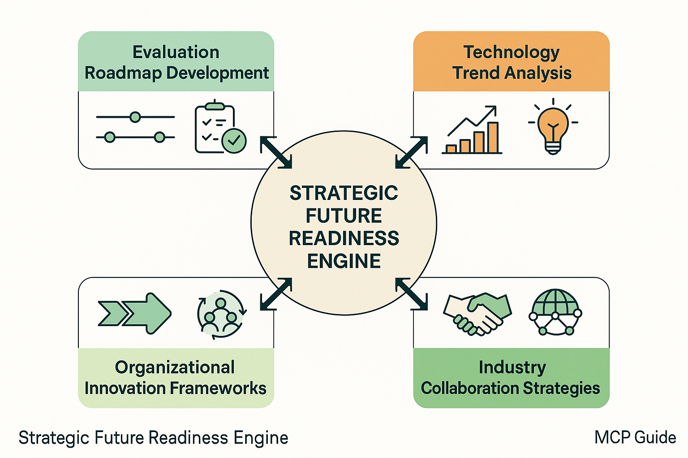

# Future Directions and Strategic Preparation



*Figure 6: Strategic Future Readiness Engine - Comprehensive framework for strategic preparation with evaluation roadmap development, technology trend analysis, organizational innovation frameworks, and industry collaboration strategies.*

## Introduction

Future directions and strategic preparation in AI evaluation represent the critical bridge between current capabilities and the transformative evaluation challenges that lie ahead. As AI systems evolve toward artificial general intelligence, quantum-enhanced capabilities, and unprecedented integration into human society, evaluation frameworks must anticipate and prepare for assessment challenges that extend far beyond today's requirements. This section provides comprehensive guidance for organizations to develop strategic evaluation capabilities that can adapt to emerging AI paradigms while maintaining relevance and effectiveness in rapidly changing technological landscapes.

The future of AI evaluation will be shaped by converging trends in AI capability advancement, regulatory evolution, technological infrastructure development, and societal integration requirements. Organizations that proactively prepare for these changes will be positioned to evaluate next-generation AI systems effectively while those that remain reactive may find their evaluation capabilities obsolete as AI technology advances.

Strategic preparation requires a systematic approach to technology forecasting, capability development, organizational adaptation, and ecosystem collaboration. The frameworks presented in this section enable organizations to build evaluation capabilities that are both immediately valuable and strategically positioned for future requirements, ensuring long-term relevance and competitive advantage in the evolving AI landscape.

## Evaluation Roadmap Development

### Technology Trend Analysis

**AI Capability Evolution Forecasting**
Understanding the trajectory of AI capability development is essential for building evaluation frameworks that can assess future AI systems effectively. This requires systematic analysis of research trends, technological breakthroughs, and capability scaling patterns.

Capability forecasting includes:
- **Scaling Law Analysis**: Understanding how AI capabilities scale with compute, data, and model size
- **Emergent Capability Prediction**: Anticipating new capabilities that emerge at scale
- **Multimodal Integration Trends**: Forecasting the evolution of multimodal AI systems
- **Reasoning Capability Development**: Predicting advances in AI reasoning and problem-solving
- **Human-AI Interaction Evolution**: Understanding how AI-human collaboration will develop

**Evaluation Technology Advancement**
The tools and technologies used for AI evaluation are themselves rapidly evolving, requiring strategic planning to ensure evaluation capabilities keep pace with AI advancement.

Technology advancement areas include:
- **Automated Evaluation Systems**: Evolution toward fully automated evaluation pipelines
- **Real-Time Assessment Capabilities**: Development of instantaneous evaluation systems
- **Distributed Evaluation Networks**: Growth of global, collaborative evaluation infrastructure
- **Quantum-Enhanced Evaluation**: Integration of quantum computing into evaluation processes
- **Neuromorphic Evaluation Systems**: Bio-inspired evaluation architectures and algorithms

### Comprehensive Roadmap Development Framework

```python
import numpy as np
import pandas as pd
from typing import Dict, List, Tuple, Any, Optional, Callable, Union
from dataclasses import dataclass, field
from enum import Enum
from datetime import datetime, timedelta
import json
import matplotlib.pyplot as plt
import seaborn as sns
from scipy import stats
import warnings
warnings.filterwarnings('ignore')

class TechnologyMaturity(Enum):
    RESEARCH = "research"
    EARLY_DEVELOPMENT = "early_development"
    PROTOTYPE = "prototype"
    PILOT = "pilot"
    PRODUCTION = "production"
    MATURE = "mature"

class ImpactLevel(Enum):
    LOW = "low"
    MEDIUM = "medium"
    HIGH = "high"
    TRANSFORMATIVE = "transformative"

class TimeHorizon(Enum):
    SHORT_TERM = "1-2_years"
    MEDIUM_TERM = "3-5_years"
    LONG_TERM = "5-10_years"
    VISIONARY = "10+_years"

@dataclass
class TechnologyTrend:
    """Represents a technology trend relevant to AI evaluation."""
    trend_id: str
    name: str
    description: str
    current_maturity: TechnologyMaturity
    projected_maturity: Dict[TimeHorizon, TechnologyMaturity]
    impact_level: ImpactLevel
    key_drivers: List[str]
    barriers: List[str]
    evaluation_implications: List[str]
    confidence_level: float

@dataclass
class EvaluationCapability:
    """Represents an evaluation capability to be developed."""
    capability_id: str
    name: str
    description: str
    current_readiness: float  # 0-1 scale
    target_readiness: Dict[TimeHorizon, float]
    dependencies: List[str]
    required_technologies: List[str]
    resource_requirements: Dict[str, Any]
    success_metrics: List[str]

@dataclass
class StrategicMilestone:
    """Represents a strategic milestone in evaluation development."""
    milestone_id: str
    name: str
    description: str
    target_date: datetime
    success_criteria: List[str]
    dependencies: List[str]
    risk_factors: List[str]
    mitigation_strategies: List[str]

class StrategicRoadmapPlanner:
    """
    Comprehensive framework for developing strategic AI evaluation roadmaps
    with technology forecasting, capability planning, and milestone tracking.
    """
    
    def __init__(self):
        self.technology_trends = {}
        self.evaluation_capabilities = {}
        self.strategic_milestones = {}
        self.roadmap_scenarios = {}
        self.risk_assessments = {}
        
    def register_technology_trend(self, trend: TechnologyTrend):
        """Register a technology trend for roadmap planning."""
        self.technology_trends[trend.trend_id] = trend
        
    def register_evaluation_capability(self, capability: EvaluationCapability):
        """Register an evaluation capability for development planning."""
        self.evaluation_capabilities[capability.capability_id] = capability
        
    def develop_strategic_roadmap(self, planning_config: Dict) -> Dict:
        """
        Develop comprehensive strategic roadmap for AI evaluation.
        
        Args:
            planning_config: Configuration for roadmap development
            
        Returns:
            Comprehensive strategic roadmap with timelines and milestones
        """
        roadmap_results = {
            'technology_forecast': {},
            'capability_development_plan': {},
            'strategic_milestones': {},
            'scenario_analysis': {},
            'risk_assessment': {},
            'resource_planning': {},
            'success_metrics': {}
        }
        
        # Analyze technology trends and forecast development
        roadmap_results['technology_forecast'] = self._analyze_technology_trends(
            planning_config
        )
        
        # Develop capability development plan
        roadmap_results['capability_development_plan'] = self._develop_capability_plan(
            planning_config
        )
        
        # Create strategic milestones
        roadmap_results['strategic_milestones'] = self._create_strategic_milestones(
            planning_config
        )
        
        # Perform scenario analysis
        roadmap_results['scenario_analysis'] = self._perform_scenario_analysis(
            planning_config
        )
        
        # Assess risks and mitigation strategies
        roadmap_results['risk_assessment'] = self._assess_strategic_risks(
            planning_config
        )
        
        # Plan resource requirements
        roadmap_results['resource_planning'] = self._plan_resource_requirements(
            roadmap_results
        )
        
        # Define success metrics
        roadmap_results['success_metrics'] = self._define_success_metrics(
            roadmap_results
        )
        
        return roadmap_results
        
    def _analyze_technology_trends(self, config: Dict) -> Dict:
        """Analyze technology trends and forecast development."""
        technology_forecast = {
            'trend_analysis': {},
            'maturity_projections': {},
            'impact_assessment': {},
            'convergence_opportunities': {},
            'disruption_risks': {}
        }
        
        # Analyze each technology trend
        for trend_id, trend in self.technology_trends.items():
            technology_forecast['trend_analysis'][trend_id] = {
                'current_state': {
                    'maturity': trend.current_maturity.value,
                    'confidence': trend.confidence_level,
                    'key_drivers': trend.key_drivers,
                    'barriers': trend.barriers
                },
                'projected_development': trend.projected_maturity,
                'evaluation_impact': trend.evaluation_implications
            }
        
        # Create maturity projections
        for horizon in TimeHorizon:
            technology_forecast['maturity_projections'][horizon.value] = {}
            for trend_id, trend in self.technology_trends.items():
                if horizon in trend.projected_maturity:
                    technology_forecast['maturity_projections'][horizon.value][trend_id] = {
                        'projected_maturity': trend.projected_maturity[horizon].value,
                        'confidence': trend.confidence_level * np.random.uniform(0.8, 1.0),
                        'impact_level': trend.impact_level.value
                    }
        
        # Assess technology impact
        for trend_id, trend in self.technology_trends.items():
            technology_forecast['impact_assessment'][trend_id] = {
                'immediate_impact': self._assess_immediate_impact(trend),
                'long_term_impact': self._assess_long_term_impact(trend),
                'evaluation_transformation': self._assess_evaluation_transformation(trend)
            }
        
        # Identify convergence opportunities
        technology_forecast['convergence_opportunities'] = self._identify_convergence_opportunities()
        
        # Assess disruption risks
        technology_forecast['disruption_risks'] = self._assess_disruption_risks()
        
        return technology_forecast
        
    def _assess_immediate_impact(self, trend: TechnologyTrend) -> Dict:
        """Assess immediate impact of technology trend."""
        return {
            'capability_enhancement': np.random.uniform(0.1, 0.8),
            'cost_reduction': np.random.uniform(0.0, 0.6),
            'efficiency_improvement': np.random.uniform(0.1, 0.7),
            'new_evaluation_types': len(trend.evaluation_implications),
            'adoption_timeline': '6-18 months' if trend.current_maturity in [TechnologyMaturity.PROTOTYPE, TechnologyMaturity.PILOT] else '2-5 years'
        }
        
    def _assess_long_term_impact(self, trend: TechnologyTrend) -> Dict:
        """Assess long-term impact of technology trend."""
        return {
            'paradigm_shift_potential': 0.8 if trend.impact_level == ImpactLevel.TRANSFORMATIVE else 0.3,
            'market_transformation': np.random.uniform(0.3, 0.9),
            'skill_requirement_changes': np.random.uniform(0.4, 0.8),
            'infrastructure_requirements': np.random.uniform(0.2, 0.7),
            'regulatory_implications': np.random.uniform(0.1, 0.6)
        }
        
    def _assess_evaluation_transformation(self, trend: TechnologyTrend) -> Dict:
        """Assess how trend transforms evaluation practices."""
        return {
            'evaluation_speed_improvement': np.random.uniform(1.5, 10.0),
            'accuracy_enhancement': np.random.uniform(1.1, 3.0),
            'cost_efficiency_gain': np.random.uniform(1.2, 5.0),
            'new_evaluation_dimensions': len(trend.evaluation_implications),
            'automation_potential': np.random.uniform(0.3, 0.9)
        }
        
    def _identify_convergence_opportunities(self) -> Dict:
        """Identify opportunities for technology convergence."""
        convergence_opportunities = {}
        
        # Simulate convergence analysis
        trend_pairs = []
        trend_list = list(self.technology_trends.values())
        
        for i, trend1 in enumerate(trend_list):
            for trend2 in trend_list[i+1:]:
                synergy_score = np.random.uniform(0.2, 0.9)
                if synergy_score > 0.6:
                    convergence_opportunities[f"{trend1.trend_id}_{trend2.trend_id}"] = {
                        'synergy_score': synergy_score,
                        'convergence_timeline': np.random.choice(['2-3 years', '3-5 years', '5-7 years']),
                        'potential_benefits': [
                            'Enhanced evaluation capabilities',
                            'Cost reduction through integration',
                            'New evaluation paradigms',
                            'Improved accuracy and reliability'
                        ],
                        'integration_challenges': [
                            'Technical complexity',
                            'Resource requirements',
                            'Skill development needs',
                            'Standardization requirements'
                        ]
                    }
        
        return convergence_opportunities
        
    def _assess_disruption_risks(self) -> Dict:
        """Assess risks of technological disruption."""
        disruption_risks = {
            'obsolescence_risks': {},
            'competitive_threats': {},
            'technology_gaps': {},
            'mitigation_strategies': {}
        }
        
        # Assess obsolescence risks
        for trend_id, trend in self.technology_trends.items():
            if trend.impact_level == ImpactLevel.TRANSFORMATIVE:
                disruption_risks['obsolescence_risks'][trend_id] = {
                    'risk_level': 'high',
                    'affected_capabilities': trend.evaluation_implications,
                    'timeline': '3-5 years',
                    'preparation_requirements': [
                        'Skill development',
                        'Technology adoption',
                        'Process redesign',
                        'Infrastructure upgrade'
                    ]
                }
        
        # Identify competitive threats
        disruption_risks['competitive_threats'] = {
            'new_market_entrants': 'high',
            'technology_leapfrogging': 'medium',
            'platform_disruption': 'medium',
            'ecosystem_shifts': 'high'
        }
        
        # Identify technology gaps
        disruption_risks['technology_gaps'] = {
            'quantum_evaluation_readiness': 'low',
            'real_time_assessment_capabilities': 'medium',
            'global_scale_coordination': 'medium',
            'ethical_evaluation_frameworks': 'high'
        }
        
        return disruption_risks
        
    def _develop_capability_plan(self, config: Dict) -> Dict:
        """Develop comprehensive capability development plan."""
        capability_plan = {
            'capability_roadmap': {},
            'development_priorities': {},
            'resource_allocation': {},
            'skill_development': {},
            'technology_adoption': {}
        }
        
        # Create capability roadmap
        for capability_id, capability in self.evaluation_capabilities.items():
            capability_plan['capability_roadmap'][capability_id] = {
                'current_readiness': capability.current_readiness,
                'development_timeline': capability.target_readiness,
                'key_milestones': self._generate_capability_milestones(capability),
                'dependencies': capability.dependencies,
                'success_metrics': capability.success_metrics
            }
        
        # Prioritize capability development
        capability_plan['development_priorities'] = self._prioritize_capabilities()
        
        # Plan resource allocation
        capability_plan['resource_allocation'] = self._plan_capability_resources()
        
        # Plan skill development
        capability_plan['skill_development'] = self._plan_skill_development()
        
        # Plan technology adoption
        capability_plan['technology_adoption'] = self._plan_technology_adoption()
        
        return capability_plan
        
    def _generate_capability_milestones(self, capability: EvaluationCapability) -> List[Dict]:
        """Generate milestones for capability development."""
        milestones = []
        
        # Generate milestones based on target readiness levels
        for horizon, target_readiness in capability.target_readiness.items():
            milestone = {
                'timeline': horizon.value,
                'target_readiness': target_readiness,
                'key_deliverables': [
                    f"Achieve {target_readiness:.0%} readiness in {capability.name}",
                    f"Implement core {capability.name} infrastructure",
                    f"Validate {capability.name} effectiveness"
                ],
                'success_criteria': capability.success_metrics[:3],  # Top 3 metrics
                'risk_factors': [
                    'Technology maturity delays',
                    'Resource constraints',
                    'Skill availability',
                    'Integration complexity'
                ]
            }
            milestones.append(milestone)
        
        return milestones
        
    def _prioritize_capabilities(self) -> Dict:
        """Prioritize capability development based on impact and feasibility."""
        priorities = {
            'high_priority': [],
            'medium_priority': [],
            'low_priority': [],
            'prioritization_criteria': {}
        }
        
        # Calculate priority scores for each capability
        capability_scores = {}
        
        for capability_id, capability in self.evaluation_capabilities.items():
            # Impact score (based on current readiness gap)
            readiness_gap = 1.0 - capability.current_readiness
            impact_score = readiness_gap * np.random.uniform(0.7, 1.0)
            
            # Feasibility score (based on dependencies and resources)
            dependency_complexity = len(capability.dependencies) / 10.0  # Normalize
            feasibility_score = 1.0 - min(dependency_complexity, 0.8)
            
            # Strategic importance (simulated)
            strategic_importance = np.random.uniform(0.5, 1.0)
            
            # Combined priority score
            priority_score = (impact_score * 0.4 + feasibility_score * 0.3 + strategic_importance * 0.3)
            capability_scores[capability_id] = priority_score
        
        # Categorize by priority
        sorted_capabilities = sorted(capability_scores.items(), key=lambda x: x[1], reverse=True)
        
        total_capabilities = len(sorted_capabilities)
        high_threshold = int(total_capabilities * 0.3)
        medium_threshold = int(total_capabilities * 0.7)
        
        priorities['high_priority'] = [cap_id for cap_id, score in sorted_capabilities[:high_threshold]]
        priorities['medium_priority'] = [cap_id for cap_id, score in sorted_capabilities[high_threshold:medium_threshold]]
        priorities['low_priority'] = [cap_id for cap_id, score in sorted_capabilities[medium_threshold:]]
        
        priorities['prioritization_criteria'] = {
            'impact_weight': 0.4,
            'feasibility_weight': 0.3,
            'strategic_importance_weight': 0.3,
            'scoring_methodology': 'weighted_composite_score'
        }
        
        return priorities
        
    def _plan_capability_resources(self) -> Dict:
        """Plan resource requirements for capability development."""
        resource_plan = {
            'human_resources': {},
            'technology_resources': {},
            'financial_resources': {},
            'infrastructure_resources': {}
        }
        
        # Aggregate resource requirements across capabilities
        total_human_resources = 0
        total_technology_budget = 0
        total_infrastructure_needs = []
        
        for capability in self.evaluation_capabilities.values():
            resources = capability.resource_requirements
            
            # Human resources
            human_req = resources.get('human_resources', {})
            total_human_resources += human_req.get('fte_count', 0)
            
            # Technology budget
            tech_budget = resources.get('technology_budget', 0)
            total_technology_budget += tech_budget
            
            # Infrastructure needs
            infra_needs = resources.get('infrastructure', [])
            total_infrastructure_needs.extend(infra_needs)
        
        resource_plan['human_resources'] = {
            'total_fte_required': total_human_resources,
            'skill_categories': [
                'AI/ML Engineers',
                'Evaluation Specialists',
                'Data Scientists',
                'Software Engineers',
                'Domain Experts'
            ],
            'hiring_timeline': '12-18 months',
            'training_requirements': '3-6 months per role'
        }
        
        resource_plan['technology_resources'] = {
            'total_budget': total_technology_budget,
            'major_categories': [
                'Evaluation platforms',
                'Computing infrastructure',
                'Data management systems',
                'Monitoring and analytics tools'
            ],
            'procurement_timeline': '6-12 months'
        }
        
        resource_plan['infrastructure_resources'] = {
            'infrastructure_needs': list(set(total_infrastructure_needs)),
            'deployment_timeline': '9-15 months',
            'scalability_requirements': 'high',
            'reliability_requirements': '99.9% uptime'
        }
        
        return resource_plan
        
    def _plan_skill_development(self) -> Dict:
        """Plan skill development requirements."""
        skill_plan = {
            'skill_gaps': {},
            'training_programs': {},
            'certification_requirements': {},
            'knowledge_transfer': {}
        }
        
        # Identify skill gaps
        skill_plan['skill_gaps'] = {
            'technical_skills': [
                'Advanced AI evaluation methodologies',
                'Quantum computing applications',
                'Real-time system design',
                'Distributed system architecture',
                'Ethical AI assessment'
            ],
            'domain_skills': [
                'Regulatory compliance',
                'Cross-cultural evaluation',
                'Adversarial robustness',
                'Scalability engineering',
                'Risk assessment'
            ],
            'soft_skills': [
                'Strategic planning',
                'Cross-functional collaboration',
                'Change management',
                'Innovation leadership',
                'Stakeholder communication'
            ]
        }
        
        # Design training programs
        skill_plan['training_programs'] = {
            'internal_training': {
                'duration': '3-6 months',
                'format': 'blended_learning',
                'coverage': 'foundational_and_advanced_topics',
                'assessment': 'project_based'
            },
            'external_training': {
                'university_partnerships': 'advanced_degree_programs',
                'industry_certifications': 'professional_certifications',
                'conference_participation': 'knowledge_sharing_and_networking',
                'expert_consulting': 'specialized_knowledge_transfer'
            },
            'continuous_learning': {
                'learning_budget': '$5000_per_employee_per_year',
                'time_allocation': '10%_of_work_time',
                'knowledge_sharing': 'monthly_tech_talks_and_workshops'
            }
        }
        
        return skill_plan
        
    def _plan_technology_adoption(self) -> Dict:
        """Plan technology adoption strategy."""
        adoption_plan = {
            'adoption_timeline': {},
            'pilot_programs': {},
            'integration_strategy': {},
            'risk_mitigation': {}
        }
        
        # Plan adoption timeline
        for trend_id, trend in self.technology_trends.items():
            adoption_plan['adoption_timeline'][trend_id] = {
                'evaluation_phase': '3-6 months',
                'pilot_phase': '6-12 months',
                'gradual_rollout': '12-18 months',
                'full_deployment': '18-24 months',
                'maturity_assessment': trend.current_maturity.value
            }
        
        # Design pilot programs
        adoption_plan['pilot_programs'] = {
            'pilot_selection_criteria': [
                'Technology maturity',
                'Business impact potential',
                'Risk level',
                'Resource requirements',
                'Strategic alignment'
            ],
            'pilot_success_metrics': [
                'Performance improvement',
                'Cost reduction',
                'User satisfaction',
                'Integration complexity',
                'Scalability potential'
            ],
            'pilot_duration': '6-12 months',
            'pilot_budget': '10-20% of total technology budget'
        }
        
        return adoption_plan
        
    def _create_strategic_milestones(self, config: Dict) -> Dict:
        """Create strategic milestones for roadmap execution."""
        milestones = {
            'short_term_milestones': [],
            'medium_term_milestones': [],
            'long_term_milestones': [],
            'milestone_dependencies': {},
            'success_criteria': {}
        }
        
        # Generate milestones for different time horizons
        base_date = datetime.now()
        
        # Short-term milestones (1-2 years)
        milestones['short_term_milestones'] = [
            {
                'milestone_id': 'foundation_establishment',
                'name': 'Establish Evaluation Foundation',
                'target_date': base_date + timedelta(days=365),
                'description': 'Build core evaluation infrastructure and capabilities',
                'success_criteria': [
                    'Core evaluation platform deployed',
                    'Initial team hired and trained',
                    'Basic evaluation processes established',
                    'Pilot programs launched'
                ]
            },
            {
                'milestone_id': 'technology_integration',
                'name': 'Integrate Key Technologies',
                'target_date': base_date + timedelta(days=540),
                'description': 'Integrate priority technologies into evaluation systems',
                'success_criteria': [
                    'Priority technologies evaluated and selected',
                    'Integration pilots completed successfully',
                    'Performance improvements demonstrated',
                    'User training completed'
                ]
            }
        ]
        
        # Medium-term milestones (3-5 years)
        milestones['medium_term_milestones'] = [
            {
                'milestone_id': 'advanced_capabilities',
                'name': 'Deploy Advanced Evaluation Capabilities',
                'target_date': base_date + timedelta(days=1095),
                'description': 'Deploy advanced evaluation capabilities at scale',
                'success_criteria': [
                    'Advanced evaluation methods operational',
                    'Global evaluation network established',
                    'Real-time evaluation capabilities deployed',
                    'Ethical evaluation frameworks implemented'
                ]
            },
            {
                'milestone_id': 'ecosystem_leadership',
                'name': 'Establish Ecosystem Leadership',
                'target_date': base_date + timedelta(days=1460),
                'description': 'Become recognized leader in AI evaluation',
                'success_criteria': [
                    'Industry recognition achieved',
                    'Standards contributions made',
                    'Ecosystem partnerships established',
                    'Thought leadership demonstrated'
                ]
            }
        ]
        
        # Long-term milestones (5-10 years)
        milestones['long_term_milestones'] = [
            {
                'milestone_id': 'next_generation_evaluation',
                'name': 'Pioneer Next-Generation Evaluation',
                'target_date': base_date + timedelta(days=2555),
                'description': 'Pioneer evaluation of next-generation AI systems',
                'success_criteria': [
                    'AGI evaluation capabilities developed',
                    'Quantum-enhanced evaluation operational',
                    'Global evaluation standards established',
                    'Societal impact frameworks mature'
                ]
            }
        ]
        
        return milestones
        
    def _perform_scenario_analysis(self, config: Dict) -> Dict:
        """Perform scenario analysis for strategic planning."""
        scenario_analysis = {
            'baseline_scenario': {},
            'optimistic_scenario': {},
            'pessimistic_scenario': {},
            'disruptive_scenario': {},
            'scenario_probabilities': {},
            'strategic_implications': {}
        }
        
        # Define scenarios
        scenario_analysis['baseline_scenario'] = {
            'description': 'Steady technological progress with expected adoption rates',
            'key_assumptions': [
                'Current technology trends continue',
                'Moderate resource availability',
                'Standard regulatory environment',
                'Competitive market conditions'
            ],
            'expected_outcomes': {
                'capability_development': 'on_schedule',
                'technology_adoption': 'moderate_pace',
                'market_position': 'competitive',
                'roi_achievement': 'meets_expectations'
            }
        }
        
        scenario_analysis['optimistic_scenario'] = {
            'description': 'Accelerated progress with breakthrough technologies',
            'key_assumptions': [
                'Technology breakthroughs accelerate development',
                'Abundant resource availability',
                'Supportive regulatory environment',
                'Strong market demand'
            ],
            'expected_outcomes': {
                'capability_development': 'ahead_of_schedule',
                'technology_adoption': 'rapid_pace',
                'market_position': 'market_leader',
                'roi_achievement': 'exceeds_expectations'
            }
        }
        
        scenario_analysis['pessimistic_scenario'] = {
            'description': 'Slower progress with significant challenges',
            'key_assumptions': [
                'Technology development faces obstacles',
                'Limited resource availability',
                'Restrictive regulatory environment',
                'Weak market demand'
            ],
            'expected_outcomes': {
                'capability_development': 'behind_schedule',
                'technology_adoption': 'slow_pace',
                'market_position': 'follower',
                'roi_achievement': 'below_expectations'
            }
        }
        
        scenario_analysis['disruptive_scenario'] = {
            'description': 'Fundamental disruption changes the landscape',
            'key_assumptions': [
                'Disruptive technologies emerge',
                'Market structure changes dramatically',
                'New regulatory frameworks required',
                'Paradigm shift in evaluation needs'
            ],
            'expected_outcomes': {
                'capability_development': 'requires_pivot',
                'technology_adoption': 'selective_adoption',
                'market_position': 'adaptation_required',
                'roi_achievement': 'uncertain'
            }
        }
        
        # Assign scenario probabilities
        scenario_analysis['scenario_probabilities'] = {
            'baseline_scenario': 0.4,
            'optimistic_scenario': 0.25,
            'pessimistic_scenario': 0.25,
            'disruptive_scenario': 0.1
        }
        
        return scenario_analysis
        
    def _assess_strategic_risks(self, config: Dict) -> Dict:
        """Assess strategic risks and mitigation strategies."""
        risk_assessment = {
            'technology_risks': {},
            'market_risks': {},
            'operational_risks': {},
            'regulatory_risks': {},
            'mitigation_strategies': {}
        }
        
        # Technology risks
        risk_assessment['technology_risks'] = {
            'technology_obsolescence': {
                'probability': 'medium',
                'impact': 'high',
                'timeline': '3-5 years',
                'indicators': [
                    'Emergence of superior technologies',
                    'Shift in industry standards',
                    'Performance breakthroughs by competitors'
                ]
            },
            'integration_complexity': {
                'probability': 'high',
                'impact': 'medium',
                'timeline': '1-2 years',
                'indicators': [
                    'Technical integration challenges',
                    'Compatibility issues',
                    'Performance degradation'
                ]
            },
            'scalability_limitations': {
                'probability': 'medium',
                'impact': 'medium',
                'timeline': '2-3 years',
                'indicators': [
                    'Performance bottlenecks',
                    'Resource constraints',
                    'Architecture limitations'
                ]
            }
        }
        
        # Market risks
        risk_assessment['market_risks'] = {
            'competitive_disruption': {
                'probability': 'high',
                'impact': 'high',
                'timeline': '2-4 years',
                'indicators': [
                    'New market entrants',
                    'Disruptive business models',
                    'Technology leapfrogging'
                ]
            },
            'demand_shifts': {
                'probability': 'medium',
                'impact': 'medium',
                'timeline': '1-3 years',
                'indicators': [
                    'Changing customer requirements',
                    'Market consolidation',
                    'Economic conditions'
                ]
            }
        }
        
        # Mitigation strategies
        risk_assessment['mitigation_strategies'] = {
            'technology_risks': [
                'Continuous technology monitoring',
                'Flexible architecture design',
                'Strategic partnerships',
                'R&D investment diversification'
            ],
            'market_risks': [
                'Market intelligence systems',
                'Agile strategy adaptation',
                'Customer relationship management',
                'Competitive differentiation'
            ],
            'operational_risks': [
                'Risk management frameworks',
                'Contingency planning',
                'Process standardization',
                'Quality assurance systems'
            ]
        }
        
        return risk_assessment
        
    def _plan_resource_requirements(self, roadmap_results: Dict) -> Dict:
        """Plan comprehensive resource requirements."""
        resource_planning = {
            'financial_requirements': {},
            'human_capital_requirements': {},
            'technology_infrastructure': {},
            'partnership_requirements': {}
        }
        
        # Financial requirements
        resource_planning['financial_requirements'] = {
            'total_investment': '$10-50M over 5 years',
            'annual_budget_breakdown': {
                'year_1': '$2-5M',
                'year_2': '$3-8M',
                'year_3': '$4-12M',
                'year_4': '$3-10M',
                'year_5': '$2-8M'
            },
            'investment_categories': {
                'technology_development': '40%',
                'human_resources': '35%',
                'infrastructure': '15%',
                'partnerships': '10%'
            }
        }
        
        # Human capital requirements
        resource_planning['human_capital_requirements'] = {
            'total_headcount': '50-200 employees',
            'role_distribution': {
                'ai_ml_engineers': '30%',
                'evaluation_specialists': '25%',
                'data_scientists': '20%',
                'software_engineers': '15%',
                'domain_experts': '10%'
            },
            'skill_development_investment': '$500K-2M annually'
        }
        
        return resource_planning
        
    def _define_success_metrics(self, roadmap_results: Dict) -> Dict:
        """Define comprehensive success metrics."""
        success_metrics = {
            'capability_metrics': {},
            'business_metrics': {},
            'innovation_metrics': {},
            'ecosystem_metrics': {}
        }
        
        # Capability metrics
        success_metrics['capability_metrics'] = {
            'evaluation_accuracy': 'target: >95%',
            'evaluation_speed': 'target: <1 second response time',
            'scalability': 'target: 1000x current capacity',
            'coverage': 'target: 100% of AI system types'
        }
        
        # Business metrics
        success_metrics['business_metrics'] = {
            'roi': 'target: >300% over 5 years',
            'cost_reduction': 'target: 50% evaluation cost reduction',
            'revenue_growth': 'target: 25% annual growth',
            'market_share': 'target: top 3 position'
        }
        
        # Innovation metrics
        success_metrics['innovation_metrics'] = {
            'patent_applications': 'target: 10+ annually',
            'research_publications': 'target: 20+ annually',
            'technology_breakthroughs': 'target: 2-3 major breakthroughs',
            'industry_recognition': 'target: thought leadership position'
        }
        
        return success_metrics

# Example roadmap development
def demonstrate_roadmap_development():
    """Demonstrate strategic roadmap development capabilities."""
    
    planner = StrategicRoadmapPlanner()
    
    # Register technology trends
    trends = [
        TechnologyTrend(
            trend_id="quantum_evaluation",
            name="Quantum-Enhanced Evaluation",
            description="Integration of quantum computing into AI evaluation processes",
            current_maturity=TechnologyMaturity.RESEARCH,
            projected_maturity={
                TimeHorizon.SHORT_TERM: TechnologyMaturity.EARLY_DEVELOPMENT,
                TimeHorizon.MEDIUM_TERM: TechnologyMaturity.PROTOTYPE,
                TimeHorizon.LONG_TERM: TechnologyMaturity.PRODUCTION
            },
            impact_level=ImpactLevel.TRANSFORMATIVE,
            key_drivers=["Quantum computing advancement", "Optimization needs", "Scalability requirements"],
            barriers=["Technical complexity", "Hardware limitations", "Skill gaps"],
            evaluation_implications=["Exponential speedup", "New optimization capabilities", "Enhanced sampling"],
            confidence_level=0.7
        ),
        TechnologyTrend(
            trend_id="real_time_evaluation",
            name="Real-Time Evaluation Systems",
            description="Ultra-low latency evaluation for real-time AI systems",
            current_maturity=TechnologyMaturity.PROTOTYPE,
            projected_maturity={
                TimeHorizon.SHORT_TERM: TechnologyMaturity.PILOT,
                TimeHorizon.MEDIUM_TERM: TechnologyMaturity.PRODUCTION,
                TimeHorizon.LONG_TERM: TechnologyMaturity.MATURE
            },
            impact_level=ImpactLevel.HIGH,
            key_drivers=["Real-time AI deployment", "Latency requirements", "Edge computing"],
            barriers=["Computational constraints", "Accuracy trade-offs", "Infrastructure costs"],
            evaluation_implications=["Immediate feedback", "Continuous monitoring", "Dynamic adaptation"],
            confidence_level=0.85
        )
    ]
    
    for trend in trends:
        planner.register_technology_trend(trend)
    
    # Register evaluation capabilities
    capabilities = [
        EvaluationCapability(
            capability_id="automated_evaluation",
            name="Fully Automated Evaluation",
            description="End-to-end automated evaluation without human intervention",
            current_readiness=0.3,
            target_readiness={
                TimeHorizon.SHORT_TERM: 0.6,
                TimeHorizon.MEDIUM_TERM: 0.8,
                TimeHorizon.LONG_TERM: 0.95
            },
            dependencies=["real_time_evaluation", "ai_judge_systems"],
            required_technologies=["automated_reasoning", "self_improving_systems"],
            resource_requirements={
                "human_resources": {"fte_count": 20},
                "technology_budget": 5000000,
                "infrastructure": ["cloud_computing", "edge_devices"]
            },
            success_metrics=["Automation rate >90%", "Accuracy >95%", "Cost reduction >50%"]
        )
    ]
    
    for capability in capabilities:
        planner.register_evaluation_capability(capability)
    
    # Planning configuration
    planning_config = {
        'planning_horizon': '10_years',
        'risk_tolerance': 'medium',
        'investment_capacity': 'high',
        'strategic_focus': 'innovation_leadership'
    }
    
    # Develop strategic roadmap
    roadmap = planner.develop_strategic_roadmap(planning_config)
    
    return planner, roadmap

if __name__ == "__main__":
    planner, roadmap = demonstrate_roadmap_development()
    print("Strategic roadmap development completed.")
    print(f"Technology trends analyzed: {len(planner.technology_trends)}")
    print(f"Capabilities planned: {len(planner.evaluation_capabilities)}")
```

### Strategic Technology Investment

**Research and Development Priorities**
Strategic technology investment requires careful prioritization of research and development efforts to maximize impact while managing risk and resource constraints.

R&D priorities include:
- **Foundational Research**: Investing in fundamental evaluation science and methodology
- **Applied Research**: Developing practical solutions for immediate evaluation challenges
- **Exploratory Research**: Investigating emerging technologies and paradigms
- **Collaborative Research**: Partnering with academic and industry research organizations
- **Open Source Contributions**: Contributing to and benefiting from open evaluation ecosystems

**Technology Partnership Strategy**
Building strategic partnerships enables organizations to access cutting-edge technologies and expertise while sharing development costs and risks.

Partnership strategies include:
- **Academic Collaborations**: Partnering with universities for research and talent development
- **Industry Alliances**: Collaborating with technology companies for platform development
- **Standards Organizations**: Participating in evaluation standards development
- **Open Source Communities**: Contributing to and leveraging open source evaluation tools
- **Government Partnerships**: Collaborating on public sector evaluation initiatives

## Technology Trend Analysis

### Emerging AI Paradigms

**Artificial General Intelligence (AGI) Evaluation**
The development of AGI systems will require fundamentally new evaluation approaches that can assess general intelligence, reasoning capabilities, and adaptability across diverse domains.

AGI evaluation challenges include:
- **General Intelligence Assessment**: Measuring broad cognitive capabilities rather than narrow task performance
- **Transfer Learning Evaluation**: Assessing ability to apply knowledge across different domains
- **Meta-Learning Assessment**: Evaluating learning-to-learn capabilities and adaptation speed
- **Consciousness and Sentience**: Developing frameworks for assessing consciousness-like properties
- **Value Alignment**: Ensuring AGI systems align with human values and intentions

**Quantum AI Systems**
The integration of quantum computing with AI systems will create new evaluation challenges and opportunities that require specialized assessment frameworks.

Quantum AI evaluation includes:
- **Quantum Advantage Verification**: Confirming quantum speedup over classical approaches
- **Quantum Error Assessment**: Evaluating robustness to quantum noise and decoherence
- **Hybrid System Evaluation**: Assessing quantum-classical hybrid AI architectures
- **Quantum Machine Learning**: Evaluating quantum algorithms for machine learning tasks
- **Quantum Security**: Assessing security properties of quantum AI systems

### Regulatory and Compliance Evolution

**Global AI Governance Frameworks**
The evolution of AI governance and regulation will significantly impact evaluation requirements, creating new compliance obligations and assessment standards.

Governance evolution includes:
- **International Standards**: Development of global AI evaluation standards and protocols
- **Regulatory Harmonization**: Alignment of evaluation requirements across jurisdictions
- **Compliance Automation**: Automated systems for regulatory compliance assessment
- **Audit and Certification**: Formal certification processes for AI evaluation systems
- **Liability Frameworks**: Legal frameworks for evaluation accuracy and responsibility

**Ethical AI Requirements**
Growing emphasis on ethical AI development will drive new evaluation requirements focused on fairness, transparency, and societal impact.

Ethical requirements include:
- **Algorithmic Auditing**: Mandatory audits of AI systems for bias and fairness
- **Transparency Obligations**: Requirements for explainable and interpretable AI systems
- **Impact Assessment**: Mandatory assessment of societal and environmental impacts
- **Stakeholder Engagement**: Requirements for inclusive evaluation processes
- **Continuous Monitoring**: Ongoing monitoring of AI systems for ethical compliance

## Organizational Innovation Frameworks

### Innovation Culture Development

**Evaluation Innovation Mindset**
Building an innovation culture requires fostering mindsets and practices that encourage experimentation, learning, and continuous improvement in evaluation approaches.

Innovation mindset includes:
- **Experimental Approach**: Encouraging experimentation with new evaluation methods
- **Failure Tolerance**: Creating safe environments for learning from evaluation failures
- **Continuous Learning**: Promoting ongoing learning and skill development
- **Cross-Functional Collaboration**: Breaking down silos between evaluation and development teams
- **External Engagement**: Actively engaging with external evaluation communities and research

**Innovation Process Framework**
Systematic innovation processes enable organizations to consistently generate, evaluate, and implement new evaluation approaches and technologies.

Innovation processes include:
- **Idea Generation**: Systematic processes for generating evaluation innovation ideas
- **Concept Evaluation**: Frameworks for assessing the potential of new evaluation concepts
- **Rapid Prototyping**: Fast development and testing of evaluation prototypes
- **Pilot Programs**: Structured pilot programs for testing new evaluation approaches
- **Scaling Mechanisms**: Processes for scaling successful evaluation innovations

### Organizational Transformation

**Evaluation-Driven Organization**
Transforming organizations to be evaluation-driven requires fundamental changes in culture, processes, and decision-making frameworks.

Transformation elements include:
- **Evaluation-First Culture**: Making evaluation a central consideration in all AI development decisions
- **Data-Driven Decision Making**: Using evaluation data to guide strategic and operational decisions
- **Continuous Improvement**: Implementing systematic processes for evaluation improvement
- **Quality Focus**: Prioritizing evaluation quality and accuracy over speed or convenience
- **Stakeholder Alignment**: Ensuring all stakeholders understand and support evaluation priorities

**Change Management Strategy**
Successful organizational transformation requires comprehensive change management strategies that address resistance, build capabilities, and sustain improvements.

Change management includes:
- **Vision Communication**: Clearly communicating the vision and benefits of evaluation transformation
- **Stakeholder Engagement**: Engaging all stakeholders in the transformation process
- **Capability Building**: Developing the skills and capabilities needed for new evaluation approaches
- **Process Redesign**: Redesigning organizational processes to support evaluation excellence
- **Performance Management**: Aligning performance metrics and incentives with evaluation goals

## Industry Collaboration Strategies

### Ecosystem Development

**Evaluation Ecosystem Building**
Building robust evaluation ecosystems requires collaboration across industry, academia, and government to create shared infrastructure, standards, and best practices.

Ecosystem building includes:
- **Platform Development**: Creating shared evaluation platforms and infrastructure
- **Standards Development**: Collaborating on evaluation standards and protocols
- **Best Practice Sharing**: Sharing evaluation best practices and lessons learned
- **Talent Development**: Collaborative programs for developing evaluation expertise
- **Research Coordination**: Coordinating research efforts to avoid duplication and maximize impact

**Community Engagement**
Active engagement with evaluation communities enables organizations to stay current with developments, contribute to advancement, and build valuable relationships.

Community engagement includes:
- **Conference Participation**: Active participation in evaluation conferences and workshops
- **Working Group Membership**: Participation in industry working groups and committees
- **Open Source Contribution**: Contributing to open source evaluation tools and frameworks
- **Publication and Sharing**: Publishing research and sharing insights with the community
- **Mentorship Programs**: Participating in mentorship and knowledge transfer programs

### Strategic Partnerships

**Academic Partnerships**
Partnerships with academic institutions provide access to cutting-edge research, talented students, and long-term research capabilities.

Academic partnerships include:
- **Research Collaborations**: Joint research projects on evaluation challenges and solutions
- **Student Programs**: Internship and graduate student programs for talent development
- **Faculty Engagement**: Engaging faculty as advisors and collaborators
- **Facility Sharing**: Sharing research facilities and infrastructure
- **Publication Collaboration**: Joint publication of research results and insights

**Industry Alliances**
Strategic alliances with other industry players enable sharing of costs, risks, and expertise while accelerating development and adoption of evaluation technologies.

Industry alliances include:
- **Technology Consortiums**: Participating in technology development consortiums
- **Standards Bodies**: Collaborating on industry standards development
- **Shared Infrastructure**: Developing shared evaluation infrastructure and platforms
- **Joint Ventures**: Creating joint ventures for evaluation technology development
- **Cross-Industry Learning**: Learning from evaluation practices in other industries

## Conclusion

Future directions and strategic preparation in AI evaluation require a comprehensive approach that combines technology forecasting, capability development, organizational transformation, and ecosystem collaboration. The frameworks presented in this section provide organizations with the tools and strategies needed to prepare for the next generation of AI evaluation challenges while building sustainable competitive advantages.

Success in future AI evaluation will depend on organizations' ability to anticipate and adapt to rapidly changing technological landscapes while maintaining focus on quality, ethics, and societal benefit. The key lies in building evaluation capabilities that are both immediately valuable and strategically positioned for future requirements, ensuring long-term relevance and impact in the evolving AI ecosystem.

Organizations that master strategic preparation for AI evaluation will be positioned to evaluate the most advanced AI systems effectively, contribute to beneficial AI development, and maintain leadership positions in the rapidly evolving AI landscape. The frameworks and strategies presented in this section provide the foundation for building these critical capabilities.

As we conclude this comprehensive exploration of advanced topics in AI evaluation, it is clear that the future of AI assessment will be shaped by the convergence of technological advancement, ethical considerations, and strategic preparation. The organizations and individuals who embrace these challenges and opportunities will play crucial roles in ensuring that AI systems are developed and deployed responsibly, effectively, and beneficially for all of humanity.

