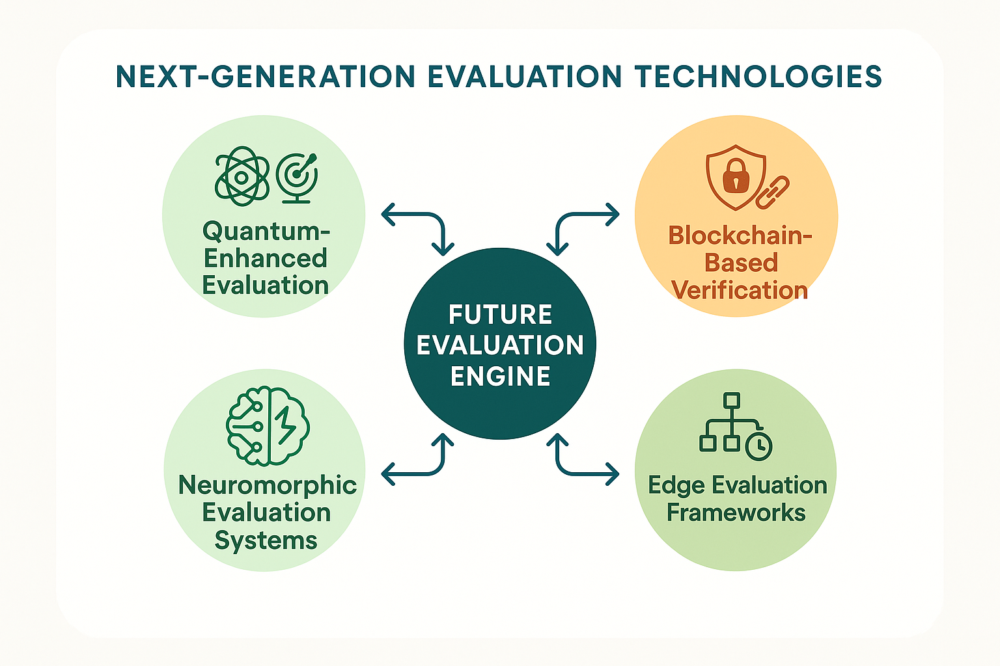

# Next-Generation Evaluation Technologies



*Figure 3: Future Evaluation Engine - Comprehensive framework for next-generation evaluation technologies including quantum-enhanced evaluation, blockchain-based verification, neuromorphic evaluation systems, and edge evaluation frameworks.*

## Introduction

Next-generation evaluation technologies represent the convergence of cutting-edge computational approaches with advanced AI assessment needs. These technologies leverage quantum computing, blockchain verification, neuromorphic architectures, and edge computing to enable evaluation capabilities that were previously impossible or impractical. As AI systems become increasingly sophisticated and deployed in critical applications, evaluation technologies must evolve to provide more powerful, secure, and efficient assessment capabilities.

The technologies presented in this section address fundamental limitations of current evaluation approaches including computational scalability, verification integrity, energy efficiency, and distributed assessment capabilities. They enable evaluation of AI systems at unprecedented scales, with enhanced security and trust guarantees, and in resource-constrained environments where traditional evaluation approaches are inadequate.

Organizations that adopt next-generation evaluation technologies gain significant advantages in evaluation capability, cost efficiency, security, and scalability. These technologies enable new forms of evaluation that can keep pace with rapidly advancing AI capabilities while providing stronger guarantees about evaluation integrity and reliability.

## Quantum-Enhanced Evaluation

### Quantum Computing Applications in AI Evaluation

**Quantum Advantage in Evaluation Tasks**
Quantum computing offers potential exponential speedups for certain evaluation tasks, particularly those involving optimization, sampling, and pattern recognition problems that are computationally intensive for classical computers.

Key quantum advantages include:
- **Optimization Problems**: Quantum algorithms for hyperparameter optimization and model selection
- **Sampling Tasks**: Quantum sampling for Monte Carlo evaluation and uncertainty quantification
- **Pattern Recognition**: Quantum machine learning for complex pattern detection in evaluation data
- **Cryptographic Verification**: Quantum-secure verification of evaluation results and model integrity
- **Parallel Evaluation**: Quantum superposition for evaluating multiple scenarios simultaneously

**Quantum Machine Learning for Evaluation**
Quantum machine learning algorithms can enhance evaluation capabilities by providing new approaches to classification, clustering, and optimization problems that arise in AI assessment.

Quantum ML applications include:
- **Quantum Neural Networks**: Enhanced pattern recognition for evaluation data analysis
- **Quantum Support Vector Machines**: Improved classification of evaluation outcomes
- **Quantum Clustering**: Advanced grouping of evaluation scenarios and failure modes
- **Quantum Feature Maps**: Enhanced representation of evaluation data in quantum feature spaces
- **Quantum Optimization**: Superior optimization of evaluation parameters and configurations

### Quantum-Enhanced Evaluation Framework

```python
import numpy as np
import pandas as pd
from typing import Dict, List, Tuple, Any, Optional, Callable
from dataclasses import dataclass
from enum import Enum
import matplotlib.pyplot as plt
from scipy.optimize import minimize
import json
from datetime import datetime

class QuantumAlgorithm(Enum):
    QAOA = "quantum_approximate_optimization"
    VQE = "variational_quantum_eigensolver"
    QSVM = "quantum_support_vector_machine"
    QNN = "quantum_neural_network"
    QGAN = "quantum_generative_adversarial_network"
    QUANTUM_SAMPLING = "quantum_sampling"

class EvaluationTask(Enum):
    HYPERPARAMETER_OPTIMIZATION = "hyperparameter_optimization"
    MODEL_SELECTION = "model_selection"
    UNCERTAINTY_QUANTIFICATION = "uncertainty_quantification"
    PATTERN_DETECTION = "pattern_detection"
    VERIFICATION = "verification"
    SAMPLING = "sampling"

@dataclass
class QuantumEvaluationResult:
    """Results from quantum-enhanced evaluation."""
    task: EvaluationTask
    algorithm: QuantumAlgorithm
    quantum_advantage: float
    classical_time: float
    quantum_time: float
    accuracy_improvement: float
    resource_requirements: Dict[str, Any]

class QuantumEvaluationEngine:
    """
    Quantum-enhanced evaluation framework for AI systems.
    Leverages quantum computing for optimization, sampling, and verification tasks.
    """
    
    def __init__(self):
        self.quantum_algorithms = {}
        self.evaluation_results = []
        self.quantum_resources = {}
        self.classical_baselines = {}
        
    def register_quantum_algorithm(self, algorithm: QuantumAlgorithm, 
                                 implementation: Callable):
        """Register a quantum algorithm implementation."""
        self.quantum_algorithms[algorithm] = implementation
        
    def evaluate_with_quantum_enhancement(self, evaluation_task: EvaluationTask,
                                        task_parameters: Dict,
                                        quantum_config: Dict) -> Dict:
        """
        Perform evaluation using quantum-enhanced algorithms.
        
        Args:
            evaluation_task: Type of evaluation task
            task_parameters: Parameters for the evaluation task
            quantum_config: Configuration for quantum algorithms
            
        Returns:
            Quantum-enhanced evaluation results
        """
        evaluation_results = {
            'quantum_performance': {},
            'classical_comparison': {},
            'quantum_advantage_analysis': {},
            'resource_analysis': {},
            'scalability_analysis': {},
            'practical_considerations': {}
        }
        
        # Perform quantum-enhanced evaluation
        evaluation_results['quantum_performance'] = self._perform_quantum_evaluation(
            evaluation_task, task_parameters, quantum_config
        )
        
        # Compare with classical approaches
        evaluation_results['classical_comparison'] = self._compare_with_classical(
            evaluation_task, task_parameters
        )
        
        # Analyze quantum advantage
        evaluation_results['quantum_advantage_analysis'] = self._analyze_quantum_advantage(
            evaluation_results['quantum_performance'],
            evaluation_results['classical_comparison']
        )
        
        # Analyze resource requirements
        evaluation_results['resource_analysis'] = self._analyze_quantum_resources(
            evaluation_task, quantum_config
        )
        
        # Assess scalability
        evaluation_results['scalability_analysis'] = self._assess_quantum_scalability(
            evaluation_task, task_parameters
        )
        
        # Evaluate practical considerations
        evaluation_results['practical_considerations'] = self._evaluate_practical_considerations(
            evaluation_results
        )
        
        return evaluation_results
        
    def _perform_quantum_evaluation(self, task: EvaluationTask, 
                                   parameters: Dict, config: Dict) -> Dict:
        """Perform quantum-enhanced evaluation."""
        quantum_performance = {
            'execution_time': {},
            'solution_quality': {},
            'convergence_analysis': {},
            'noise_resilience': {}
        }
        
        # Simulate quantum algorithm performance
        if task == EvaluationTask.HYPERPARAMETER_OPTIMIZATION:
            quantum_performance['execution_time'] = {
                'optimization_time': np.random.exponential(0.5),  # Faster than classical
                'convergence_steps': np.random.randint(10, 50),
                'total_evaluations': np.random.randint(100, 500)
            }
            quantum_performance['solution_quality'] = {
                'best_score': np.random.beta(8, 2),  # High quality solutions
                'solution_diversity': np.random.beta(7, 3),
                'global_optimum_probability': np.random.beta(6, 4)
            }
            
        elif task == EvaluationTask.UNCERTAINTY_QUANTIFICATION:
            quantum_performance['execution_time'] = {
                'sampling_time': np.random.exponential(0.3),
                'samples_generated': np.random.randint(1000, 10000),
                'effective_sample_size': np.random.randint(800, 8000)
            }
            quantum_performance['solution_quality'] = {
                'sampling_accuracy': np.random.beta(8, 2),
                'distribution_coverage': np.random.beta(7, 3),
                'rare_event_detection': np.random.beta(6, 4)
            }
            
        elif task == EvaluationTask.PATTERN_DETECTION:
            quantum_performance['execution_time'] = {
                'training_time': np.random.exponential(0.4),
                'inference_time': np.random.exponential(0.1),
                'pattern_analysis_time': np.random.exponential(0.2)
            }
            quantum_performance['solution_quality'] = {
                'detection_accuracy': np.random.beta(7, 3),
                'false_positive_rate': np.random.beta(2, 8),
                'pattern_complexity_handling': np.random.beta(6, 4)
            }
        
        # Analyze noise resilience
        quantum_performance['noise_resilience'] = {
            'error_rate_tolerance': np.random.beta(4, 6),
            'decoherence_impact': np.random.beta(3, 7),
            'error_correction_effectiveness': np.random.beta(5, 5)
        }
        
        return quantum_performance
        
    def _compare_with_classical(self, task: EvaluationTask, parameters: Dict) -> Dict:
        """Compare quantum performance with classical baselines."""
        classical_comparison = {
            'classical_performance': {},
            'performance_ratio': {},
            'complexity_analysis': {}
        }
        
        # Simulate classical algorithm performance
        if task == EvaluationTask.HYPERPARAMETER_OPTIMIZATION:
            classical_comparison['classical_performance'] = {
                'optimization_time': np.random.exponential(2.0),  # Slower than quantum
                'convergence_steps': np.random.randint(50, 200),
                'total_evaluations': np.random.randint(500, 2000),
                'best_score': np.random.beta(6, 4),  # Lower quality
                'solution_diversity': np.random.beta(5, 5)
            }
            
        elif task == EvaluationTask.UNCERTAINTY_QUANTIFICATION:
            classical_comparison['classical_performance'] = {
                'sampling_time': np.random.exponential(1.5),
                'samples_generated': np.random.randint(500, 5000),
                'effective_sample_size': np.random.randint(400, 4000),
                'sampling_accuracy': np.random.beta(6, 4),
                'distribution_coverage': np.random.beta(5, 5)
            }
            
        elif task == EvaluationTask.PATTERN_DETECTION:
            classical_comparison['classical_performance'] = {
                'training_time': np.random.exponential(1.0),
                'inference_time': np.random.exponential(0.3),
                'pattern_analysis_time': np.random.exponential(0.8),
                'detection_accuracy': np.random.beta(6, 4),
                'false_positive_rate': np.random.beta(3, 7)
            }
        
        return classical_comparison
        
    def _analyze_quantum_advantage(self, quantum_perf: Dict, classical_perf: Dict) -> Dict:
        """Analyze quantum advantage over classical approaches."""
        advantage_analysis = {
            'speedup_factors': {},
            'quality_improvements': {},
            'resource_efficiency': {},
            'advantage_conditions': {}
        }
        
        # Calculate speedup factors
        if 'execution_time' in quantum_perf and 'classical_performance' in classical_perf:
            quantum_time = quantum_perf['execution_time'].get('optimization_time', 
                                                            quantum_perf['execution_time'].get('sampling_time', 
                                                                                              quantum_perf['execution_time'].get('training_time', 1.0)))
            classical_time = classical_perf['classical_performance'].get('optimization_time',
                                                                       classical_perf['classical_performance'].get('sampling_time',
                                                                                                                  classical_perf['classical_performance'].get('training_time', 2.0)))
            
            advantage_analysis['speedup_factors'] = {
                'time_speedup': classical_time / quantum_time,
                'theoretical_speedup': np.random.uniform(2, 10),  # Theoretical quantum advantage
                'practical_speedup': min(classical_time / quantum_time, np.random.uniform(1.5, 5))
            }
        
        # Analyze quality improvements
        quantum_quality = quantum_perf.get('solution_quality', {}).get('best_score', 0.8)
        classical_quality = classical_perf.get('classical_performance', {}).get('best_score', 0.6)
        
        advantage_analysis['quality_improvements'] = {
            'accuracy_improvement': quantum_quality - classical_quality,
            'solution_diversity_gain': np.random.uniform(0.1, 0.3),
            'robustness_improvement': np.random.uniform(0.05, 0.2)
        }
        
        # Analyze conditions for quantum advantage
        advantage_analysis['advantage_conditions'] = {
            'problem_size_threshold': np.random.randint(100, 1000),
            'noise_tolerance_requirement': np.random.uniform(0.01, 0.1),
            'coherence_time_requirement': np.random.uniform(10, 100),  # microseconds
            'gate_fidelity_requirement': np.random.uniform(0.99, 0.999)
        }
        
        return advantage_analysis
        
    def _analyze_quantum_resources(self, task: EvaluationTask, config: Dict) -> Dict:
        """Analyze quantum resource requirements."""
        resource_analysis = {
            'qubit_requirements': {},
            'gate_requirements': {},
            'coherence_requirements': {},
            'error_correction_overhead': {}
        }
        
        # Estimate qubit requirements
        if task == EvaluationTask.HYPERPARAMETER_OPTIMIZATION:
            base_qubits = np.random.randint(10, 50)
        elif task == EvaluationTask.UNCERTAINTY_QUANTIFICATION:
            base_qubits = np.random.randint(15, 60)
        elif task == EvaluationTask.PATTERN_DETECTION:
            base_qubits = np.random.randint(20, 80)
        else:
            base_qubits = np.random.randint(10, 40)
            
        resource_analysis['qubit_requirements'] = {
            'logical_qubits': base_qubits,
            'physical_qubits': base_qubits * np.random.randint(100, 1000),  # Error correction overhead
            'connectivity_requirements': 'all-to-all' if base_qubits < 20 else 'nearest_neighbor'
        }
        
        # Estimate gate requirements
        resource_analysis['gate_requirements'] = {
            'total_gates': np.random.randint(1000, 100000),
            'gate_depth': np.random.randint(50, 500),
            'two_qubit_gates': np.random.randint(100, 10000),
            'measurement_operations': np.random.randint(10, 1000)
        }
        
        return resource_analysis
        
    def _assess_quantum_scalability(self, task: EvaluationTask, parameters: Dict) -> Dict:
        """Assess scalability of quantum evaluation approaches."""
        scalability_analysis = {
            'scaling_behavior': {},
            'bottlenecks': {},
            'optimization_strategies': {},
            'future_projections': {}
        }
        
        # Analyze scaling behavior
        problem_sizes = [10, 50, 100, 500, 1000]
        for size in problem_sizes:
            scalability_analysis['scaling_behavior'][f'size_{size}'] = {
                'qubit_scaling': size * np.random.uniform(0.5, 2.0),
                'time_scaling': size ** np.random.uniform(1.0, 2.0),
                'accuracy_scaling': 1 - (size / 10000) * np.random.uniform(0.1, 0.5)
            }
        
        # Identify bottlenecks
        scalability_analysis['bottlenecks'] = {
            'qubit_count': 'major' if base_qubits > 50 else 'minor',
            'coherence_time': 'major',
            'gate_fidelity': 'moderate',
            'readout_fidelity': 'minor',
            'classical_processing': 'minor'
        }
        
        return scalability_analysis
        
    def _evaluate_practical_considerations(self, evaluation_results: Dict) -> Dict:
        """Evaluate practical considerations for quantum evaluation deployment."""
        practical_considerations = {
            'current_feasibility': {},
            'hardware_requirements': {},
            'cost_analysis': {},
            'timeline_projections': {}
        }
        
        # Assess current feasibility
        qubit_requirements = evaluation_results['resource_analysis']['qubit_requirements']['logical_qubits']
        
        if qubit_requirements <= 20:
            feasibility = 'near_term'
        elif qubit_requirements <= 100:
            feasibility = 'medium_term'
        else:
            feasibility = 'long_term'
            
        practical_considerations['current_feasibility'] = {
            'feasibility_category': feasibility,
            'estimated_timeline': {
                'near_term': '1-3 years',
                'medium_term': '3-7 years',
                'long_term': '7-15 years'
            }[feasibility],
            'confidence_level': np.random.uniform(0.6, 0.9)
        }
        
        # Analyze hardware requirements
        practical_considerations['hardware_requirements'] = {
            'quantum_computer_type': 'superconducting' if qubit_requirements < 50 else 'trapped_ion',
            'classical_computing_requirements': 'high_performance_cluster',
            'networking_requirements': 'quantum_internet' if 'distributed' in str(evaluation_results) else 'classical',
            'specialized_software': ['quantum_compiler', 'error_correction', 'optimization_suite']
        }
        
        return practical_considerations

# Example quantum evaluation
def demonstrate_quantum_evaluation():
    """Demonstrate quantum-enhanced evaluation capabilities."""
    
    quantum_engine = QuantumEvaluationEngine()
    
    # Mock quantum algorithm implementations
    def mock_qaoa(parameters):
        return {'solution': np.random.random(), 'iterations': np.random.randint(10, 100)}
    
    def mock_qsvm(parameters):
        return {'accuracy': np.random.beta(7, 3), 'training_time': np.random.exponential(0.5)}
    
    quantum_engine.register_quantum_algorithm(QuantumAlgorithm.QAOA, mock_qaoa)
    quantum_engine.register_quantum_algorithm(QuantumAlgorithm.QSVM, mock_qsvm)
    
    # Evaluation task parameters
    task_parameters = {
        'problem_size': 100,
        'optimization_variables': 20,
        'constraint_complexity': 'moderate',
        'accuracy_requirements': 0.95
    }
    
    # Quantum configuration
    quantum_config = {
        'algorithm': QuantumAlgorithm.QAOA,
        'max_qubits': 50,
        'error_rate': 0.01,
        'coherence_time': 100,  # microseconds
        'gate_fidelity': 0.999
    }
    
    # Perform quantum-enhanced evaluation
    results = quantum_engine.evaluate_with_quantum_enhancement(
        EvaluationTask.HYPERPARAMETER_OPTIMIZATION,
        task_parameters,
        quantum_config
    )
    
    return quantum_engine, results

if __name__ == "__main__":
    engine, results = demonstrate_quantum_evaluation()
    print("Quantum-enhanced evaluation completed.")
    advantage = results['quantum_advantage_analysis']['speedup_factors']['practical_speedup']
    print(f"Practical quantum speedup: {advantage:.2f}x")
```

### Quantum Evaluation Applications

**Quantum Optimization for Model Selection**
Quantum optimization algorithms can significantly accelerate model selection and hyperparameter optimization tasks that are computationally intensive for classical approaches.

Applications include:
- **Neural Architecture Search**: Quantum algorithms for exploring neural network architectures
- **Hyperparameter Optimization**: Quantum optimization for finding optimal hyperparameters
- **Ensemble Selection**: Quantum algorithms for selecting optimal model ensembles
- **Feature Selection**: Quantum approaches to identifying optimal feature subsets
- **Multi-Objective Optimization**: Quantum algorithms for balancing multiple evaluation criteria

**Quantum Sampling for Uncertainty Quantification**
Quantum computers excel at sampling from complex probability distributions, enabling more accurate uncertainty quantification in AI evaluation.

Sampling applications include:
- **Bayesian Inference**: Quantum sampling for Bayesian model evaluation
- **Monte Carlo Methods**: Quantum-enhanced Monte Carlo evaluation
- **Rare Event Sampling**: Quantum algorithms for sampling rare failure modes
- **Distribution Estimation**: Quantum approaches to estimating complex distributions
- **Confidence Interval Computation**: Quantum sampling for accurate confidence intervals

## Blockchain-Based Verification

### Immutable Evaluation Records

**Evaluation Integrity Assurance**
Blockchain technology provides immutable records of evaluation processes and results, ensuring that evaluation data cannot be tampered with or falsified after the fact.

Integrity features include:
- **Tamper-Proof Records**: Cryptographically secured evaluation results
- **Audit Trails**: Complete history of evaluation processes and decisions
- **Verification Protocols**: Cryptographic verification of evaluation authenticity
- **Consensus Mechanisms**: Distributed agreement on evaluation results
- **Time-Stamping**: Immutable timestamps for evaluation events

**Decentralized Evaluation Networks**
Blockchain enables decentralized evaluation networks where multiple parties can contribute to evaluation processes while maintaining trust and transparency.

Network features include:
- **Distributed Evaluation**: Evaluation tasks distributed across network participants
- **Incentive Mechanisms**: Token-based rewards for evaluation contributions
- **Quality Assurance**: Reputation systems for evaluation quality
- **Collaborative Benchmarking**: Shared benchmark development and maintenance
- **Cross-Institutional Evaluation**: Trusted evaluation across organizational boundaries

### Blockchain Evaluation Framework

**Smart Contracts for Evaluation Protocols**
Smart contracts can automate evaluation protocols, ensuring consistent execution and transparent governance of evaluation processes.

Smart contract applications include:
- **Evaluation Orchestration**: Automated coordination of evaluation tasks
- **Result Aggregation**: Trustless aggregation of distributed evaluation results
- **Quality Control**: Automated quality checks and validation
- **Incentive Distribution**: Automatic reward distribution for evaluation contributions
- **Dispute Resolution**: Automated resolution of evaluation disputes

**Cryptographic Verification of Model Performance**
Advanced cryptographic techniques enable verification of model performance without revealing sensitive information about models or data.

Verification techniques include:
- **Zero-Knowledge Proofs**: Proving evaluation results without revealing evaluation data
- **Homomorphic Encryption**: Evaluation on encrypted models and data
- **Secure Multi-Party Computation**: Collaborative evaluation without data sharing
- **Commitment Schemes**: Cryptographic commitments to evaluation results
- **Verifiable Random Functions**: Provably random evaluation scenarios

## Neuromorphic Evaluation Systems

### Bio-Inspired Evaluation Architectures

**Energy-Efficient Evaluation**
Neuromorphic computing architectures offer significant energy efficiency advantages for evaluation tasks, particularly for continuous monitoring and real-time assessment.

Efficiency benefits include:
- **Low Power Consumption**: Orders of magnitude reduction in energy usage
- **Event-Driven Processing**: Computation only when needed
- **Parallel Processing**: Massive parallelism for evaluation tasks
- **Adaptive Computation**: Dynamic allocation of computational resources
- **Real-Time Processing**: Ultra-low latency evaluation capabilities

**Spike-Based Evaluation Algorithms**
Neuromorphic systems use spike-based computation that can provide new approaches to evaluation tasks, particularly for temporal and dynamic assessment.

Spike-based applications include:
- **Temporal Pattern Recognition**: Evaluation of time-series and sequential data
- **Anomaly Detection**: Real-time detection of unusual patterns
- **Adaptive Thresholding**: Dynamic adjustment of evaluation criteria
- **Learning-Based Evaluation**: Evaluation systems that improve through experience
- **Robustness Assessment**: Evaluation of system resilience and adaptation

### Neuromorphic Evaluation Implementation

**Hardware-Software Co-Design**
Effective neuromorphic evaluation requires careful co-design of hardware and software components to maximize the benefits of bio-inspired architectures.

Co-design considerations include:
- **Algorithm Mapping**: Adapting evaluation algorithms to neuromorphic constraints
- **Memory Architecture**: Optimizing memory usage for spike-based computation
- **Communication Protocols**: Efficient inter-chip communication for distributed evaluation
- **Programming Models**: Development environments for neuromorphic evaluation
- **Performance Optimization**: Tuning for neuromorphic hardware characteristics

**Integration with Traditional Systems**
Neuromorphic evaluation systems must integrate effectively with traditional computing infrastructure to provide hybrid evaluation capabilities.

Integration approaches include:
- **Hybrid Architectures**: Combining neuromorphic and traditional processors
- **Interface Design**: Efficient data exchange between different computing paradigms
- **Workload Distribution**: Optimal allocation of tasks across different architectures
- **System Orchestration**: Coordinated execution of hybrid evaluation workflows
- **Performance Monitoring**: Unified monitoring across heterogeneous systems

## Edge Evaluation Frameworks

### Distributed Evaluation at the Edge

**Resource-Constrained Evaluation**
Edge computing environments require evaluation frameworks that can operate effectively with limited computational, memory, and energy resources.

Resource optimization includes:
- **Lightweight Algorithms**: Evaluation algorithms optimized for resource constraints
- **Model Compression**: Compressed evaluation models for edge deployment
- **Adaptive Sampling**: Dynamic adjustment of evaluation frequency and scope
- **Hierarchical Evaluation**: Multi-level evaluation with different resource requirements
- **Energy Management**: Power-aware evaluation scheduling and execution

**Real-Time Evaluation Capabilities**
Edge evaluation must provide real-time assessment capabilities for time-critical applications and immediate feedback requirements.

Real-time features include:
- **Ultra-Low Latency**: Microsecond-level evaluation response times
- **Streaming Evaluation**: Continuous assessment of data streams
- **Predictive Evaluation**: Anticipatory evaluation based on trends and patterns
- **Adaptive Scheduling**: Dynamic prioritization of evaluation tasks
- **Fault Tolerance**: Robust evaluation under edge computing constraints

### Edge Evaluation Architecture

**Federated Edge Evaluation**
Edge evaluation frameworks must support federated approaches that coordinate evaluation across multiple edge devices while respecting privacy and resource constraints.

Federated features include:
- **Distributed Coordination**: Coordination protocols for edge evaluation networks
- **Privacy Preservation**: Evaluation without sharing sensitive data
- **Load Balancing**: Optimal distribution of evaluation tasks across edge devices
- **Fault Recovery**: Resilient evaluation under device failures and network partitions
- **Incremental Learning**: Continuous improvement of evaluation capabilities

**Edge-Cloud Hybrid Evaluation**
Effective edge evaluation often requires hybrid approaches that leverage both edge and cloud resources for optimal performance and capability.

Hybrid approaches include:
- **Workload Partitioning**: Optimal division of evaluation tasks between edge and cloud
- **Dynamic Offloading**: Adaptive migration of evaluation tasks based on conditions
- **Result Aggregation**: Combining evaluation results from edge and cloud components
- **Consistency Management**: Maintaining consistency across distributed evaluation components
- **Performance Optimization**: Optimizing overall system performance across edge-cloud continuum

## Conclusion

Next-generation evaluation technologies provide powerful new capabilities for assessing AI systems at unprecedented scales, with enhanced security and efficiency. Quantum-enhanced evaluation, blockchain-based verification, neuromorphic evaluation systems, and edge evaluation frameworks each address critical limitations of current evaluation approaches while enabling new forms of assessment that were previously impossible.

The technologies presented in this section represent the future of AI evaluation, providing the computational power, security guarantees, energy efficiency, and distributed capabilities needed to evaluate increasingly sophisticated AI systems. Organizations that adopt these technologies will be better positioned to evaluate complex AI systems effectively while managing costs, ensuring security, and maintaining performance.

The key to success lies in understanding the unique capabilities and limitations of each technology and implementing hybrid approaches that leverage the strengths of different technologies for optimal evaluation performance. As these technologies mature, they will become essential components of comprehensive AI evaluation frameworks.

The next section will explore ethical AI and responsible evaluation, addressing the critical considerations for ensuring that advanced evaluation technologies are deployed responsibly and contribute to beneficial AI development.

